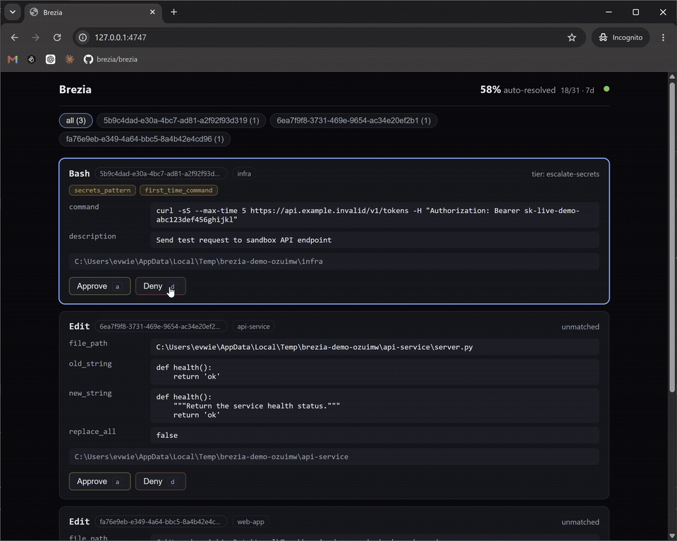

# Brezia

**An open-source approval control plane for AI agents.** Your coding agent's routine
tool calls clear themselves; the handful that actually need you wait in a local inbox;
every decision lands in a tamper-evident log. Runs entirely on `127.0.0.1` — no
account, no cloud, no telemetry.

<!-- To re-record: node scripts/demo.mjs (see "Recording the demo" below). -->


---

## Why

Agentic coding means a firehose of permission prompts: `Edit this? Run that? Allow?`
You either babysit every prompt or flip on "accept edits" and stop reading. Brezia is
the layer in between — a policy you write once auto-resolves the routine, so the only
prompts that reach you are the ones worth a human. And because it sits in the tool-call
path, **a dead daemon changes nothing**: your agent falls straight back to its native
permission flow. Degraded Brezia is just normal Claude Code.

## Quickstart

Requires Node ≥ 20 and Claude Code.

```sh
npx brezia init      # register the hook in .claude/settings.json (backs it up first)
npx brezia up        # start the local daemon; the inbox is at http://127.0.0.1:4747
```

Then use Claude Code as usual. Reads, searches, and safe shell commands auto-clear;
edits, writes, mutating commands, and anything carrying a credential wait for you in
the inbox. Open `http://127.0.0.1:4747` and decide with `a` (approve) / `d` (deny).

`brezia init` targets the current repo (`.claude/settings.json`) by default; use
`--user` to govern every project (`~/.claude/settings.json`).

## How it works

```
Claude Code ──PreToolUse hook──▶ brezia daemon ──▶ policy (brezia.yaml)
                                       │                 │
                                       │          auto-allow / auto-deny ──▶ tool runs / blocked
                                       │                 │
                                       │               "ask" ──▶ held in the inbox ──▶ you decide
                                       ▼
                              hash-chained audit log (~/.brezia/brezia.db)
```

- **Localhost only.** The daemon binds `127.0.0.1` and serves the inbox same-origin.
- **Never bricks.** Daemon down, slow, or timed out → no decision → the runtime's
  native permission prompt. You are never worse off than without Brezia.
- **Every state change is chained.** `brezia verify` walks the hash chain end to end;
  `brezia export` dumps it to JSON/CSV.

## The inbox

`http://127.0.0.1:4747` — a queue of held requests, grouped by session so parallel
agents share one screen.

- `j` / `k` move · `a` approve · `d` deny (type a reason, Enter submits)
- Each card shows the tool, arguments, project, matched policy tier, and any anomaly
  flags (e.g. a secrets-shaped argument). Agent-supplied text renders inert — never
  interpreted as HTML, links, markdown, or terminal escapes.
- The header shows your **auto-resolved rate** (rolling 7 days) — how much Brezia is
  clearing for you.

## Policy — `brezia.yaml`

Ordered tiers, **first match wins** (the firewall model). `unmatched: ask` is the
floor — nothing is ever allowed by omission. `brezia init` writes a starter policy;
the shipped default is heavily commented and doubles as the format reference.

```yaml
version: 1
defaults:
  unmatched: ask            # no allow by omission
tiers:
  - name: escalate-secrets  # a credential-shaped argument escalates, whatever the tool
    match: [{ flags: [secrets_pattern] }]
    action: ask
  - name: allow-reads       # read-only tools + classified-safe shell reads auto-resolve
    match:
      - { tool: Read }
      - { tool: Grep }
      - { tool: Glob }
      - { tool: Bash, bash: [read, vcs-read] }
    action: allow
limits:
  - { per: session, window: 24h, max_asks_auto_allowed: 200 }  # anti-splitting ceiling
```

Edit it and the daemon hot-reloads — an invalid file is rejected and the previous
policy stays in force (it never fails open). See
[`policy-packs/claude-code-default.yaml`](policy-packs/claude-code-default.yaml) for
the fully-commented default.

## Commands

| Command | What it does |
|---|---|
| `brezia init [--project\|--user]` | Register the hook (backs up settings, never clobbers existing hooks) + write a starter policy |
| `brezia up` | Start the daemon (foreground); print the inbox URL + counter; Ctrl-C to stop |
| `brezia status` | Diagnose: daemon up? hook installed? port free? |
| `brezia remove` | **Uninstall** — surgically remove only Brezia's hook |
| `brezia verify` | Walk the audit chain and report integrity |
| `brezia export [--format json\|csv]` | Export the audit log |

## Uninstall

Removing Brezia is as easy as installing it, and leaves your settings **byte-identical**
minus our one hook entry:

```sh
brezia remove        # deletes only Brezia's hook; every other hook/setting untouched
```

Your `brezia.yaml` and `~/.brezia/` (audit log, config) are left in place — delete them
by hand if you want them gone. Stop the daemon with Ctrl-C in the `brezia up` terminal.

## Security model (v0)

- Binds `127.0.0.1` only — never configurable, asserted at startup. Localhost binding
  *is* the v0 security model; there is no cross-origin client.
- Refuses requests not addressed to `127.0.0.1`/`localhost` or announcing another origin,
  and forbids framing — so another web page can't read from or act on the inbox, DNS
  rebinding included.
- No telemetry, phone-home, or update checks. Ever.
- Agent-supplied strings are treated as untrusted everywhere a human reads them.
- The audit log is append-only and hash-chained; `brezia verify` proves it hasn't been
  altered.

## Recording the demo

`node scripts/demo.mjs [N]` stands up N throwaway sample repos (each with the hook) and
runs a real headless Claude session in each, concurrently — honest multi-session load
to record the GIF from. Requires `brezia up` running and `claude` on your PATH. It
cleans up its temp repos on exit.

## Team tier

Brezia is free and open source for single-player use, forever. A **Team** tier is on
the way for organizations that need shared policy across a fleet of agents:

- Shared policy as a versioned repo artifact, org-wide
- Multi-approver inbox and routing to the owning team's queue
- Delegation, batching with discipline rules, and evidence exports

**Price: TBD.** It ships when the demand is real, not before — pricing follows once
that demand is. If that's you, add your name to the waitlist:

**➡ [Join the Team waitlist](https://tally.so/r/q484Ng)**

*(An honest heads-up: the Team tier is not built yet. The waitlist is how we decide
whether to build it.)*

## License

[Apache License 2.0](LICENSE).
