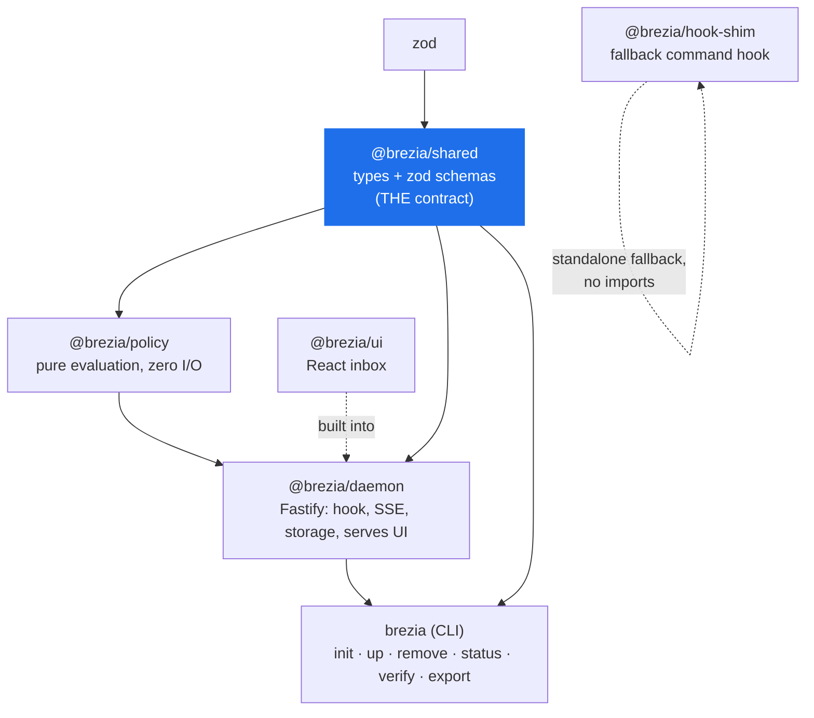
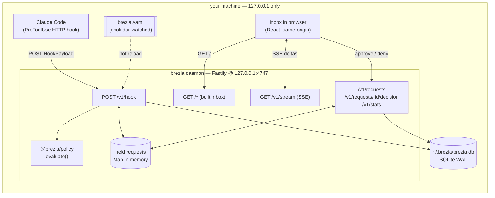
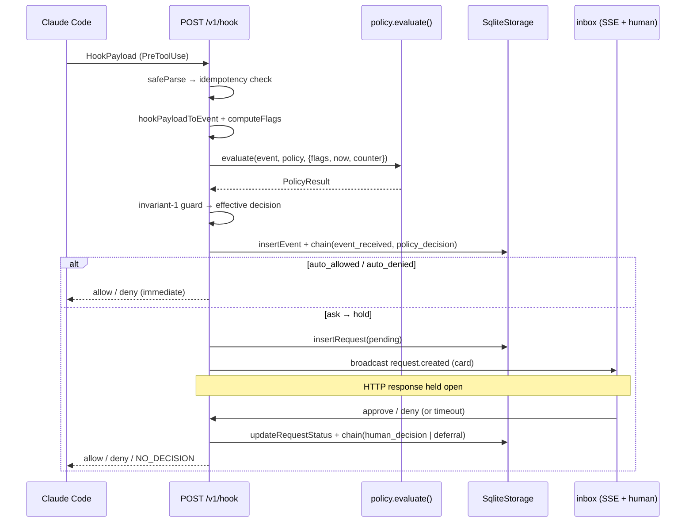

# Architecture — how the system is wired

> The whole system in one view: the six packages and their dependency graph, the
> localhost runtime topology, the end-to-end request lifecycle at altitude, the
> held-requests model, and the build/artifact shape.

Read [concepts.md](concepts.md) first for the vocabulary. This page assumes those terms.

## Contents

- [Package map & dependency graph](#package-map--dependency-graph)
- [The contract-flows-everywhere rule](#the-contract-flows-everywhere-rule)
- [Runtime topology](#runtime-topology)
- [The request lifecycle, end to end](#the-request-lifecycle-end-to-end)
- [The held-requests model](#the-held-requests-model)
- [Build & artifact shape](#build--artifact-shape)

---

## Package map & dependency graph

Brezia is an npm-workspaces monorepo of six packages (root `package.json:5`). Each has a
single job; the dependency edges are deliberately few and all point *toward* the contract.

| Package | Name | Role | Runtime deps (beyond workspace) |
|---|---|---|---|
| `packages/shared` | `@brezia/shared` | **THE contract** — every type + zod schema. | `zod` |
| `packages/policy` | `@brezia/policy` | **Pure** policy evaluation, zero I/O. The most-tested code. | `picomatch`, `shell-quote` |
| `packages/daemon` | `@brezia/daemon` | Fastify server: `/v1/hook`, Events API, SSE, storage, serves the UI. | `fastify`, `better-sqlite3`, `chokidar`, `yaml`, `ulid` |
| `packages/cli` | `brezia` | The `brezia` binary: `init`/`up`/`remove`/`status`/`verify`/`export`. | (workspace only) |
| `packages/hook-shim` | `@brezia/hook-shim` | ~80-line fallback command hook. Any error → print nothing, exit 0. | (none) |
| `packages/ui` | `@brezia/ui` | Vite + React inbox → built into the daemon's static assets. | `react`, `react-dom` |



Read the edges as "imports": `daemon` imports `policy` and `shared`; `cli` imports
`daemon` (to reuse `SqliteStorage`, `defaultDbPath`, chain verification) and `shared`.

Two packages sit apart from the import graph on purpose:

- **`hook-shim` imports nothing** — not even `@brezia/shared`. It is a standalone ~80-line
  binary whose only contract is the hook wire format, so it must never fail to start
  because a dependency did. (At v0 it is retained as a documented fallback but not used;
  the HTTP hook won the transport decision — see below.)
- **`ui` does not import `@brezia/shared`.** Its only runtime deps are `react`/`react-dom`
  (`packages/ui/package.json:13`); it re-declares the small card shape locally so the Vite
  bundle stays a self-contained browser artifact. The wire contract between them is the
  JSON on `/v1/requests` and `/v1/stream`, not a shared type import.

## The contract-flows-everywhere rule

`packages/shared` is the single source of truth for every domain type, and the arrows only
ever flow *into* consumers — nothing imports "up." Two rules keep this clean and are worth
stating because later docs lean on them:

> **`packages/policy` is pure — zero I/O.** It imports no `fs`, `net`, or `db`. Events,
> flags, clock, history, and counters all arrive as *inputs*
> (`packages/policy/src/evaluate.ts:102`, `flags.ts:21`, `limits.ts:6`). The daemon owns
> all the I/O and injects the `HistoryLookup` / `AllowCounter` implementations
> (`packages/daemon/src/derived.ts`). This is what makes the engine exhaustively
> table-testable and is enforced by the layering. See
> [internals/policy-evaluation.md](internals/policy-evaluation.md).

> **The Events API is the seam, not Claude Code.** Everything downstream of the hook
> adapter operates on an `ApprovalEvent`, never a raw `HookPayload`. The one
> Claude-Code-specific module is `hook-adapter.ts`. See
> [reference/events-api.md](reference/events-api.md).

---

## Runtime topology

Everything runs on one machine, on loopback. There is exactly one daemon process; the
inbox is served *same-origin* by that same process; the database and policy file are local
files. There is no network service, no cloud, no cross-origin client.



The load-bearing constant: **the daemon binds `127.0.0.1` only.** It is a hard-coded
constant, never configurable, and asserted at startup — if any bound address is not the
loopback host, the daemon refuses to run.

```ts
// packages/daemon/src/index.ts:39
export const HOST = "127.0.0.1";
export const PORT = 4747;
```

```ts
// packages/daemon/src/index.ts:440 — startup invariant, covered by a test
for (const addr of app.addresses()) {
  if (addr.address !== HOST) {
    await app.close();
    throw new Error(`FATAL: daemon bound to ${addr.address}, expected ${HOST} only.`);
  }
}
```

> **Security.** Localhost binding *is* the v0 security model: no auth, no CORS, no
> configurable address. The inbox is served same-origin by the daemon, so there is no
> legitimate cross-origin client. Detail in [security.md](security.md).

The transport into the daemon is a Claude Code **HTTP hook**, decided live in the A2 spike
(decision 008): the adapter is pure settings config — `{ "type": "http", "url":
"http://127.0.0.1:4747/v1/hook", "timeout": … }` under `hooks.PreToolUse` — with no client
binary. The `hook-shim` is kept as a documented fallback for environments where HTTP-hook
failure semantics differ. See [internals/hook-integration.md](internals/hook-integration.md)
and [reference/configuration.md](reference/configuration.md).

---

## The request lifecycle, end to end

One tool call, from hook POST to resolution, at altitude. The daemon's `/v1/hook` handler
is the spine (`packages/daemon/src/index.ts:211`); the full detail (with every failure
branch, idempotency replay, and crash recovery) is in
[internals/request-lifecycle.md](internals/request-lifecycle.md).



The stages, named (these are the canonical stage names used throughout the internals docs):

1. **Validate** — `HookPayloadSchema.safeParse`; failure → `NO_DECISION` (native flow).
2. **Idempotency** — a replayed `tool_use_id` returns the original stored outcome.
3. **Normalize** — `hookPayloadToEvent` maps the payload to an `ApprovalEvent`.
4. **Compute flags** — before policy; against *prior* events.
5. **Evaluate** — pure `evaluate()`; ordered tiers, first match wins.
6. **Effective-decision guard** — invariant 1: a tierless `auto_allowed` is downgraded to
   `ask`; the *effective* decision is what gets persisted and emitted.
7. **Persist + chain** — insert the event, chain `event_received` then `policy_decision`.
8. **Auto-respond or hold** — allow/deny answer immediately; `ask` inserts a pending
   request, broadcasts the card, and holds the HTTP response.
9. **Resolve** — a human decision, a hold timeout, or crash recovery completes the held
   response and chains `human_decision` or `deferral`.

Every failure branch in this pipeline resolves toward `ask` (policy layer) or
`NO_DECISION` (ingestion boundary) — never toward `allow`. See
[internals/failure-semantics.md](internals/failure-semantics.md).

---

## The held-requests model

A held request is simply an **open HTTP response held in a `Map`**. When an event resolves
to `ask`, the handler stores the response's promise-resolver keyed by request id, then
awaits. A human decision — or the hold timeout — looks the id up and completes the
response. There is deliberately **no queue and no worker abstraction**: parallel sessions
are just concurrent entries in the map.

```ts
// packages/daemon/src/held-requests.ts:20
export class HeldRequests {
  private readonly entries = new Map<string, { req: HeldRequest; resolve: Resolver }>();
  add(req: HeldRequest, resolve: Resolver): void { this.entries.set(req.id, { req, resolve }); }
  // returns false if already resolved — idempotent and race-safe between a human
  // decision and the hold timeout firing
  resolve(id: string, body: unknown): boolean { /* delete + call resolver */ }
}
```

The hold itself is an `await new Promise` whose `resolve` is registered in the map, with a
`setTimeout` racing it:

```ts
// packages/daemon/src/index.ts:316
const body = await new Promise<unknown>((resolve) => {
  const timer = setTimeout(() => {
    if (held.has(requestId)) { /* mark deferred + chain(hold_timeout) + broadcast */ }
    held.resolve(requestId, NO_DECISION); // native flow (never-brick)
  }, holdTimeoutMs);
  held.add(heldReq, (finalBody) => { clearTimeout(timer); resolve(finalBody); });
  sse.broadcast("request.created", cardPayload(heldReq));
});
```

`HeldRequests.resolve` returning `false` when the id is gone is what makes the
human-decision and timeout paths safe against each other: whoever gets there first wins,
the other is a no-op. The map is in-memory only; durability of the *pending* state is the
`requests` table, and **crash recovery** on startup resolves any `pending` row left by a
dead process to `deferred` and chains it (`packages/daemon/src/index.ts:139`), so the
audit log stays truthful about what Brezia did not decide.

Why this shape: the whole daemon workload is I/O-bound held HTTP responses at trivial
volume (decision 001), so the correct primitive is an open connection plus a map lookup —
not a job system.

---

## Build & artifact shape

| Package | Builder | Output | Notes |
|---|---|---|---|
| `shared`, `policy`, `daemon`, `hook-shim`, `cli` | **tsup** | `dist/` (ESM `.js` + `.d.ts`) | `"type": "module"` throughout. |
| `ui` | **Vite** | `packages/daemon/static/` (gitignored) | Built *into* the daemon, not published separately. |

Binaries: the `cli` package publishes the `brezia` bin (`packages/cli/package.json:5` →
`dist/index.js`); `hook-shim` publishes `brezia-shim`.

The daemon serves the built inbox from an **in-memory map** loaded at startup
(`registerUi`, `packages/daemon/src/ui-static.ts:61`), not from disk at request time — so
there is no path-traversal surface and no `@fastify/static` dependency. UI routes are
registered *last* so `/v1/*` always wins; when the UI has not been built, a friendly
placeholder is served instead.

Root scripts tie it together (`package.json:16`): `npm run build` builds all packages in
dependency order, `npm test` runs the entire Vitest suite (the invariant tests included),
`npm run typecheck` runs `tsc --noEmit` per workspace. Stack specifics — and the "a new
dependency is a decision" rule — are in [guides/development.md](guides/development.md).

---

**Next:** [concepts.md](concepts.md) for the types, or
[internals/request-lifecycle.md](internals/request-lifecycle.md) for the pipeline in full
detail. For the failure model that governs every branch above, see
[internals/failure-semantics.md](internals/failure-semantics.md).
