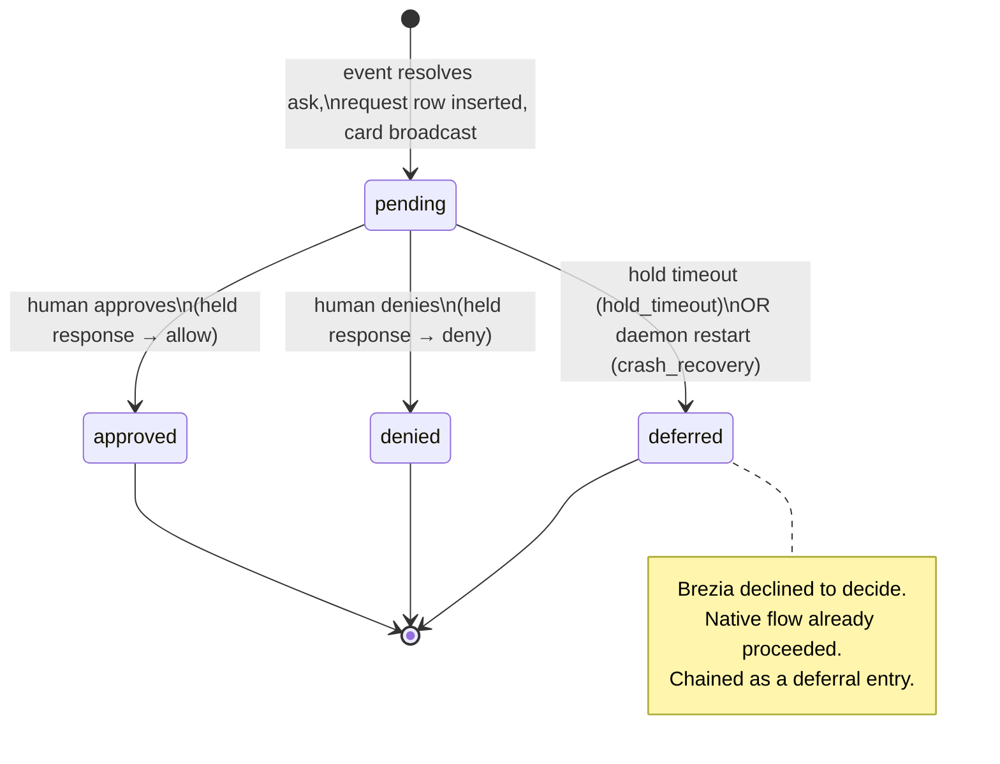

# Concepts — the domain model & glossary

> The canonical vocabulary of Brezia and the core types that carry it. Read this
> before any deep doc: every other page uses these terms exactly as defined here.

The entire contract lives in one file — `packages/shared/src/index.ts` — and every
other package imports its types from there. `shared` depends only on `zod`; it is
"THE contract" in the words of the project rules, versioned from commit one and
additive-only after v0. This page walks that file type by type, shows the load-bearing
shape of each, explains the *why*, then draws the request state machine and closes with
a glossary.

## Contents

- [The decision vocabulary](#the-decision-vocabulary) — `Decision`, `RequestStatus`
- [The event](#approvalevent--the-normalized-event) — `ApprovalEvent`, `HookPayload`
- [The policy result](#policyresult--the-output-of-evaluation) — `PolicyResult`
- [The held item](#request--the-held-human-review-item) — `Request`
- [The policy format](#the-policy-format-breziayaml) — `Policy`, `PolicyTier`, `Matcher`, `PolicyLimit`
- [Flags](#flags--anomaly--context-signals) — `Flags`, `FLAG_NAMES`, `looksLikeSecret`
- [Persistence & evidence](#persistence--evidence) — `StoredEvent`, `AuditEntry`, `AuditRow`, `StorageAdapter`
- [The request state machine](#the-request-state-machine)
- [Glossary](#glossary)

---

## The decision vocabulary

Two enums anchor everything. Keep them distinct: a **`Decision`** is what *policy*
produces for an event; a **`RequestStatus`** is the lifecycle state of a *held item*
that a human still has to resolve.

```ts
// packages/shared/src/index.ts:4
export const DecisionSchema = z.enum([
  "auto_allowed",
  "auto_denied",
  "ask",
  "no_decision",
]);
export type Decision = z.infer<typeof DecisionSchema>;
```

| `Decision` | Meaning | Produced by |
|---|---|---|
| `auto_allowed` | Policy matched an `allow` tier — allow *without* a human. Always names its tier (invariant 1). | `evaluate()` |
| `auto_denied` | Policy matched a `deny` tier, or `unmatched: deny`. | `evaluate()` |
| `ask` | No auto-resolution — hold for a human. The floor for anything unmatched under `unmatched: ask`. | `evaluate()` |
| `no_decision` | Reserved. See the note below — **not** currently emitted anywhere. |  — |

> **Source note (divergence to track).** `no_decision` is a member of the enum but
> nothing in the v0 codebase produces it as a `Decision` value. The never-brick "no
> decision" outcome is instead an **empty hook response** — the constant
> `NO_DECISION = {}` in `packages/daemon/src/hook-adapter.ts:50` — returned when
> ingestion is malformed or a held call times out. The persisted `StoredEvent.decision`
> is always one of `auto_allowed` / `auto_denied` / `ask`. Treat `no_decision` in the
> enum as reserved; see [internals/failure-semantics.md](internals/failure-semantics.md).

```ts
// packages/shared/src/index.ts:13
export const RequestStatusSchema = z.enum([
  "pending",
  "approved",
  "denied",
  "deferred",
  "expired",
]);
export type RequestStatus = z.infer<typeof RequestStatusSchema>;
```

| `RequestStatus` | Meaning | Set by |
|---|---|---|
| `pending` | Held, awaiting a human. The one state a request is born in. | hook handler, on `ask` |
| `approved` | Human approved → the held response emits `allow`. | `POST /v1/requests/:id/decision` |
| `denied` | Human denied → the held response emits `deny`. | `POST /v1/requests/:id/decision` |
| `deferred` | Brezia declined to decide: the hold timed out, or the daemon crashed and the request was resolved on restart. | hold-timeout path; crash recovery |
| `expired` | Reserved. See the note below — **not** currently produced at v0. | — |

> **Source note (divergence to track).** `expired` is in the enum but nothing at v0
> writes it. Both ways Brezia declines to decide — a hold outliving the hook window and
> crash recovery on restart — resolve to **`deferred`** (`packages/daemon/src/index.ts:321`
> and `:140`). `expired` is forward room for the enforced-mode expiry path
> (`defaults.on_expiry`, decision 006) that is not built at v0.

---

## `ApprovalEvent` — the normalized event

`ApprovalEvent` is Brezia's internal, runtime-agnostic event. The daemon's hook adapter
maps a raw Claude Code payload onto this shape; the (stubbed at v0) Events API accepts it
directly. Everything downstream — flags, policy, storage, the audit chain — sees only the
`ApprovalEvent`, never the raw payload. This is the seam that lets Brezia be "an approval
control plane for AI agents" and not "a Claude Code plugin."

```ts
// packages/shared/src/index.ts:24
export const ApprovalEventSchema = z.object({
  source: z.string(),
  session: z.string(),
  tool: z.string(),
  arguments: z.record(z.unknown()),
  context: z.object({
    task: z.string().optional(),
    workspace: z.string().optional(),
    owner: z.string().optional(),
    cwd: z.string().optional(),
    worktree: z.string().optional(),
  }).optional(),
  idempotencyKey: z.string().optional(),
});
```

| Field | Type | Meaning |
|---|---|---|
| `source` | `string` | Origin of the event, e.g. `"claude-code-http"`. |
| `session` | `string` | The runtime session id — groups events in the inbox and is an aggregation dimension. |
| `tool` | `string` | Tool name, e.g. `Bash`, `Read`, `mcp__everything__echo`. |
| `arguments` | `Record<string, unknown>` | The tool's raw input. `arguments.command` is where Bash classification and first-time-command look. |
| `context?` | object | Optional `task` / `workspace` / `owner` / `cwd` / `worktree`. `cwd`/`worktree` drive multi-session grouping; `owner` is the `agent` aggregation key. |
| `idempotencyKey?` | `string` | The dedupe key. The adapter sets it from `tool_use_id`. |

## `HookPayload` — the raw Claude Code payload

The one Claude-Code-specific shape. **This schema is coded from reality, never from
memory:** it was tightened in Phase A against payloads captured off the installed Claude
Code into `fixtures/pretooluse-*.json` (decision 009), because the published docs omitted
`tool_use_id` and did not list `prompt_id`/`effort` — the live payload carries all three.

```ts
// packages/shared/src/index.ts:51
export const HookPayloadSchema = z.object({
  session_id: z.string(),
  transcript_path: z.string(),
  cwd: z.string(),
  permission_mode: z.string(),
  hook_event_name: z.literal("PreToolUse"),
  tool_name: z.string(),
  tool_input: z.record(z.unknown()),
  tool_use_id: z.string(),
  prompt_id: z.string().optional(),
  effort: z.object({ level: z.string() }).passthrough().optional(),
  agent_id: z.string().optional(),
  agent_type: z.string().optional(),
  worktree: z.string().optional(),
}).passthrough();
```

Two design choices carry the never-brick guarantee:

- **Core fields required, version/subagent fields optional.** `prompt_id`/`effort` are
  version-specific; `agent_id`/`agent_type`/`worktree` are subagent-only.
- **`.passthrough()`** — unknown future fields survive validation, because Claude Code
  adds fields between versions. Combined with the daemon parsing via `safeParse` (a parse
  failure → `NO_DECISION`, never a throw), a shape change never bricks the user.

The mapping from `HookPayload` to `ApprovalEvent` is `hookPayloadToEvent()`
(`packages/daemon/src/hook-adapter.ts:7`); `tool_use_id → idempotencyKey`. Detail lives in
[internals/hook-integration.md](internals/hook-integration.md) and
[reference/events-api.md](reference/events-api.md).

---

## `PolicyResult` — the output of evaluation

What the pure evaluator returns. The invariant lives right in the shape: `tierName` MUST
be present whenever `decision` is `auto_allowed`.

```ts
// packages/shared/src/index.ts:72
export const PolicyResultSchema = z.object({
  decision: DecisionSchema,
  tierName: z.string().optional(),
  reason: z.string().optional(),
});
```

> **Invariant 1.** No event resolves `auto_allowed` without a named matching tier. The
> evaluator only ever returns `auto_allowed` from inside a matched tier, stamping
> `tierName` (`packages/policy/src/evaluate.ts:128`); the daemon then re-checks it and
> downgrades a tierless allow to `ask` before emitting anything
> (`packages/daemon/src/index.ts:238`). See
> [internals/policy-evaluation.md](internals/policy-evaluation.md).

## `Request` — the held human-review item

A `Request` is the persisted record of an event that resolved to `ask` and is now (or was)
waiting on a human. Auto-resolved events never create a `Request`.

```ts
// packages/shared/src/index.ts:80
export const RequestSchema = z.object({
  id: z.string(),
  eventId: z.string(),
  status: RequestStatusSchema,
  createdTs: z.number(),
  resolvedTs: z.number().optional(),
  reason: z.string().optional(),
});
```

`id` is a ulid; `eventId` links the request to its `StoredEvent` row and its audit
entries. The in-flight, in-memory counterpart is a **held request** (`HeldRequest`,
`packages/daemon/src/held-requests.ts:3`) — the open HTTP response plus the card fields;
see the [held-requests model in architecture.md](architecture.md#the-held-requests-model).

---

## The policy format (`brezia.yaml`)

A versioned contract, additive-only after v0. `shared` owns only the *shape and
validation*; the *evaluation* lives in `packages/policy`. Every schema level is
`.strict()` — unknown keys are rejected loudly so typos surface instead of silently
disabling a rule (decision 010).

```ts
// packages/shared/src/index.ts:161
export const PolicySchema = z.object({
  version: z.literal(1),
  defaults: PolicyDefaultsSchema,
  tiers: z.array(PolicyTierSchema),
  limits: z.array(PolicyLimitSchema).optional(),
}).strict();
```

**`Policy`** is a file with a `version` (literal `1`), `defaults`, an ordered list of
`tiers`, and optional aggregation `limits`.

**`PolicyDefaults`** — the floor. `unmatched` is `ask` or `deny` (never `allow` — there is
no allow-by-omission). `on_expiry` (`deny`/`defer`) is reserved for enforced mode.

```ts
// packages/shared/src/index.ts:152
export const PolicyDefaultsSchema = z.object({
  unmatched: z.enum(["ask", "deny"]),
  on_expiry: z.enum(["deny", "defer"]).optional(),
}).strict();
```

**`PolicyTier`** — a named rung: a `match` list (a disjunction of matchers) and an
`action` (`allow` / `ask` / `deny`). Tiers evaluate top to bottom, first match wins.
`route` and `batch` are the v1-reserved keys — accepted and **ignored** at v0 so a
forward-compatible policy loads on the single-player daemon; `evaluate()` never reads them
(decision 014). Every *other* unknown tier key is still rejected by `.strict()`.

```ts
// packages/shared/src/index.ts:125
export const PolicyTierSchema = z.object({
  name: z.string().min(1),
  match: z.array(MatcherSchema),
  action: PolicyActionSchema,      // "allow" | "ask" | "deny"
  route: z.unknown().optional(),   // v1-reserved, accepted-and-ignored
  batch: z.unknown().optional(),   // v1-reserved, accepted-and-ignored
}).strict();
```

**`Matcher`** — the atom of matching. A matcher matches when **ALL** its present
conditions hold (a conjunction): `tool` (exact or picomatch glob) AND every `args` pattern
AND every listed `bash` class AND every listed `flag`. Argument values are picomatch globs
by default; a value prefixed `re:` is a regular expression. This "AND within a matcher,
OR across a tier's matchers" gives disjunctive normal form — full boolean expressiveness
(decision 010).

```ts
// packages/shared/src/index.ts:112
export const MatcherSchema = z.object({
  tool: z.string().optional(),
  args: z.record(z.string()).optional(),
  bash: z.array(z.string()).optional(),
  flags: z.array(z.string()).optional(),
}).strict();
```

**`PolicyLimit`** — an aggregation ceiling (anti-splitting). `per` is the dimension
(`agent` / `tool` / `session`), `window` is a duration like `24h`, and
`max_asks_auto_allowed` is the cap. When prior auto-allows for a key reach the cap, the
next would-be allow escalates to `ask`. Ships in v0 — not deferred.

```ts
// packages/shared/src/index.ts:143
export const PolicyLimitSchema = z.object({
  per: z.enum(["agent", "tool", "session"]),
  window: z.string().regex(/^\d+[smhd]$/), // e.g. "24h", "30m"
  max_asks_auto_allowed: z.number().int().positive(),
}).strict();
```

Full authoring reference: [reference/policy-format.md](reference/policy-format.md).
Semantics: [internals/policy-evaluation.md](internals/policy-evaluation.md),
[internals/bash-classification.md](internals/bash-classification.md),
[internals/aggregation-limits.md](internals/aggregation-limits.md).

---

## Flags — anomaly & context signals

Flags are booleans computed **before** policy runs. Matchers may require them; the inbox
card always displays them. The v0 set is small and grows additively.

```ts
// packages/shared/src/index.ts:100
export const FLAG_NAMES = [
  "secrets_pattern",
  "first_time_tool",
  "first_time_command",
] as const;
export type Flags = Partial<Record<FlagName, boolean>>;
```

| Flag | True when | Computed in |
|---|---|---|
| `secrets_pattern` | Any string in `arguments` looks like a credential (`looksLikeSecret`). | `computeFlags` + `looksLikeSecret` |
| `first_time_tool` | This `tool` has no prior persisted event. | `computeFlags` (needs history) |
| `first_time_command` | This `arguments.command` string has no prior persisted event. | `computeFlags` (needs history) |

`computeFlags(event, history)` (`packages/policy/src/flags.ts:21`) is pure — the
first-time flags need a `HistoryLookup`, injected so the policy layer touches no storage.
`looksLikeSecret` (`packages/shared/src/index.ts:223`) is a curated set of credential
patterns (PEM keys, cloud/GitHub/Slack/OpenAI/Stripe tokens, `key=value` secrets,
`Authorization` headers, `.env` references) plus a conservative high-entropy heuristic that
deliberately skips pure hex/decimal runs (git SHAs, ids) to avoid false positives. Detail:
[internals/flags.md](internals/flags.md).

---

## Persistence & evidence

### `StoredEvent`

An `ApprovalEvent` plus what Brezia computed and decided about it — the durable events row
that also backs first-time history and the aggregation counter (decision 012).

```ts
// packages/shared/src/index.ts:298
export interface StoredEvent extends ApprovalEvent {
  id: string;
  ts: number;
  flags: Flags;
  policyTier?: string;
  decision: Decision;
}
```

`decision` here is the **effective** decision the daemon emitted (a tierless allow is
stored as `ask`, never `auto_allowed`), so the counter and stats never credit a
non-emitted allow (`packages/daemon/src/index.ts:242`).

### `AuditEntry` — the chained state changes

A zod discriminated union on `kind`: one variant per state change (decision 011). The
`entry_json` string is a versioned contract — `brezia verify` re-hashes it and
`brezia export` emits it — so it is additive-only after v0. `ts` lives inside the entry so
an exported record is self-describing.

```ts
// packages/shared/src/index.ts:244
export const AuditEntrySchema = z.discriminatedUnion("kind", [
  z.object({ kind: z.literal("event_received"), ts, eventId, source, session, tool, idempotencyKey? }),
  z.object({ kind: z.literal("policy_decision"), ts, eventId, decision, tierName?, reason? }),
  z.object({ kind: z.literal("human_decision"), ts, requestId, eventId, status: "approved"|"denied", reason? }),
  z.object({ kind: z.literal("deferral"), ts, requestId, eventId, cause: "hold_timeout"|"crash_recovery" }),
  z.object({ kind: z.literal("policy_reload"), ts, ok, error? }),
]);
```

| `kind` | Written when |
|---|---|
| `event_received` | An event is accepted and persisted. |
| `policy_decision` | The (effective) policy decision for that event. |
| `human_decision` | A human approves or denies a held request. |
| `deferral` | A held call outlived the hook window (`hold_timeout`) or a `pending` request was resolved on restart (`crash_recovery`). |
| `policy_reload` | A `brezia.yaml` hot-reload succeeded or was rejected. |

An auto-resolved event is **two** rows (`event_received` → `policy_decision`); a
human-decided one is **three** (→ `human_decision`). `GENESIS_HASH` is 64 hex zeros — the
fixed `prev_hash` of seq 1 (`packages/shared/src/index.ts:239`). The hash rule is
`sha256(prev_hash + entry_json)`; detail in
[internals/audit-chain.md](internals/audit-chain.md).

### `AuditRow`

A persisted audit row as read back for verify and export.

```ts
// packages/shared/src/index.ts:289
export interface AuditRow {
  seq: number; ts: number; entryJson: string; prevHash: string; hash: string;
}
```

### `StorageAdapter` — the one piece of v1 foresight

The persistence contract (decision 003): storage behind an interface so a later Postgres
is an *implementation*, not a rewrite. SQLite is the only implementation at v0
(`SqliteStorage`, `packages/daemon/src/sqlite-storage.ts`). There is deliberately **no
update or delete for the audit chain** — it is append-only.

```ts
// packages/shared/src/index.ts:315 (abbreviated)
export interface StorageAdapter {
  insertEvent(event: StoredEvent): void;
  getEventByIdempotencyKey(key: string): StoredEvent | undefined;
  hasSeenTool(tool: string): boolean;               // derived history
  hasSeenCommand(command: string): boolean;         // derived history
  countAutoAllows(dim: AggregationDim, value: string, sinceTs: number): number;
  statsSince(sinceTs: number): { total: number; autoResolved: number };
  insertRequest(request: Request): void;
  getRequest(id): Request | undefined;
  getRequestByEventId(eventId): Request | undefined;
  listRequestsByStatus(status): Request[];
  updateRequestStatus(id, status, resolvedTs, reason?): void;
  appendAuditEntry(entryJson, prevHash): { seq; hash };   // no update/delete for audit_log
  getLastAuditEntry(): { seq; hash } | undefined;
  allAuditEntries(): AuditRow[];
  verifyAuditChain(): boolean;
}
```

`AggregationDim` (`"tool" | "session" | "agent"`) mirrors `PolicyLimit.per`; the counter
parses the policy layer's opaque `dim:value` key back into a query. First-time history and
the counter are **derived** from the events table (no in-memory shadow, decision 012).
Full field-by-field schema: [reference/storage-adapter.md](reference/storage-adapter.md)
and [internals/persistence.md](internals/persistence.md).

---

## The request state machine

A `Request` exists only for events that resolve to `ask`. It is born `pending` and leaves
via exactly one terminal transition. Note `expired` is reserved and unreached at v0 (see
the source note above); the drawn states are the ones the code actually produces.



ASCII fallback:

```
                +----------------------------------------+
                |  event resolves `ask`                  |
                |  -> insert Request(status=pending)     |
                |  -> broadcast request.created card     |
                +--------------------+-------------------+
                                     |
                                 [pending]
                                     |
        +----------------------------+----------------------------+
        |                            |                            |
   human approve                human deny              hold timeout / crash recovery
        |                            |                            |
   [approved]                    [denied]                    [deferred]
   held resp -> allow            held resp -> deny        held resp -> NO_DECISION {}
        |                            |                            |
        +----------------------------+----------------------------+
                                     |
                                  (terminal)
```

The held HTTP response is completed in lockstep with the status change: `approved`/`denied`
emit an `allow`/`deny` hook decision; `deferred` returns `NO_DECISION` (`{}`) so Claude
Code's native flow proceeds. Auto-resolved events (`auto_allowed`/`auto_denied`) skip this
machine entirely — they answer the hook immediately and never create a `Request`. The full
pipeline is in [internals/request-lifecycle.md](internals/request-lifecycle.md).

---

## Glossary

Canonical terms. Later docs use these spellings and meanings exactly — do not coin
synonyms.

| Term | Definition | Source |
|---|---|---|
| **ApprovalEvent** | Brezia's normalized, runtime-agnostic event. The unit everything downstream operates on. | `packages/shared/src/index.ts:24` |
| **HookPayload** | The raw Claude Code `PreToolUse` payload, coded from captured fixtures. Mapped to an ApprovalEvent at the edge. | `packages/shared/src/index.ts:51` |
| **hook adapter** | The only Claude-Code-specific code in the pipeline: `hookPayloadToEvent`, `hookDecision`, `NO_DECISION`. | `packages/daemon/src/hook-adapter.ts` |
| **Decision** | Policy's outcome for an event: `auto_allowed` / `auto_denied` / `ask` (+ reserved `no_decision`). | `packages/shared/src/index.ts:4` |
| **effective decision** | The decision the daemon actually emits/persists after the invariant-1 guard (a tierless allow becomes `ask`). | `packages/daemon/src/index.ts:242` |
| **auto-resolve / auto-resolved** | An event decided by policy alone (`auto_allowed` or `auto_denied`), no human. The `/v1/stats` numerator. | `packages/shared/src/index.ts:331` |
| **Request** | The persisted record of an `ask` event awaiting/awaited a human. | `packages/shared/src/index.ts:80` |
| **RequestStatus** | A request's lifecycle state: `pending` → `approved` / `denied` / `deferred` (+ reserved `expired`). | `packages/shared/src/index.ts:13` |
| **held request** | The in-memory, in-flight counterpart of a pending Request: the open HTTP response + card fields, keyed in a `Map`. | `packages/daemon/src/held-requests.ts:3` |
| **hold / hold timeout** | Keeping the hook's HTTP response open until a human decides; the timeout after which it returns `NO_DECISION`. Default 290s — just under the 300s hook timeout `brezia init` installs, so Brezia defers first. | `packages/daemon/src/index.ts:61,316` |
| **deferred / deferral** | Brezia declining to decide — hold timeout or crash recovery — recorded as a `deferral` audit entry. | `packages/shared/src/index.ts:270` |
| **PolicyResult** | The evaluator's return: `decision` + optional `tierName` + `reason`. | `packages/shared/src/index.ts:72` |
| **Policy** | A parsed `brezia.yaml`: `version`, `defaults`, ordered `tiers`, optional `limits`. | `packages/shared/src/index.ts:161` |
| **tier** | A named rung of policy: a disjunction of matchers + an `allow`/`ask`/`deny` action. First match wins. | `packages/shared/src/index.ts:125` |
| **matcher** | A conjunction of conditions (`tool` AND `args` AND `bash` AND `flags`). The atom of matching. | `packages/shared/src/index.ts:112` |
| **matcher algebra** | AND within a matcher, OR across a tier's matchers → disjunctive normal form (decision 010). | `packages/policy/src/evaluate.ts:61` |
| **unmatched floor** | `defaults.unmatched` (`ask`/`deny`) — what an event that matches no tier resolves to. Never `allow`. | `packages/shared/src/index.ts:152` |
| **bash class** | A curated command category (e.g. `read`, `test`) a simple Bash command classifies into; compound commands are unclassifiable. | `packages/policy/src/bash.ts` |
| **flag** | An anomaly/context boolean computed before policy: `secrets_pattern`, `first_time_tool`, `first_time_command`. | `packages/shared/src/index.ts:100` |
| **aggregation limit** | An anti-splitting ceiling (`per`/`window`/`max_asks_auto_allowed`): too many auto-allows escalate the next to `ask`. | `packages/shared/src/index.ts:143` |
| **StoredEvent** | The durable events row: an ApprovalEvent + flags + effective decision + policy tier. Also backs derived history/counter. | `packages/shared/src/index.ts:298` |
| **AuditEntry** | One chained state change (discriminated union on `kind`). | `packages/shared/src/index.ts:244` |
| **audit chain** | The append-only, hash-linked log: `hash = sha256(prev_hash + entry_json)`, `GENESIS_HASH` at seq 1. | `packages/shared/src/index.ts:231`, `packages/daemon/src/sqlite-storage.ts:16` |
| **StorageAdapter** | The persistence interface (the one v1 foresight); SQLite is the only v0 implementation. | `packages/shared/src/index.ts:315` |
| **NO_DECISION** | The never-brick empty hook response (`{}`) → Claude Code's native flow proceeds. | `packages/daemon/src/hook-adapter.ts:50` |
| **invariant** | One of the three permanent guarantees (see [overview.md](overview.md#the-three-invariants)). | `*/invariants.test.ts` |

---

**Next:** [architecture.md](architecture.md) for how these types flow through the system,
or [overview.md](overview.md) for the one-page mental model.
