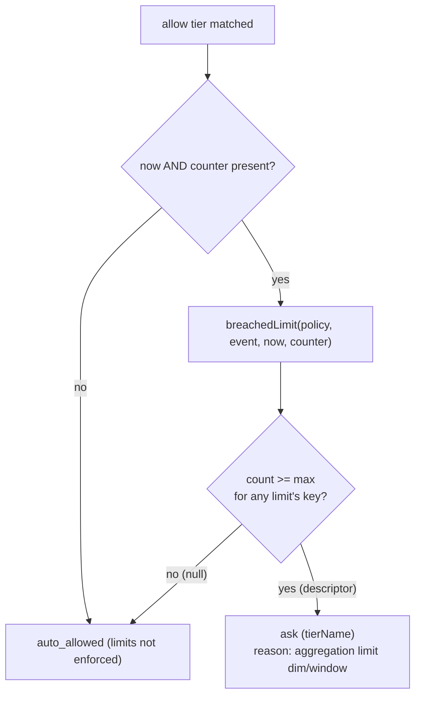

# Aggregation limits — anti-splitting

> The ceiling that stops an agent laundering one large change into many individually-cheap
> auto-allows. When prior auto-allows for a key reach the cap, the next would-be allow
> escalates to `ask`. Ships in v0 — not deferred.

The rule is enforced inside the pure evaluator (`breachedLimit` in
`packages/policy/src/limits.ts:41`), fed by a `SqliteAllowCounter`
(`packages/daemon/src/derived.ts:35`) that queries the events table. Read
[policy-evaluation.md](policy-evaluation.md) for where this sits in the allow branch, and
[concepts.md](../concepts.md#the-policy-format-breziayaml) for the `PolicyLimit` shape.

## Contents

- [The rule](#the-rule)
- [The counter interface](#the-counter-interface)
- [Per-dimension keys](#per-dimension-keys)
- [Windows](#windows)
- [Where it plugs into evaluation](#where-it-plugs-into-evaluation)
- [The SQL-derived counter](#the-sql-derived-counter)
- [Fail toward breach on an unevaluable key (decision 013)](#fail-toward-breach-on-an-unevaluable-key-decision-013)
- [Counting only final auto-allows](#counting-only-final-auto-allows)

---

## The rule

A `PolicyLimit` is `per` (the dimension) + `window` (a duration) + `max_asks_auto_allowed`
(the cap). A limit is **breached** when the count of prior auto-allows for its key, within
its window, has *already reached* the cap — at which point the next would-be allow must
escalate to `ask` rather than auto-resolve:

```ts
// packages/policy/src/limits.ts:41
export function breachedLimit(
  policy: Policy, event: ApprovalEvent, now: number, counter: AllowCounter,
): string | null {
  for (const limit of policy.limits ?? []) {
    const windowMs = parseWindowMs(limit.window);
    if (windowMs === null) continue; // schema guards the format; skip if somehow bad
    const key = aggregationKey(limit.per, event);
    if (counter.countInWindow(key, windowMs, now) >= limit.max_asks_auto_allowed) {
      return `${limit.per}/${limit.window}`;
    }
  }
  return null;
}
```

It returns the *first* breached limit's descriptor (e.g. `"session/24h"`) or `null`. The
comparison is `>=`: once the count equals the cap, the ceiling is reached and the next allow
is held. The default pack ships a concrete instance — 200 auto-allows per session per 24h
(`policy-packs/claude-code-default.yaml:62`) — so an agent cannot launder a large change into
many cheap approved calls.

---

## The counter interface

The engine stays pure: it never counts anything itself, it asks an injected `AllowCounter`.
The interface is a single question — how many auto-allows for `key` in the last `windowMs`,
as of `now`:

```ts
// packages/policy/src/limits.ts:6
export interface AllowCounter {
  countInWindow(key: string, windowMs: number, now: number): number;
}
```

The clock (`now`) is also an input, keeping `evaluate()` pure. Both are optional on the
`EvaluationContext`; if either is missing, limits are simply not enforced (see below).

---

## Per-dimension keys

`aggregationKey` turns a dimension + event into an opaque `dim:value` string. `agent` uses
the event's `owner` when present, else the `session` — the hook has no distinct agent id for
the main session, so session is the v0 proxy:

```ts
// packages/policy/src/limits.ts:26
export function aggregationKey(per: PolicyLimit["per"], event: ApprovalEvent): string {
  switch (per) {
    case "tool":    return `tool:${event.tool}`;
    case "session": return `session:${event.session}`;
    case "agent":   return `agent:${event.context?.owner ?? event.session}`;
  }
}
```

The key is deliberately opaque to the policy layer — it is a string the counter parses back
into a query (`derived.ts`). The owner-or-session fallback is asserted at
`packages/policy/src/__tests__/limits.test.ts:31`.

---

## Windows

`window` is a `\d+[smhd]` duration string (schema-validated on `PolicyLimit`). `parseWindowMs`
converts it to milliseconds, returning `null` for anything malformed:

```ts
// packages/policy/src/limits.ts:17
export function parseWindowMs(window: string): number | null {
  const m = /^(\d+)([smhd])$/.exec(window);
  if (m === null) return null;
  return Number(m[1]) * WINDOW_UNITS[m[2]!]!;
}
```

`s`/`m`/`h`/`d` map to the obvious millisecond factors (`limits.ts:10`). A `null` window
causes `breachedLimit` to *skip* that limit — but the schema already guards the format, so a
`null` here is a defensive belt-and-suspenders, not the normal path. Parsing is asserted at
`limits.test.ts:19`.

---

## Where it plugs into evaluation

The check lives *inside* the `allow` branch of the tier loop — only a would-be allow can be
downgraded. The clock and counter must both be present to enforce; without them, limits are
not applied and the allow stands:

```ts
// packages/policy/src/evaluate.ts:114
case "allow": {
  if (context.now !== undefined && context.allowCounter !== undefined) {
    const breach = breachedLimit(policy, event, context.now, context.allowCounter);
    if (breach !== null) {
      return { decision: "ask", tierName: tier.name, reason: `aggregation limit ${breach}` };
    }
  }
  return { decision: "auto_allowed", tierName: tier.name, reason: `tier '${tier.name}'` };
}
```

A breach downgrades to `ask` **while still naming the tier** — so the card and audit entry
show which tier *would have* allowed, and why it didn't. Note the escalation is only ever
allow → ask, never allow → allow: `limits.test.ts:61` asserts a breached limit *never* turns
an allow into another allow. The "under the ceiling → allow, at the ceiling → ask" pair is
`limits.test.ts:43`/`:48`; the daemon-level end-to-end (two allows, then the third held) is
`packages/daemon/src/hook-endpoint.test.ts:226`.



---

## The SQL-derived counter

The daemon's `SqliteAllowCounter` implements `AllowCounter` by deriving the count from the
persisted events table (decision 012 — Option A, no in-memory shadow). It splits the opaque
`dim:value` key, validates the dimension, and delegates to `countAutoAllows`:

```ts
// packages/daemon/src/derived.ts:38
countInWindow(key: string, windowMs: number, now: number): number {
  const i = key.indexOf(":");
  if (i < 0) return FORCE_BREACH;
  const dim = key.slice(0, i);
  const value = key.slice(i + 1);
  if (!DIMS.has(dim)) return FORCE_BREACH;
  return this.storage.countAutoAllows(dim as AggregationDim, value, now - windowMs);
}
```

`countAutoAllows` is a single `COUNT(*)` over `events`, filtered to `auto_allowed` rows at or
after the cutoff, keyed by the dimension's column (`agent` resolves to
`COALESCE(json_extract(context_json,'$.owner'), session_id)`, mirroring `aggregationKey`):

```sql
-- packages/daemon/src/sqlite-storage.ts:144
SELECT COUNT(*) AS n FROM events
 WHERE decision = 'auto_allowed' AND ts >= ? AND <column> = ?
```

Because the current event is inserted *after* flags and evaluation
([request-lifecycle.md](request-lifecycle.md#the-pipeline-stages)), the count is always of
*prior* auto-allows — the event being evaluated never counts itself. The window/cutoff
arithmetic (`now - windowMs`) is asserted at `packages/daemon/src/derived.test.ts:44`.

---

## Fail toward breach on an unevaluable key (decision 013)

The two `FORCE_BREACH` returns above are load-bearing (decision 013). The
sentinel is `Number.MAX_SAFE_INTEGER`, chosen so it trips *any* positive
`max_asks_auto_allowed`:

```ts
// packages/daemon/src/derived.ts:23
const FORCE_BREACH = Number.MAX_SAFE_INTEGER;
```

> **Failure direction (decision 013).** A malformed key or an unrecognized
> dimension is an *unevaluable* limit. Because the count is consumed as *"breach when count ≥
> max"*, returning `0` would leave the ceiling unbreached and let the would-be auto-allow
> through — **fail-open**, the cap silently disabled. The implemented behavior is the
> opposite: an unevaluable key returns a force-breach sentinel, so the limit
> registers as breached and the would-be allow escalates to `ask` — consistent with the hard
> rule that nothing anywhere fails toward `allow`.

This matters because `PolicyLimit.per` is an additive-only contract: a future `brezia.yaml`
could name a dimension this counter doesn't yet recognize. Fail-toward-breach means such a
policy over-asks (safe) rather than silently disabling its own ceiling (unsafe). The behavior
is locked in with a property test:

```ts
// packages/daemon/src/derived.test.ts:56
it("an unrecognized dimension forces a breach (fail toward ask, never allow)", () => {
  const c = new SqliteAllowCounter(storage());
  expect(c.countInWindow("owner:someone", 1_000, 500)).toBe(Number.MAX_SAFE_INTEGER);
  expect(c.countInWindow("no-colon-key", 1_000, 500)).toBe(Number.MAX_SAFE_INTEGER);
});
```

Both the unknown-dimension (`owner:…`) and malformed-key (no colon) cases force the breach.

---

## Counting only final auto-allows

The counter counts `decision = 'auto_allowed'` rows only — and the persisted `decision` is
the **effective** decision, not the raw evaluator output. A tierless allow that the
effective-decision guard downgraded to `ask` is stored as `ask`
([request-lifecycle.md](request-lifecycle.md#the-effective-decision-guard-invariant-1-at-the-edge),
`index.ts:263`), so it never counts toward a ceiling. Likewise a would-be allow that *this*
limit just escalated to `ask` is stored as `ask` and does not inflate the next count. The
counter therefore credits only allows Brezia actually emitted — the same reason the
`/v1/stats` numerator and the audit chain use the effective decision. Known-dimension counting
within the window is asserted at `derived.test.ts:44`.

---

**Related:** [policy-evaluation.md](policy-evaluation.md) (the allow branch) ·
[persistence.md](persistence.md) (Option-A derivation, the events table) ·
[request-lifecycle.md](request-lifecycle.md) (effective decision, insert-after-evaluate) ·
[../reference/storage-adapter.md](../reference/storage-adapter.md) (`countAutoAllows`) ·
[../reference/policy-format.md](../reference/policy-format.md) (`limits` authoring).
