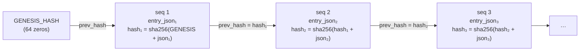

# The audit chain — the evidence story

> Every state change Brezia makes lands in an append-only, hash-linked log:
> `hash = sha256(prev_hash + entry_json)`, a fixed genesis root, one row per change.
> `brezia verify` re-hashes it end to end; nothing anywhere updates or deletes it.

This is [invariant 3](failure-semantics.md#the-three-invariants): *the audit chain
verifies end-to-end after every test-suite run*. This page traces the chain from the
`AuditEntry` shape in the contract, through how each entry is built and linked, to how
`verify` and `export` read it back — and the two things that make it trustworthy:
**append-only enforcement** and **re-hashing the stored string** rather than
re-serializing.

Read [concepts.md](../concepts.md) for the vocabulary (`AuditEntry`, `AuditRow`,
`deferred`, `StorageAdapter`). The storage schema is in
[reference/storage-adapter.md](../reference/storage-adapter.md); the durability layer is
in [persistence.md](persistence.md).

## Contents

- [The AuditEntry discriminated union](#the-auditentry-discriminated-union)
- [When each kind is written](#when-each-kind-is-written)
- [The hash rule and GENESIS_HASH](#the-hash-rule-and-genesis_hash)
- [The AuditChain helper — read-last, then append](#the-auditchain-helper--read-last-then-append)
- [Append-only enforcement](#append-only-enforcement)
- [verify — re-hash the stored string, never re-serialize](#verify--re-hash-the-stored-string-never-re-serialize)
- [export — JSON and CSV](#export--json-and-csv)
- [Crash-recovery deferrals](#crash-recovery-deferrals)

---

## The AuditEntry discriminated union

`AuditEntry` is a zod discriminated union on `kind`, one variant per state change
(decision 011). It lives in `packages/shared` because the serialized `entry_json` is a
**versioned contract** — it is exactly what `brezia verify` re-hashes and `brezia export`
emits — so it is fixed at v0 and additive-only after.

```ts
// packages/shared/src/index.ts:244
export const AuditEntrySchema = z.discriminatedUnion("kind", [
  z.object({ kind: z.literal("event_received"), ts, eventId, source, session, tool, idempotencyKey? }),
  z.object({ kind: z.literal("policy_decision"), ts, eventId, decision, tierName?, reason? }),
  z.object({ kind: z.literal("human_decision"), ts, requestId, eventId, status: "approved"|"denied", reason? }),
  z.object({ kind: z.literal("deferral"),       ts, requestId, eventId, cause: "hold_timeout"|"crash_recovery" }),
  z.object({ kind: z.literal("policy_reload"),  ts, ok, error? }),
]);
export type AuditEntry = z.infer<typeof AuditEntrySchema>;
```

Two design choices are load-bearing:

- **`ts` lives *inside* the entry**, not only in the row column, so an exported record is
  self-describing — a verifier holding just the JSON knows when it happened
  (`packages/shared/src/index.ts:243`).
- **`event_received` and `policy_decision` are separate rows**, not collapsed (decisions
  007 and 011). The row counts fall out of this: an auto-resolved event is **two** rows
  (`event_received` → `policy_decision`); a human-decided one is **three** (→
  `human_decision`); a held call that times out is also three (→ `deferral`).

Every persisted row is validated against this schema in the contract test — each stored
`entry_json` must parse against `AuditEntrySchema`:

```ts
// packages/daemon/src/persistence.test.ts:51
function assertWellFormedEntries(s: SqliteStorage): void {
  for (const row of s.allAuditEntries()) {
    expect(AuditEntrySchema.safeParse(JSON.parse(row.entryJson)).success).toBe(true);
  }
}
```

## When each kind is written

Every entry is constructed by the `AuditChain` helper and appended from the daemon's hook
and decision paths (`packages/daemon/src/index.ts`). The table maps kind → trigger →
source.

| `kind` | Written when | Constructed at | Appended from |
|---|---|---|---|
| `event_received` | An event passes validation, is not an idempotency replay, and is persisted. | `audit-chain.ts:22` | `index.ts:275` (hook handler) |
| `policy_decision` | The **effective** decision for that event is computed (after the invariant-1 guard). | `audit-chain.ts:32` | `index.ts:282` (hook handler) |
| `human_decision` | A human approves or denies a held request. | `audit-chain.ts:41` | `index.ts:372` (`POST /v1/requests/:id/decision`) |
| `deferral` | A held call outlives the hook window (`hold_timeout`) **or** a `pending` request is resolved on the next boot (`crash_recovery`). | `audit-chain.ts:50` | `index.ts:322` (timeout), `index.ts:141` (recovery) |
| `policy_reload` | A `brezia.yaml` hot-reload succeeds or is rejected. | `audit-chain.ts:58` | `index.ts:164` (chokidar watcher) |

> **The decision recorded is the *effective* decision.** The `policy_decision` entry
> carries what the daemon actually emitted, not the raw evaluator output. A tierless
> `auto_allowed` is downgraded to `ask` before it is chained
> (`packages/daemon/src/index.ts:242`), so the audit log never claims an allow that never
> reached Claude Code. See [failure-semantics.md](failure-semantics.md#the-invariant-1-edge-guard).

The order of the two hook-path writes is fixed: `eventReceived` then `policyDecision`,
both inside the same synchronous handler, so a per-event pair is always adjacent and in
order. The end-to-end test asserts the exact kind sequence for each path:

```ts
// packages/daemon/src/persistence.test.ts:64
const kinds = s.allAuditEntries().map((r) => JSON.parse(r.entryJson).kind);
expect(kinds).toEqual(["event_received", "policy_decision"]);           // auto-allow
// ...human approve →
expect(kinds).toEqual(["event_received", "policy_decision", "human_decision"]);
// ...hold timeout →
expect(kinds).toEqual(["event_received", "policy_decision", "deferral"]);
```

## The hash rule and GENESIS_HASH

Every row stores four fields relevant to the chain: `entry_json` (the entry verbatim),
`prev_hash` (the previous row's hash), `hash` (this row's hash), and `seq` (the
autoincrement position). The link rule is one line:

```ts
// packages/daemon/src/sqlite-storage.ts:16
export function chainHash(prevHash: string, entryJson: string): string {
  return createHash("sha256").update(prevHash + entryJson).digest("hex");
}
```

`hash = sha256(prev_hash + entry_json)` (decision 007). The root of the chain is a fixed,
well-known constant so anyone — not just this daemon — can reproduce it: seq 1's
`prev_hash` is `GENESIS_HASH`, 64 hex zeros.

```ts
// packages/shared/src/index.ts:239
export const GENESIS_HASH = "0".repeat(64);
```

`chainHash` deliberately lives in the daemon (`sqlite-storage.ts`), not in `shared`,
because it is I/O-adjacent chain mechanics; `shared` owns only the entry *shape* and the
genesis constant (`packages/daemon/src/sqlite-storage.ts:13`). This keeps `shared` a pure
contract with a single dependency (`zod`).



ASCII:

```
GENESIS(0…0) ──prev──▶ [seq1: json1, hash1=sha256(GENESIS+json1)]
                              │ hash1
                              ▼ prev
                        [seq2: json2, hash2=sha256(hash1+json2)]
                              │ hash2
                              ▼ prev
                        [seq3: json3, hash3=sha256(hash2+json3)]
```

Changing any byte of any `entry_json` changes that row's `hash`, which breaks the
`prev_hash` link of every row after it — so tampering is detectable at the first altered
row and cascades forward.

## The AuditChain helper — read-last, then append

`AuditChain` (`packages/daemon/src/audit-chain.ts`) owns entry construction and prev-hash
sequencing; the `StorageAdapter` owns only the raw append. The whole append is two
synchronous calls with nothing between them:

```ts
// packages/daemon/src/audit-chain.ts:16
private append(entry: AuditEntry): void {
  const prevHash = this.storage.getLastAuditEntry()?.hash ?? GENESIS_HASH;
  // entry_json is stored verbatim and re-hashed on verify — never re-serialized.
  this.storage.appendAuditEntry(JSON.stringify(entry), prevHash);
}
```

> **Why this is atomic.** better-sqlite3 is **synchronous by design** (decision 003). The
> read of the last hash and the append are both plain function calls with **no `await`
> between them**, so within Node's single-threaded event loop no other request can
> interleave — the chain never forks or races (`packages/daemon/src/audit-chain.ts:8`).
> This is the reason the daemon does not wrap SQLite in async ceremony; the synchronous
> API *is* the concurrency guarantee. If `getLastAuditEntry` returns nothing (an empty
> log), the first entry links to `GENESIS_HASH`.

The adapter computes the hash and inserts in one statement, returning the new seq and
hash:

```ts
// packages/daemon/src/sqlite-storage.ts:221
appendAuditEntry(entryJson: string, prevHash: string): { seq: number; hash: string } {
  const ts = Date.now();
  const hash = chainHash(prevHash, entryJson);
  const info = this.db
    .prepare(`INSERT INTO audit_log (ts, entry_json, prev_hash, hash) VALUES (?, ?, ?, ?)`)
    .run(ts, entryJson, prevHash, hash);
  return { seq: Number(info.lastInsertRowid), hash };
}
```

## Append-only enforcement

Append-only is *discipline plus a guard* (decision 007). The discipline: the `audit_log`
table is created with no code path that mutates it — `appendAuditEntry` is the only writer,
and it only ever `INSERT`s. The guard: a source-scan test asserts that no `UPDATE
audit_log` or `DELETE FROM audit_log` statement exists in the storage file at all.

```ts
// packages/daemon/src/sqlite-storage.test.ts:173
it("has no UPDATE or DELETE statement against audit_log", () => {
  const src = readFileSync(fileURLToPath(new URL("./sqlite-storage.ts", import.meta.url)), "utf8");
  expect(src).not.toMatch(/\bupdate\s+audit_log\b/i);
  expect(src).not.toMatch(/\bdelete\s+from\s+audit_log\b/i);
});
```

The contrast is deliberate and documented in the source: the `requests` table **is** a
mutable lifecycle table (`pending → resolved`), and `updateRequestStatus` uses a real
`UPDATE` — the append-only rule applies to `audit_log` only
(`packages/daemon/src/sqlite-storage.ts:210`). The `StorageAdapter` interface reflects
this: there is deliberately no update or delete method for the audit chain, only
`appendAuditEntry` / `getLastAuditEntry` / `allAuditEntries` / `verifyAuditChain`
(`packages/shared/src/index.ts:345`).

> **Security.** Append-only is a *tamper-evidence* property, not a tamper-*prevention*
> one. A determined attacker with write access to `brezia.db` can rewrite rows out of band
> — the invariant-3 test does exactly that with a raw SQLite handle to prove detection.
> What Brezia guarantees is that such a rewrite **cannot go unnoticed**: `verify` will
> fail. See [security.md](../security.md).

## verify — re-hash the stored string, never re-serialize

`verifyAuditChain` walks the log from genesis, checking two things per row: that its
`prev_hash` equals the previous row's `hash` (the links hold), and that its stored `hash`
equals `sha256(prev_hash + entry_json)` recomputed from the **stored** `entry_json`.

```ts
// packages/daemon/src/sqlite-storage.ts:254
verifyAuditChain(): boolean {
  let expectedPrev = GENESIS_HASH;
  for (const row of this.allAuditEntries()) {
    if (row.prevHash !== expectedPrev) return false;
    if (chainHash(row.prevHash, row.entryJson) !== row.hash) return false;
    expectedPrev = row.hash;
  }
  return true;
}
```

> **The trust boundary is the stored string.** `verify` hashes `row.entryJson` **exactly
> as it was stored** — it never parses the entry and re-serializes it. This is the crux of
> decision 011: entries are stored verbatim and re-hashed on verify — never
> re-serialized — so canonical-JSON ordering never enters the trust boundary. If verify
> re-serialized, any difference in key order, whitespace, or unicode escaping between the
> writer's `JSON.stringify` and the verifier's would produce a different hash and fail a
> perfectly intact chain. By hashing bytes-as-stored, the only thing that can fail verify
> is an actual change to the stored bytes.

An empty chain verifies vacuously (the loop body never runs → `true`)
(`packages/daemon/src/sqlite-storage.test.ts:140`). The two failure modes are each tested:
a corrupted `entry_json` (hash no longer matches its entry) and a broken `prev_hash` link.

```ts
// packages/daemon/src/sqlite-storage.test.ts:165
it("detects a broken prev_hash link", () => {
  const s = storage();
  s.appendAuditEntry('{"a":1}', GENESIS_HASH);
  s.appendAuditEntry('{"a":2}', "wrong-prev"); // should have been the prior hash
  expect(s.verifyAuditChain()).toBe(false);
});
```

The canonical invariant-3 test drives a real held → human-decide loop and then verifies,
and separately corrupts a row via a raw handle to prove tamper detection
(`packages/daemon/src/invariants.test.ts:67`). `brezia verify` is the CLI surface over
this method — it reports the entry count and a pass/fail, exiting non-zero on failure. See
[reference/cli.md](../reference/cli.md#verify).

```ts
// packages/cli/src/commands.ts:7
export function runVerify(storage: StorageAdapter): { ok: boolean; count: number; output: string } {
  const count = storage.allAuditEntries().length;
  const ok = storage.verifyAuditChain();
  // ✓ verified — N entries intact   /   ✗ FAILED verification — the log has been altered
  ...
}
```

## export — JSON and CSV

`brezia export` emits the whole log for offline archival and re-verification
(`packages/cli/src/audit.ts`). Both formats preserve the raw `entry_json` so the export
can itself be re-hashed:

- **JSON** keeps the parsed entry inline alongside its chain linkage (`seq`, `ts`,
  `prevHash`, `hash`, `entry`) so a reader sees the semantic record and the links together
  (`packages/cli/src/audit.ts:8`).
- **CSV** flattens to one row per entry with columns `seq, ts, kind, prev_hash, hash,
  entry_json`. Fields are unconditionally RFC-4180 quoted so commas, newlines, and quotes
  inside agent-supplied `entry_json` stay inert (`packages/cli/src/audit.ts:22`).

```ts
// packages/cli/src/audit.ts:8
export function auditToJson(rows: AuditRow[]): string {
  return JSON.stringify(
    rows.map((r) => ({ seq: r.seq, ts: r.ts, prevHash: r.prevHash, hash: r.hash, entry: JSON.parse(r.entryJson) })),
    null, 2,
  );
}
```

Because CSV carries `entry_json` verbatim, an exported CSV holds everything needed to
recompute `sha256(prev_hash + entry_json)` per row and confirm the chain independently of
Brezia.

## Crash-recovery deferrals

The chain must stay truthful about what Brezia *did not* decide. Two paths write a
`deferral` (decision 011):

- **`hold_timeout`** — a held call outlives the hook window; native flow takes over. The
  timeout handler marks the request `deferred` and chains the deferral
  (`packages/daemon/src/index.ts:321`).
- **`crash_recovery`** — a `pending` request left by a dead process. On the next boot,
  `createServer` sweeps every `pending` row, resolves it `deferred`, and chains a
  `crash_recovery` deferral before serving any traffic:

```ts
// packages/daemon/src/index.ts:139
for (const req of storage.listRequestsByStatus("pending")) {
  storage.updateRequestStatus(req.id, "deferred", Date.now(), "daemon restart");
  chain.deferral({ requestId: req.id, eventId: req.eventId, cause: "crash_recovery" });
  log(`defer crash_recovery ${req.id}`);
}
```

Both are `deferred`, never `expired` — `expired` is reserved for the enforced-mode expiry
path that is not built at v0 (see [concepts.md](../concepts.md#the-decision-vocabulary)).
The recovery test asserts the last chained entry is a `crash_recovery` deferral and the
chain still verifies (`packages/daemon/src/persistence.test.ts:131`).

---

**Next:** [persistence.md](persistence.md) for the storage layer that backs this chain,
[reference/cli.md](../reference/cli.md) for `verify`/`export`, or
[failure-semantics.md](failure-semantics.md) for how the chain fits the three invariants.
