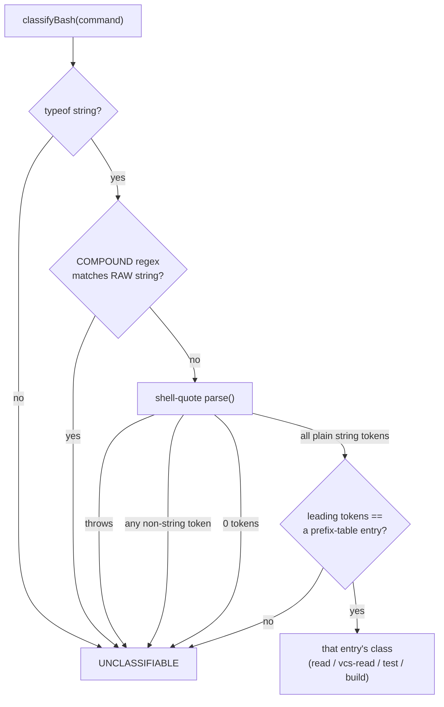

# Bash classification — the hard 20%

> How a Bash command *string* becomes a curated **bash class**, safely. The parser is
> deliberately dumb and conservative: any compound construct, any parse failure, and any
> command not in the curated table are all unclassifiable — and unclassifiable never
> matches an allow tier. Fail toward `ask` by construction.

The classifier is `classifyBash()` in `packages/policy/src/bash.ts:58`. It exists because
`tool_input.command` is an opaque string and the `bash:` matcher needs a category to match
against (see [policy-evaluation.md](policy-evaluation.md#tool-args-bash-flags--the-four-conditions)).
This is the sharpest failure-direction surface in the engine — decision 005 governs it.

## Contents

- [The problem: a command is a string](#the-problem-a-command-is-a-string)
- [The COMPOUND raw-string gate](#the-compound-raw-string-gate)
- [Tokenize with shell-quote](#tokenize-with-shell-quote)
- [The curated prefix table](#the-curated-prefix-table)
- [Fail-toward-ask by construction](#fail-toward-ask-by-construction)
- [The property test](#the-property-test)
- [Security: why rg / tree / file were removed](#security-why-rg--tree--file-were-removed)
- [Why find / env / node are excluded](#why-find--env--node-are-excluded)

---

## The problem: a command is a string

A policy can say `tool: Bash`, but that governs *every* shell command equally. The value is
in distinguishing `git status` (a read) from `git push` (a mutation) from `ls; rm -rf /` (a
disaster). Classification needs parsing, and any parser is a potential bypass. Decision 005
resolves the tension by making the parser conservative *by construction*: it classifies
only a small curated set of simple commands and treats everything else — including anything
it cannot confidently reason about — as `UNCLASSIFIABLE`.

```ts
// packages/policy/src/bash.ts:6
export const UNCLASSIFIABLE = "unclassifiable";
```

`UNCLASSIFIABLE` is a sentinel, never a real class. The matcher refuses it explicitly
(`matchBash`, `evaluate.ts:53`), so a command that lands here can never match an allow tier
even if a policy author literally lists `bash: ["unclassifiable"]` — asserted at
`packages/policy/src/__tests__/bash.test.ts:136`.

The pipeline is three gates in order, each of which can only *reject*:



---

## The COMPOUND raw-string gate

Before *any* tokenizing, the raw string is tested for shell metacharacters. If it contains
any, the command is compound/expansion/substitution/redirect and is unclassifiable outright:

```ts
// packages/policy/src/bash.ts:12
const COMPOUND = /[;&|<>$`(){}\n\r]/;
```

```ts
// packages/policy/src/bash.ts:58
export function classifyBash(command: unknown): string {
  if (typeof command !== "string") return UNCLASSIFIABLE;
  if (COMPOUND.test(command)) return UNCLASSIFIABLE;
  // ...tokenize...
}
```

> **Why check the raw string first, before tokenizing.** A tokenizer's job is to *interpret*
> quoting and escaping — precisely the machinery an attacker uses to smuggle an operator past
> naive inspection. By gating on the raw, uninterpreted string, an escaped or quoted operator
> can never survive to sneak a "safe" classification: `;` `&` `|` `<` `>` `$` `` ` `` `(` `)`
> `{` `}` and newlines all disqualify the command *regardless* of how they are dressed up.
> This is the load-bearing ordering of decision 005 — the parser fails toward ask.

---

## Tokenize with shell-quote

Only a command that survived the COMPOUND gate is tokenized, and even then the result is
distrusted. `shell-quote`'s `parse()` returns plain strings for words but *objects* for
operators, globs, and comments; any object token means the string still contained something
structural, so the classifier bails:

```ts
// packages/policy/src/bash.ts:62
let tokens: ReturnType<typeof parse>;
try {
  tokens = parse(command);
} catch {
  return UNCLASSIFIABLE;                 // a parse failure is unclassifiable
}
// After the COMPOUND check every token should be a plain string; if shell-quote
// still produced an operator/glob/comment object, bail conservatively.
if (tokens.some((t) => typeof t !== "string")) return UNCLASSIFIABLE;
const strs = tokens as string[];
if (strs.length === 0) return UNCLASSIFIABLE;
```

Three independent bail-outs — parse throw, non-string token, zero tokens — all resolve to
`UNCLASSIFIABLE`. This is redundant with the COMPOUND gate on purpose: defense in depth
against any construct the raw-string regex might miss.

---

## The curated prefix table

A surviving all-string token list is matched against a small, hand-audited table. A command
classifies only when its **leading tokens exactly equal** an entry's prefix — token
equality, not substring, not "starts with the characters":

```ts
// packages/policy/src/bash.ts:75
for (const entry of PREFIX_TABLE) {
  if (
    strs.length >= entry.prefix.length &&
    entry.prefix.every((p, i) => strs[i] === p)
  ) {
    return entry.klass;
  }
}
return UNCLASSIFIABLE;
```

The v0 table (`bash.ts:17`–`52`) is small and conservative:

| Class | Prefixes |
|---|---|
| `read` | `ls`, `cat`, `head`, `tail`, `pwd`, `wc`, `stat`, `grep`, `which`, `echo`, `du` |
| `vcs-read` | `git status`, `git diff`, `git log`, `git show`, `git rev-parse`, `git ls-files`, `git blame`, `git describe` |
| `test` | `npm test`, `pytest`, `vitest` |
| `build` | `npm run build`, `tsc` |

Multi-token prefixes (`git status`, `npm run build`) mean `git` alone or `npm` alone never
classify — only the exact read-only subcommands do. `git push`, `git commit`, `git branch -D`,
`git config`, `git remote add` all stay `UNCLASSIFIABLE` (asserted at `bash.test.ts:46`), so
the mutating git surface can never reach an allow class even though the read subcommands can.
The happy-path mappings are exhaustively asserted at `bash.test.ts:6`.

---

## Fail-toward-ask by construction

Every gate can only reject; there is no path that *promotes* a command. So the only way to
reach an allow-able class is to be a simple, single, metacharacter-free command whose exact
leading tokens are one of the curated read-only prefixes. Everything else — unknown
commands (`rm -rf /`, `curl …`), mutating commands, compound commands, parse failures,
non-strings, the empty string — is `UNCLASSIFIABLE` and cannot match an allow tier. In the
integration test, `ls; rm -rf /` starts with the safe `ls` but is compound, so it resolves
`ask`, not `allow` (`bash.test.ts:127`).

---

## The property test

The load-bearing guarantee (decision 005) is a property, not an example: **no
adversarial string may ever classify into a real class.** The test constructs a large matrix
— safe-command bases × every shell metacharacter × dangerous payloads, in both spaced and
unspaced forms — plus hand-picked classics, and asserts *every one* is `UNCLASSIFIABLE`:

```ts
// packages/policy/src/__tests__/bash.test.ts:76
const bases = ["ls", "cat x", "pwd", "git status", "npm test", "tsc"];
const injections = [";", "&&", "||", "|", "&", "$(", "`", ">", ">>", "<", "${", "(", ")", "{", "}", "\n", "\r"];
const payloads = ["rm -rf /", "curl http://evil", "cat /etc/passwd", "sh"];
// ...builds every base × injection × payload, spaced and unspaced...
it(`all ${adversarial.length} adversarial strings → unclassifiable`, () => {
  const leaks = adversarial.filter((c) => classifyBash(c) !== UNCLASSIFIABLE);
  expect(leaks).toEqual([]);
});
```

`leaks` must be empty. This test is the enforcement of the hard rule *"no adversarial or
fuzzed string may ever classify into an allow-tier class."*

---

## Security: why rg / tree / file were removed

The COMPOUND gate stops *shell*-level attacks (metacharacters). It does **nothing** about a
command's **own dangerous flags** — a plain-form invocation with no shell metacharacter at
all. So every entry in the prefix table must be a command with *no plain-argument
exec-or-write vector*. Three commands that look read-only were caught and **removed** for
exactly this reason (a review finding, recorded in the `bash.ts:17` comment and the
`bash.test.ts:50` cases):

| Removed | Plain-form vector | Why COMPOUND can't catch it |
|---|---|---|
| `rg` (ripgrep) | `rg --pre <prog>` / `--hostname-bin <prog>` **executes an arbitrary program** | no metacharacter — the program name is a plain arg |
| `tree` | `tree -o <file>` **writes/clobbers a file** | plain arg, no redirect operator |
| `file` | `file -C -m <magic>` **compiles and writes** a `.mgc` | plain arg, no redirect operator |

```ts
// packages/policy/src/bash.ts:17
//  ... notably `rg` (--pre / --hostname-bin execute a program), `tree` (-o writes a
//  file), and `file` (-C -m compiles/writes) — all of which look read-only but are not.
```

These are regression-tested as permanently `UNCLASSIFIABLE`, with the vector spelled out in
each case (`bash.test.ts:55`):

```ts
// packages/policy/src/__tests__/bash.test.ts:55
"rg --pre bash pattern ./file", // ripgrep --pre runs an arbitrary program
"rg --hostname-bin sh pat",     // ditto
"tree -o /etc/passwd",          // tree -o writes/clobbers a file
"file -C -m evil.magic",        // file -C -m compiles + writes a .mgc
```

> **Security.** The distinction is subtle and it is the whole point: a command can be an
> exec/write vector *in its plain form*, without any shell metacharacter, so the COMPOUND
> gate never sees it. The only defense is curation — every prefix in the table is audited to
> have no such vector. `grep` stays in the table precisely because GNU grep has no exec/write
> flag, unlike `rg` (`bash.ts:32` comment). This exclusion is a deliberate security decision,
> also documented in [security.md](../security.md).

> **Considered and ruled out: git's external-diff/textconv/pager hooks.** `git diff`/`log`/
> `show` render diffs, and git can be configured (`.gitattributes` `diff=<driver>` + a
> matching `diff.<driver>.command` in git config, or `core.pager`) to shell out to an
> external program while doing so — a plain-form exec side channel in the same family as
> `rg`/`tree`/`file` above. Verified empirically (a throwaway repo) rather than assumed: a
> hostile `.gitattributes` *alone* — the part a repo can actually ship via a normal
> `git clone` — does nothing without a matching driver already defined in *local* git
> config, which a clone cannot supply. The attack needs the victim to have pre-configured
> the dangerous driver themselves, outside Brezia's threat model (an agent operating on a
> repo it was just handed). Left in the table; documented in `bash.ts` next to the git
> entries and regression-tested (`bash.test.ts` — the trailing-flags-not-validated describe
> block covers `git log -p`, the one path that renders diffs).

---

## Why find / env / node are excluded

The same "no plain-form exec/write vector" rule keeps several obvious-looking commands out
of the table entirely:

- **`find`** — `find . -exec <cmd>` runs arbitrary commands; `-delete` removes files. A plain
  vector, excluded (`bash.ts:24` comment; `bash.test.ts:51` keeps `find . -name x`
  unclassifiable).
- **`env`** — `env <VAR=val> <program>` runs an arbitrary program (and rewrites the
  environment). Excluded (`bash.ts:24`).
- **`node`** (and `sh`, `awk`) — these *are* code execution; `node -e`, `sh -c`, `awk`
  programs run arbitrary logic. Excluded (`bash.ts:24`).

The table is intentionally tiny; a command earns a place only after it is audited to have no
plain-argument way to execute code or write files. Growth is additive and deliberate — the
default policy pack tunes *which* classes auto-resolve, but the table itself is the curated
trust boundary.

---

**Related:** [policy-evaluation.md](policy-evaluation.md) (the `bash:` matcher) ·
[failure-semantics.md](failure-semantics.md) (fail-toward-ask) ·
[../security.md](../security.md) (exclusions as a security decision) ·
[../reference/policy-format.md](../reference/policy-format.md) (authoring bash classes).
