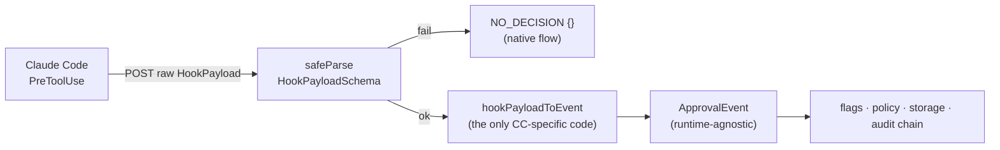

# Hook integration — how Brezia plugs into Claude Code

> The one Claude-Code-specific seam in the system, verified from reality: the PreToolUse
> payload shape read from captured fixtures (never from memory), the HTTP-hook transport
> that won the A2 spike, the decision response format, and the ~80-line command shim kept
> as a documented fallback.

Everything downstream of the hook adapter operates on an `ApprovalEvent`, never a raw
Claude Code payload — the Events API is the contract, and this module is the adapter over
it (see [architecture.md](../architecture.md#the-contract-flows-everywhere-rule)). This
page documents that adapter, the transport, and the fixtures ritual that keeps the payload
contract honest.

Read [concepts.md](../concepts.md) for `HookPayload`, `ApprovalEvent`, `NO_DECISION`, and
the hook adapter. The full HTTP surface is in
[reference/http-api.md](../reference/http-api.md); the settings entry is in
[reference/configuration.md](../reference/configuration.md).

## Contents

- [The never-from-memory rule](#the-never-from-memory-rule)
- [The PreToolUse payload contract](#the-pretooluse-payload-contract)
- [Mapping a payload to an ApprovalEvent](#mapping-a-payload-to-an-approvalevent)
- [The decision response format](#the-decision-response-format)
- [The HTTP-hook transport and the A2 spike](#the-http-hook-transport-and-the-a2-spike)
- [The hook-shim fallback](#the-hook-shim-fallback)
- [The fixtures ritual](#the-fixtures-ritual)

---

## The never-from-memory rule

The single hardest thing about integrating with a runtime is that its wire format drifts
between versions, and the published docs lag reality. The project rule is absolute:

> **Never code the Claude Code hook protocol from memory or training data — field names
> and semantics drift between versions. Code it from payloads captured off the installed
> version in `fixtures/`.**

This is not caution for its own sake. When the payload was actually captured (decision
009, Phase A1), reality outran the docs: the live PreToolUse payload carries `tool_use_id`,
`prompt_id`, and `effort`, none of which the published docs listed at the time. Had the
schema been coded from the docs, idempotency (which keys on `tool_use_id`) would have had
nothing to key on.

## The PreToolUse payload contract

`HookPayloadSchema` is the one Claude-Code-specific shape in `shared`. It was tightened
against captured fixtures, and its structure encodes the never-brick guarantee:

```ts
// packages/shared/src/index.ts:51
export const HookPayloadSchema = z
  .object({
    session_id: z.string(),
    transcript_path: z.string(),
    cwd: z.string(),
    permission_mode: z.string(),
    hook_event_name: z.literal("PreToolUse"),
    tool_name: z.string(),
    tool_input: z.record(z.unknown()),
    tool_use_id: z.string(),
    prompt_id: z.string().optional(),
    effort: z.object({ level: z.string() }).passthrough().optional(),
    agent_id: z.string().optional(),
    agent_type: z.string().optional(),
    worktree: z.string().optional(),
  })
  .passthrough();
```

| Field | Required | Meaning | Evidence |
|---|---|---|---|
| `session_id` | yes | Runtime session id → `ApprovalEvent.session`. | all fixtures |
| `transcript_path` | yes | Path to the session transcript. | all fixtures |
| `cwd` | yes | Working directory → `context.cwd`. | all fixtures |
| `permission_mode` | yes | e.g. `"auto"`, `"default"`. | all fixtures |
| `hook_event_name` | yes | Literal `"PreToolUse"` — the only event Brezia hooks at v0. | all fixtures |
| `tool_name` | yes | e.g. `Bash`, `Read`, `mcp__everything__echo` → `ApprovalEvent.tool`. | all fixtures |
| `tool_input` | yes | The tool's raw args → `ApprovalEvent.arguments`. | all fixtures |
| `tool_use_id` | yes | The idempotency key → `Idempotency-Key`. | all fixtures (`toolu_…`) |
| `prompt_id` | no | Version-specific. | `pretooluse-bash.json:5` |
| `effort` | no | Version-specific `{ level }`. | `pretooluse-bash.json:7` |
| `agent_id`, `agent_type` | no | Subagent-only. | `pretooluse-subagent-bash.json:7` |
| `worktree` | no | Subagent/worktree-only; not yet observed in a capture. | (kept optional per decision 009) |

Two choices carry the never-brick guarantee (see
[failure-semantics.md](failure-semantics.md)):

- **Core fields required, version/subagent fields optional.** `prompt_id`/`effort` are
  version-specific; `agent_id`/`agent_type`/`worktree` are subagent-only. Requiring only
  the always-present core never risks bricking, because the daemon parses with `safeParse`
  and falls back to `NO_DECISION` on any mismatch.
- **`.passthrough()`** — unknown future fields survive validation, because Claude Code adds
  fields between versions. A shape change therefore never fails a valid call.

The fixtures *are* the contract test — the schema must accept exactly what the tool sends,
across Bash, Read, Write, a subagent call, and an MCP tool:

```ts
// packages/daemon/src/hook-payload.test.ts:23
for (const name of FIXTURES) {
  it(`parses ${name}`, () => {
    expect(HookPayloadSchema.safeParse(loadFixture(name)).success).toBe(true);
  });
}
// ...also asserts: tool_use_id present, subagent identity present-or-absent,
// mcp__<server>__<tool> names accepted, and unknown future fields tolerated.
```

The MCP case matters: a captured `mcp__everything__echo` payload confirmed the
`mcp__<server>__<tool>` naming and the identical top-level shape, so MCP calls need **no
special handling at ingestion** — the schema accepts them unchanged
(`fixtures/pretooluse-mcp.json`, decision 009).

## Mapping a payload to an ApprovalEvent

`hookPayloadToEvent` is the only Claude-Code-specific code in the pipeline. It projects the
raw payload onto the runtime-agnostic `ApprovalEvent`:

```ts
// packages/daemon/src/hook-adapter.ts:7
export function hookPayloadToEvent(payload: HookPayload): ApprovalEvent {
  return {
    source: "claude-code-http",
    session: payload.session_id,
    tool: payload.tool_name,
    arguments: payload.tool_input,
    context: { cwd: payload.cwd, worktree: payload.worktree },
    idempotencyKey: payload.tool_use_id,
  };
}
```

The `source` stamps `"claude-code-http"` so persisted events record which adapter produced
them. `tool_use_id → idempotencyKey` is the idempotency contract (confirmed present in A1
fixtures). Everything after this line — flags, policy, storage, the audit chain — sees only
the `ApprovalEvent`. The mapping is unit-tested per fixture
(`packages/daemon/src/hook-adapter.test.ts:15`).



## The decision response format

The hook-protocol response is a `hookSpecificOutput` object. Brezia only ever *emits*
`allow` or `deny`; a `pending` request is **held** with no response until a human decides,
and a hold timeout returns `NO_DECISION` instead.

```ts
// packages/daemon/src/hook-adapter.ts:35
export function hookDecision(decision: EmittedDecision, reason: string): HookDecisionResponse {
  return {
    hookSpecificOutput: {
      hookEventName: "PreToolUse",
      permissionDecision: decision,       // "allow" | "deny"
      permissionDecisionReason: reason,
    },
  };
}
```

The never-brick response is the **empty object** — 2xx + `{}` → Claude Code proceeds with
its native flow:

```ts
// packages/daemon/src/hook-adapter.ts:50
// No decision → 2xx + empty body → Claude Code proceeds with its native flow.
// This is the never-brick response: ingestion errors and hold timeouts return it.
export const NO_DECISION: Record<string, never> = {};
```

> **`NO_DECISION` is not a `Decision`.** The `no_decision` member of the `Decision` enum is
> reserved and unused at v0; the never-brick outcome is this empty *hook response*, not a
> persisted decision value (see [concepts.md](../concepts.md#the-decision-vocabulary)). The
> three wire outcomes are: `allow`, `deny`, and `{}` (no decision).

## The HTTP-hook transport and the A2 spike

Claude Code supports `"type": "http"` hooks. Using one makes the v0 adapter *pure settings
config* — no client binary to ship, install, or keep running. The open question (decision
008) was the disqualifying condition: **a dead daemon must
leave the native permission flow fully intact.** If it didn't, Brezia would fall back to
the command shim.

The spike ran live against the installed Claude Code, scoped to one MCP tool
(`mcp__everything__echo`) so the daemon governed only a tool that could be fired on demand,
driven through every decision mode. **All five checks passed** (decision 008):

| # | Check | Observed |
|---|---|---|
| 1 | allow | the tool ran |
| 2 | deny | the tool was blocked; the reason surfaced to the agent as the tool error |
| 3 | held ~3s then returned | honored on arrival (the held call) |
| 4 | daemon down | connection refused as a *non-blocking* error → native flow, tool ran |
| 5 | daemon holds past the hook `timeout` | Claude Code timed out and proceeded via native flow |

The disqualifying condition (checks 4–5) did not trigger, so **the HTTP hook is the v0
transport — the adapter is pure settings config, no client binary** (decision 008).

The observed transport specifics, recorded from the live run, are what the code now
implements: the POST body is the raw `HookPayload`; a decision is the `hookSpecificOutput`
JSON returned 2xx; no-decision is 2xx + empty body; Claude Code's default hook timeout is
**600s** (the spike used 10s). But `brezia init` installs the hook with an explicit **300s**
timeout, and the daemon's default hold window is **290s** — just under it — so Brezia defers
first (`DEFAULT_HOLD_TIMEOUT_MS`, `packages/daemon/src/index.ts:61`). The settings entry
`brezia init` writes is exactly
`{ type: "http", url: "http://127.0.0.1:4747/v1/hook", timeout: 300 }` under
`hooks.PreToolUse` (`packages/cli/src/settings.ts:15`) — see
[reference/cli.md](../reference/cli.md#init) and
[reference/configuration.md](../reference/configuration.md).

## The hook-shim fallback

The `hook-shim` is a standalone ~80-line command hook, retained in the tree as the
documented fallback for versions or environments where HTTP-hook failure semantics differ.
It is **not used by default** (the HTTP hook won). It imports *nothing* — not even
`@brezia/shared` — so it can never fail to start because a dependency did
([architecture.md](../architecture.md#package-map--dependency-graph)).

Its entire contract is the never-brick guarantee: read the PreToolUse JSON from stdin, POST
it to the daemon, write the decision to stdout, exit 0 — and on **any** error print nothing
and exit 0.

```ts
// packages/hook-shim/src/index.ts:63
async function main(): Promise<void> {
  try {
    const rawStdin = await readStdin();
    JSON.parse(rawStdin);                 // malformed stdin → no decision
    const rawResponse = await postToDaemon(rawStdin);
    JSON.parse(rawResponse);              // corrupt response → no decision
    process.stdout.write(rawResponse, "utf8");
  } catch {
    // No decision → native flow proceeds. Never write to stdout on error.
  }
  process.exit(0);
}
```

Exit 0 with no stdout is "no decision," so the runtime's native permission flow proceeds
untouched — daemon down, timeout, parse failure, anything. The empty catch is *deliberate*,
not missing error handling (`packages/hook-shim/src/index.ts:8`). See
[failure-semantics.md](failure-semantics.md#the-ingestion-boundary--never-brick).

## The fixtures ritual

The rule "code it from reality" is operationalized as a repeatable ritual: **capture →
scrub → test.**

1. **Capture.** `scripts/capture-hook.mjs` is a temporary A1 capture harness registered as
   a hook. It reads the PreToolUse JSON from stdin and writes it verbatim to
   `fixtures/raw/<tool_name>-<timestamp>.json`, then prints nothing and exits 0 — so it
   never blocks a real tool call while capturing:

   ```js
   // scripts/capture-hook.mjs:18
   process.stdin.on("end", () => {
     try {
       let tool = "unknown";
       try { tool = JSON.parse(input)?.tool_name ?? "unknown"; } catch { /* save raw bytes anyway */ }
       const safe = String(tool).replace(/[^a-zA-Z0-9._-]/g, "_");
       mkdirSync(rawDir, { recursive: true });
       writeFileSync(join(rawDir, `${safe}-${Date.now()}.json`), input, "utf8");
     } catch { /* never interfere with the tool call */ }
     process.exit(0);
   });
   ```

2. **Scrub.** Raw captures are **gitignored** (`fixtures/raw/` in `.gitignore`) because they
   may contain secrets or personal paths. A scrubbed fixture is promoted by hand into
   `fixtures/`: keep the shape, fake the values — session ids become
   `11111111-1111-4111-8111-…`, home paths become `C:\Users\user\…`, and `tool_use_id`
   becomes a recognizable placeholder like `toolu_01BASHfixture000000000000`
   (`fixtures/pretooluse-bash.json`).

3. **Test.** Every promoted fixture becomes a test. The scrubbed fixtures are the inputs to
   `hook-payload.test.ts` (schema acceptance), `hook-adapter.test.ts` (the mapping), and
   the daemon endpoint tests (`hook-endpoint.test.ts` uses `pretooluse-*.json` as real
   request bodies).

The five canonical scrubbed fixtures — `pretooluse-bash`, `-read`, `-write`,
`-subagent-bash`, `-mcp` — plus `pretooluse-secret-curl` (a secrets-shaped Bash command for
the flags path) live in `fixtures/`. This is the mechanism decision 009 depends on: the
schema is only ever as correct as the payloads it was tested against, and those payloads are
real.

---

**Next:** [reference/events-api.md](../reference/events-api.md) for the contract the hook
adapts onto, [reference/configuration.md](../reference/configuration.md) for the settings
entry, or [failure-semantics.md](failure-semantics.md) for the never-brick guarantees the
transport rests on.
