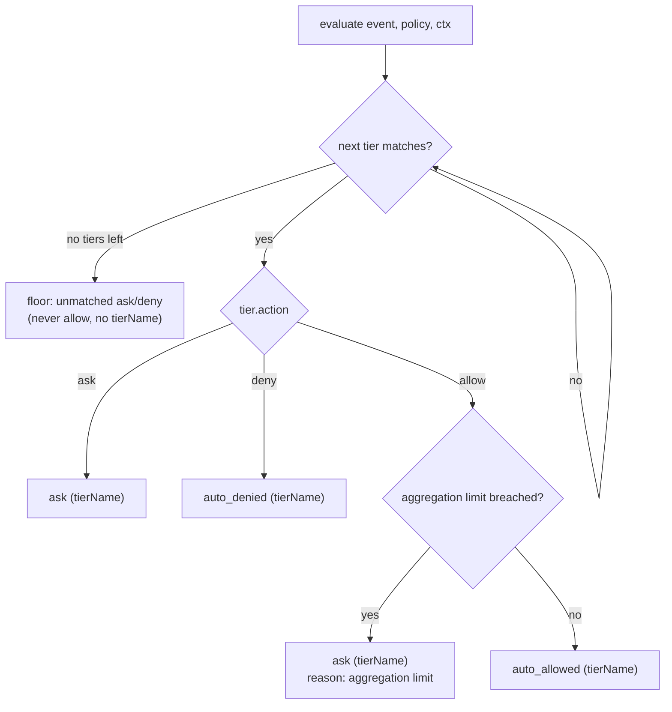

# Policy evaluation — the pure engine

> How a `Decision` is computed from an event and a `Policy`. Ordered tiers, first match
> wins; a matcher is a conjunction, a tier is a disjunction; the unmatched floor never
> allows; and the whole function never throws. The most-tested code in the repo.

The engine is `evaluate()` in `packages/policy/src/evaluate.ts:102`. Read
[concepts.md](../concepts.md#the-policy-format-breziayaml) for the `Policy`/`PolicyTier`/
`Matcher` shapes and [reference/policy-format.md](../reference/policy-format.md) for the
authoring surface; this page is the *semantics*.

## Contents

- [Purity: zero I/O, everything injected](#purity-zero-io-everything-injected)
- [Ordered tiers, first match wins](#ordered-tiers-first-match-wins)
- [The matcher algebra (AND-within, OR-across → DNF)](#the-matcher-algebra)
- [Tool, args, bash, flags — the four conditions](#tool-args-bash-flags--the-four-conditions)
- [The unmatched floor](#the-unmatched-floor)
- [Invariant 1: auto_allowed always names a tier](#invariant-1-auto_allowed-always-names-a-tier)
- [Never throws: any error → ask](#never-throws-any-error--ask)

---

## Purity: zero I/O, everything injected

`packages/policy` imports no `fs`, `net`, or `db` — it is the pure heart of the system
(the layering rule in [architecture.md](../architecture.md#the-contract-flows-everywhere-rule)).
`evaluate()` takes the event, the policy, and an `EvaluationContext` whose members are the
*only* way the outside world reaches the engine:

```ts
// packages/policy/src/evaluate.ts:90
export interface EvaluationContext {
  /** Flags computed before policy runs. Matchers may require them. */
  flags?: Flags;
  /** Clock as an input (keeps evaluate pure). Required to enforce aggregation limits. */
  now?: number;
  /** Prior-auto-allow counter for aggregation limits. Required to enforce them. */
  allowCounter?: AllowCounter;
}
```

Flags, the clock, and the counter arrive as inputs; the daemon owns the I/O and injects
`SqliteHistory`/`SqliteAllowCounter` (`packages/daemon/src/derived.ts`) at the call site
(`packages/daemon/src/index.ts:230`–`232`). This is exactly what makes the engine
exhaustively table-testable: `packages/policy/src/__tests__/evaluate.test.ts` drives it
with hand-built policies and plain objects, no server.

---

## Ordered tiers, first match wins

The firewall model (decision 004): tiers evaluate top to bottom, the first matching tier's
action decides, and nothing downstream can override it. There is no specificity scoring, no
weighting, no cleverness — outcomes are derivable by reading the file top to bottom (the
CODEOWNERS analogy). The loop is the whole engine:

```ts
// packages/policy/src/evaluate.ts:111
for (const tier of tiers) {
  if (!matchesTier(tier, event, flags)) continue;
  switch (tier.action) {
    case "allow": { /* aggregation-limit check, then auto_allowed — see below */ }
    case "deny":  return { decision: "auto_denied", tierName: tier.name, reason: `tier '${tier.name}'` };
    case "ask":   return { decision: "ask",         tierName: tier.name, reason: `tier '${tier.name}'` };
  }
}
```

An earlier `deny` tier therefore wins over a later `allow` tier for the same event — the
canonical "deny-rm before allow-bash" case is asserted at `evaluate.test.ts:97`. Every
returned `PolicyResult` from a matched tier stamps `tierName`, which feeds the card, the
audit `policy_decision` entry, and the reason string.

Inside `case "allow"`, the aggregation-limit check runs *before* returning `auto_allowed`:
a would-be allow whose per-key ceiling is already reached is escalated to `ask` (still
naming the tier). That interaction is documented in
[aggregation-limits.md](aggregation-limits.md); the branch is `evaluate.ts:118`.

---

## The matcher algebra

A tier's `match` is a list of matchers. The algebra (decision 010) is:

- **AND within a matcher** — every present condition must hold (`matchesMatcher`).
- **OR across a tier's matchers** — any matcher matching selects the tier (`matchesTier`).

```ts
// packages/policy/src/evaluate.ts:82
function matchesTier(tier: PolicyTier, event: ApprovalEvent, flags: Flags): boolean {
  return tier.match.some((m) => matchesMatcher(m, event, flags)); // OR
}
```

```ts
// packages/policy/src/evaluate.ts:61
function matchesMatcher(matcher: Matcher, event: ApprovalEvent, flags: Flags): boolean {
  if (matcher.tool  !== undefined && !matchTool(matcher.tool, event.tool))        return false;
  if (matcher.args  !== undefined && !matchArgs(matcher.args, event.arguments))   return false;
  if (matcher.bash  !== undefined && !matchBash(matcher.bash, event.arguments))   return false;
  if (matcher.flags !== undefined && !matchFlags(matcher.flags, flags))           return false;
  return true; // all present conditions held (AND)
}
```

> **Why AND-within, OR-across.** This yields **disjunctive normal form** — full boolean
> expressiveness. OR-across lets a tier list alternatives; AND-within lets a single matcher
> require a conjunction like *"secret AND first-time"*. OR-*within* a matcher would collapse
> to a flat OR and could never express that conjunction (decision 010). An empty matcher
> `{}` has no present conditions, so it matches everything — permitted but discouraged
> (`evaluate.ts:59` comment).

The DNF pairing is tested directly: OR-across at `evaluate.test.ts:88`, AND-within (flags)
at `evaluate.test.ts:68` where an `escalate` matcher requiring both `secrets_pattern` and
`first_time_command` is skipped when only one flag is active and falls through to the next
tier.

---

## Tool, args, bash, flags — the four conditions

Each condition fails toward *not matching* — a non-match sends the event to the next tier
and ultimately to the floor, never to an allow.

| Condition | Rule | Source | Fails toward |
|---|---|---|---|
| `tool` | exact string OR picomatch glob | `matchTool`, `evaluate.ts:14` | not-matching |
| `args` | per key: picomatch glob, or `re:` regex | `matchArg`, `evaluate.ts:21` | not-matching |
| `bash` | command classifies into a listed class | `matchBash`, `evaluate.ts:53` | not-matching |
| `flags` | every listed flag is active (AND) | `matchFlags`, `evaluate.ts:44` | not-matching |

**Tool** — exact equality short-circuits before picomatch, and tool names contain no `/`:

```ts
// packages/policy/src/evaluate.ts:14
function matchTool(pattern: string, tool: string): boolean {
  return pattern === tool || picomatch(pattern)(tool);
}
```

`mcp__*` matching `mcp__everything__echo` is asserted at `evaluate.test.ts:25`.

**Args** — values are picomatch globs by default; a `re:` prefix switches to a regular
expression. Two guards both fail toward not-allowing: a missing or non-string argument
never matches, and a *malformed* regex never matches (it does not throw):

```ts
// packages/policy/src/evaluate.ts:21
function matchArg(pattern: string, value: unknown): boolean {
  if (typeof value !== "string") return false;
  if (pattern.startsWith("re:")) {
    try { return new RegExp(pattern.slice(3)).test(value); }
    catch { return false; } // a malformed regex never matches
  }
  return picomatch(pattern)(value);
}
```

The malformed-regex-never-matches case is `evaluate.test.ts:62`; a missing arg key is
`evaluate.test.ts:57`.

**Bash** — the command must classify into one of the listed classes; an *unclassifiable*
command never matches, even if `"unclassifiable"` is somehow listed as a class. The full
classifier is [bash-classification.md](bash-classification.md); the matcher glue is:

```ts
// packages/policy/src/evaluate.ts:53
function matchBash(classes: string[], args: Record<string, unknown>): boolean {
  const klass = classifyBash(args.command);
  if (klass === UNCLASSIFIABLE) return false; // fail toward ask, never allow
  return classes.includes(klass);
}
```

**Flags** — the AND rule: every required flag must be strictly `true`
(`evaluate.ts:44`). Flags are computed before policy runs; see [flags.md](flags.md).

---

## The unmatched floor

If no tier matches, the result is the `defaults.unmatched` floor — `ask` or `deny`, and by
schema **never** `allow` (there is no allow-by-omission; `PolicyDefaultsSchema` enumerates
only `["ask", "deny"]`). The `?? "ask"` fallback means even a malformed/absent `defaults`
floors to `ask`:

```ts
// packages/policy/src/evaluate.ts:149
const unmatched = policy?.defaults?.unmatched ?? "ask";
return unmatched === "deny"
  ? { decision: "auto_denied", reason: "unmatched default" }
  : { decision: "ask", reason: "unmatched default" };
```

A floor result carries **no** `tierName` — which is correct, because it matched no tier.
`unmatched: deny` resolving `auto_denied` (never `auto_allowed`) is asserted at
`evaluate.test.ts:112` and in the permanent invariant test
`packages/policy/src/__tests__/invariants.test.ts:49`.

---

## Invariant 1: auto_allowed always names a tier

> **Invariant 1.** No event ever resolves `auto_allowed` without a named matching tier.
> The engine only ever returns `auto_allowed` from *inside* a matched `allow` tier, and it
> always stamps that tier's name:

```ts
// packages/policy/src/evaluate.ts:128
return {
  decision: "auto_allowed",
  tierName: tier.name,
  reason: `tier '${tier.name}'`,
};
```

There is no other `return` of `auto_allowed` in the file — the unmatched floor cannot
produce it, and the error path (below) cannot produce it. The permanent test
`invariants.test.ts:34` asserts every `auto_allowed` carries a non-empty `tierName` and
that unmatched events never resolve `auto_allowed` across varied tools. The daemon then
*re-checks* this at the edge and downgrades any tierless allow to `ask` before emitting —
the effective-decision guard, documented in
[request-lifecycle.md](request-lifecycle.md#the-effective-decision-guard-invariant-1-at-the-edge)
(`packages/daemon/src/index.ts:238`). Belt and suspenders on the one decision that must
never leak.



---

## Never throws: any error → ask

The entire body is wrapped so any unexpected error resolves to `ask` — never `allow`, never
a thrown exception escaping into the daemon:

```ts
// packages/policy/src/evaluate.ts:153
} catch {
  return { decision: "ask", reason: "policy evaluation error" };
}
```

This is invariant 2 at the policy layer: malformed input never throws out of evaluation and
never resolves toward allow. The permanent test
`invariants.test.ts:64` fuzzes it — `null` tiers, `undefined` defaults, empty tool, deeply
nested arguments — asserting each *does not throw* and *does not resolve `auto_allowed`*.
Combined with the daemon's own `try/catch` backstops
([request-lifecycle.md](request-lifecycle.md#the-never-brick-catches-invariant-2-at-the-edge)),
there is no path from a bad policy or a bad event to an emitted allow.

---

**Related:** [bash-classification.md](bash-classification.md) ·
[flags.md](flags.md) · [aggregation-limits.md](aggregation-limits.md) ·
[request-lifecycle.md](request-lifecycle.md) ·
[../reference/policy-format.md](../reference/policy-format.md) ·
[failure-semantics.md](failure-semantics.md).
