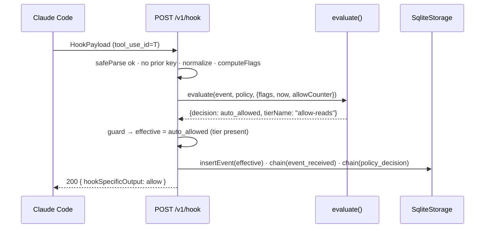
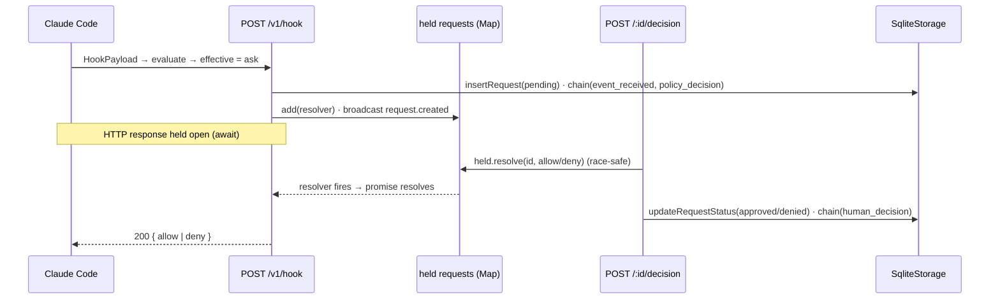
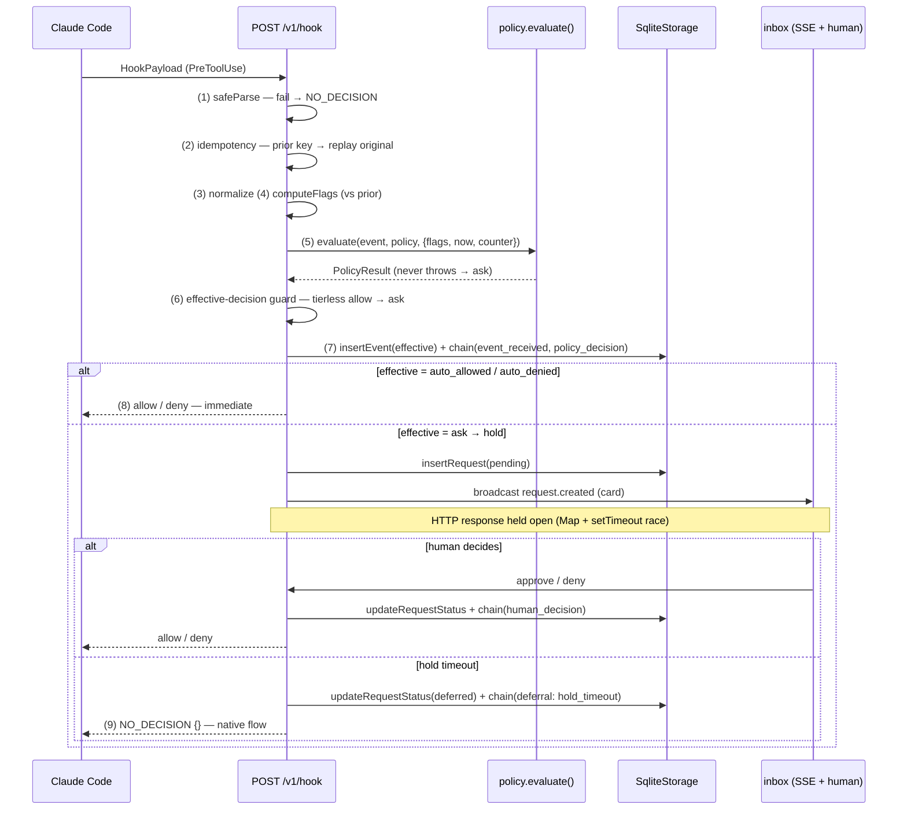

# Request lifecycle — the end-to-end pipeline

> The master flow doc. One tool call, traced from the hook POST to its resolution:
> every stage, every failure branch, the invariant-1 edge guard, and the never-brick
> catches — read line by line against the `/v1/hook` handler.

Read [concepts.md](../concepts.md) for the vocabulary and
[architecture.md](../architecture.md) for the altitude view first; this page assumes
both. Everything here lives in one handler —
`packages/daemon/src/index.ts:211` (`POST /v1/hook`) — plus its decision counterpart
`packages/daemon/src/index.ts:349` (`POST /v1/requests/:id/decision`) and the crash-recovery
sweep at `packages/daemon/src/index.ts:139`.

## Contents

- [The pipeline stages](#the-pipeline-stages)
- [The effective-decision guard (invariant 1 at the edge)](#the-effective-decision-guard-invariant-1-at-the-edge)
- [The never-brick catches (invariant 2 at the edge)](#the-never-brick-catches-invariant-2-at-the-edge)
- [Flow (a): auto-allow](#flow-a-auto-allow)
- [Flow (b): held → human decision](#flow-b-held--human-decision)
- [Flow (c): held → timeout → defer](#flow-c-held--timeout--defer)
- [Flow (d): idempotency replay](#flow-d-idempotency-replay)
- [Flow (e): crash recovery on restart](#flow-e-crash-recovery-on-restart)
- [The master sequence (Mermaid + ASCII)](#the-master-sequence)

---

## The pipeline stages

The handler is a straight line with two exits (auto-respond, or hold-then-respond) and
a fan of failure branches that all resolve *away* from `allow`. These are the canonical
stage names used across the internals docs (they mirror
[architecture.md](../architecture.md#the-request-lifecycle-end-to-end)):

| # | Stage | Code | Failure direction |
|---|---|---|---|
| 1 | **Validate** | `HookPayloadSchema.safeParse` (`index.ts:213`) | parse failure → `NO_DECISION` |
| 2 | **Idempotency** | `getEventByIdempotencyKey` (`index.ts:219`) | replay the original outcome |
| 3 | **Normalize** | `hookPayloadToEvent` (`index.ts:225`) | — (pure map) |
| 4 | **Compute flags** | `computeFlags(event, history)` (`index.ts:230`) | vs. *prior* events |
| 5 | **Evaluate** | `evaluatePolicy(event, policy, ctx)` (`index.ts:232`) | evaluator never throws → `ask` |
| 6 | **Effective-decision guard** | invariant-1 downgrade (`index.ts:238`) | tierless allow → `ask` |
| 7 | **Persist + chain** | `insertEvent` → `eventReceived` → `policyDecision` (`index.ts:268`–`287`) | UNIQUE collision → replay |
| 8 | **Auto-respond or hold** | `index.ts:290`–`333` | allow/deny answer now; `ask` holds |
| 9 | **Resolve** | human decision / hold timeout / crash recovery | timeout → `NO_DECISION` |

The whole body is wrapped so any unexpected throw resolves to no-decision
(`index.ts:212`, `:335`). Two structural rules make the ordering load-bearing:

- **Flags and limits read *prior* events.** Flags (stage 4) and the aggregation counter
  (inside stage 5) both query history/counts *before* this event is inserted (stage 7),
  so "first-time" and the anti-splitting count are always measured against the past
  (`index.ts:228`–`232`, comment at `:227`).
- **The persisted decision is the *effective* one.** Stage 7 stores `effective`, not the
  raw evaluator decision — so the counter, stats, and audit chain never credit an allow
  the daemon did not actually emit (`index.ts:263`, and the `StoredEvent.decision`
  contract note at [concepts.md](../concepts.md#storedevent)).

---

## The effective-decision guard (invariant 1 at the edge)

> **Invariant 1.** No event ever resolves `allow` without a named matching policy tier.
> The pure evaluator already guarantees this (it only returns `auto_allowed` from inside
> a matched tier, stamping `tierName` — see
> [policy-evaluation.md](policy-evaluation.md)). The daemon **re-checks it anyway** at
> the edge, because the hook response is the last place a bug could leak an allow.

```ts
// packages/daemon/src/index.ts:238
const allowWithTier =
  result.decision === "auto_allowed" &&
  typeof result.tierName === "string" &&
  result.tierName.length > 0;
const effective: Decision = allowWithTier
  ? "auto_allowed"
  : result.decision === "auto_allowed"
    ? "ask"        // tierless allow → downgraded, never emitted
    : result.decision;
```

A raw `auto_allowed` is honored *only* when it carries a non-empty `tierName`. A tierless
`auto_allowed` — which the pure evaluator can never legitimately produce — is treated as a
**policy-engine bug** and downgraded to `ask` (held for a human), never allowed by
omission. The downgrade is logged both to stderr and the diagnostics log so it is
diagnosable (`index.ts:247`–`254`):

```ts
// packages/daemon/src/index.ts:247
if (result.decision === "auto_allowed" && !allowWithTier) {
  console.error(
    "brezia: policy returned auto_allowed without a tier — downgraded to ask (policy bug)",
  );
  log("WARN policy returned auto_allowed without a tier — downgraded to ask");
}
```

This guard is tested from the edge with an injected evaluator that deliberately returns a
tierless allow: the response must be `{}` (held → timed out), never an allow
(`packages/daemon/src/hook-endpoint.test.ts:178`, and the boundary invariant test at
`packages/daemon/src/invariants.test.ts:44`). The complementary case — an allow *with* a
tier does emit `allow` — is `hook-endpoint.test.ts:165`.

---

## The never-brick catches (invariant 2 at the edge)

> **Invariant 2.** Ingestion never breaks the user. Garbage stdin, malformed POSTs, dead
> sockets, and pipeline exceptions all resolve to "no decision" — the empty
> `NO_DECISION = {}` hook response (`packages/daemon/src/hook-adapter.ts:50`) — so Claude
> Code's native permission flow proceeds. Nothing here ever fails toward `allow`.

There are **four** distinct never-brick catches on the hook path, each covering a
different failure surface:

| Catch | Location | Covers |
|---|---|---|
| Content-type parser | `index.ts:188` | Malformed JSON body → hand handler `undefined` (never a 400) |
| Fastify error handler | `index.ts:202` | Any thrown error on a `/v1/hook*` URL → 200 `NO_DECISION` |
| Handler `try/catch` | `index.ts:212`, `:335` | Any exception inside the pipeline → 200 `NO_DECISION` |
| `safeParse` guard | `index.ts:213` | Valid JSON, wrong shape → 200 `NO_DECISION` |

```ts
// packages/daemon/src/index.ts:188 — malformed JSON never 400s the boundary
app.addContentTypeParser("application/json", { parseAs: "string" }, (_req, body, done) => {
  try {
    done(null, body === "" ? undefined : JSON.parse(body as string));
  } catch {
    done(null, undefined); // → safeParse fails → NO_DECISION
  }
});
```

```ts
// packages/daemon/src/index.ts:202 — a 5xx is never surfaced as a decision on the hook path
app.setErrorHandler((_err, req, reply) => {
  if (req.url.startsWith("/v1/hook")) {
    return reply.code(200).send(NO_DECISION);
  }
  return reply.code(500).send({ error: "internal error" });
});
```

Both malformed-body and wrong-shape paths are asserted (`hook-endpoint.test.ts:48`,
`:61`; boundary invariant `invariants.test.ts:54`): status `200`, body `{}`. The
SSE and stats broadcasts are *also* guarded so a UI concern can never perturb a decision —
`broadcastStats()` swallows its own errors (`index.ts:128`).

---

## Flow (a): auto-allow

Policy matches an `allow` tier that names itself; the guard confirms the tier; the daemon
persists the effective `auto_allowed`, chains two rows (`event_received` +
`policy_decision`), and answers the hook immediately with an `allow` decision. No
`Request` row, no hold — the state machine in [concepts.md](../concepts.md#the-request-state-machine)
is skipped entirely.

```ts
// packages/daemon/src/index.ts:290
if (effective === "auto_allowed") {
  broadcastStats();
  return reply.code(200).send(hookDecision("allow", reasonForPolicy(result)));
}
```

`auto_denied` is the mirror image (`index.ts:294`) — immediate `deny`, same two audit
rows. Verified end-to-end at `packages/daemon/src/persistence.test.ts:58`: an auto-allow
writes exactly `["event_received", "policy_decision"]` and the chain verifies.



---

## Flow (b): held → human decision

Policy resolves `ask` (a matched `ask` tier, or the unmatched floor). The daemon inserts a
`pending` `Request` row, builds a `HeldRequest`, broadcasts the card, and **holds the HTTP
response open** on an `await new Promise` whose resolver is registered in the
`HeldRequests` map (`index.ts:301`–`333`). See the
[held-requests model](../architecture.md#the-held-requests-model).

```ts
// packages/daemon/src/index.ts:316
const body = await new Promise<unknown>((resolve) => {
  const timer = setTimeout(() => { /* hold-timeout path — flow (c) */ }, holdTimeoutMs);
  held.add(heldReq, (finalBody) => {
    clearTimeout(timer);
    resolve(finalBody);
  });
  sse.broadcast("request.created", cardPayload(heldReq));
});
return reply.code(200).send(body);
```

A human POSTs to `/v1/requests/:id/decision` (`index.ts:349`). That handler validates the
action, looks up the held entry, builds the `allow`/`deny` hook response, and completes the
held promise via `held.resolve(id, response)` — which returns `false` (→ 404) if the id is
already gone, making it **race-safe against the timeout**:

```ts
// packages/daemon/src/index.ts:363
const approve = body.action === "approve";
const response = approve
  ? hookDecision("allow", reason ? `brezia: ${reason}` : "brezia: approved")
  : hookDecision("deny", reason ? `brezia: ${reason}` : "brezia: denied");
if (!held.resolve(id, response)) {
  return reply.code(404).send({ error: "unknown or already-resolved request" });
}
storage.updateRequestStatus(id, approve ? "approved" : "denied", Date.now(), reason);
chain.humanDecision({ requestId: id, eventId: entry.eventId, status: approve ? "approved" : "denied", reason });
```

Only *after* the held response is completed does the daemon update the request row and
chain `human_decision`, then broadcast `request.resolved`. An approved event chains three
rows total (`event_received` → `policy_decision` (ask) → `human_decision`) — the
decision-011 shape — verified at `persistence.test.ts:71` and
`hook-endpoint.test.ts:87`/`:106`.



---

## Flow (c): held → timeout → defer

If no human decides within `holdTimeoutMs` (default `DEFAULT_HOLD_TIMEOUT_MS = 290_000` —
just under the 300s hook timeout `brezia init` installs, so Brezia defers first, `index.ts:61`),
the `setTimeout` fires. It
marks the request **`deferred`** (not `expired`), chains a `deferral` with cause
`hold_timeout`, broadcasts the resolution, and completes the held response with
`NO_DECISION` so the native flow proceeds:

```ts
// packages/daemon/src/index.ts:317
const timer = setTimeout(() => {
  if (held.has(requestId)) {
    storage.updateRequestStatus(requestId, "deferred", Date.now(), "hold timeout");
    chain.deferral({ requestId, eventId, cause: "hold_timeout" });
    sse.broadcast("request.resolved", { id: requestId, status: "deferred" });
    log(`defer hold_timeout ${requestId}`);
  }
  held.resolve(requestId, NO_DECISION); // native flow (never-brick)
}, holdTimeoutMs);
```

The `held.has(requestId)` check inside the timer is the other half of the race guard: if a
human already resolved the id, `has` is false and the timer only no-ops through
`held.resolve` (which also returns false). Verified at `persistence.test.ts:86`: the chain
becomes `["event_received", "policy_decision", "deferral"]` with `cause: "hold_timeout"`,
the request lands in `listRequestsByStatus("deferred")`, and the chain verifies.

> **Failure direction.** A timeout is Brezia *declining to decide*, not denying. The
> response is `NO_DECISION` (`{}`), so Claude Code's own permission prompt takes over —
> degraded Brezia equals normal Claude Code (decision 006). `deferred` — never `expired` —
> is the only status the timeout path writes.

---

## Flow (d): idempotency replay

Every real Claude Code tool call carries a unique `tool_use_id`; the adapter maps it to
`idempotencyKey` (`hook-adapter.ts:16`). A retried id must return the *same* outcome it got
the first time, without inserting a second event or re-chaining. Two guards enforce this:

**Pre-evaluation replay** — before any work, if the key is already persisted, return the
reconstructed original response (`index.ts:219`):

```ts
// packages/daemon/src/index.ts:219
const key = parsed.data.tool_use_id;
const prior = storage.getEventByIdempotencyKey(key);
if (prior !== undefined) {
  return reply.code(200).send(replayResponse(storage, prior));
}
```

**Race-loser replay** — if two duplicates arrive concurrently, both pass the pre-check;
the second loses the `UNIQUE(idempotency_key)` insert and replays the now-persisted winner
(`index.ts:267`):

```ts
// packages/daemon/src/index.ts:267
try {
  storage.insertEvent(stored);
} catch {
  const raced = storage.getEventByIdempotencyKey(key);
  return reply.code(200).send(raced ? replayResponse(storage, raced) : NO_DECISION);
}
```

`replayResponse` (`packages/daemon/src/replay.ts:13`) reconstructs the wire response from
the stored decision. Auto decisions replay faithfully from the recorded tier; an `ask`
event replays its request's *terminal* status (approved → allow, denied → deny); anything
still `pending`/`deferred`/`expired`/unknown replays `NO_DECISION` — a duplicate mid-hold
is a pathological retry, and never-brick beats guessing:

```ts
// packages/daemon/src/replay.ts:24
case "ask": {
  const request = storage.getRequestByEventId(stored.id);
  if (request?.status === "approved") return hookDecision("allow", `brezia: ${request.reason ?? "approved"}`);
  if (request?.status === "denied")   return hookDecision("deny",  `brezia: ${request.reason ?? "denied"}`);
  return NO_DECISION; // pending / deferred / expired / unknown → native flow
}
```

Replay is verified at `persistence.test.ts:101` (auto-deny replays without a second event
or re-chain — `statsSince(0).total` stays `1`, chain length unchanged) and `:116` (a
human deny outcome, including its reason, replays for a resolved held request).

---

## Flow (e): crash recovery on restart

The held-requests `Map` is in-memory only; if the daemon dies, every open connection dies
with it, leaving `pending` rows in the `requests` table that no live promise can ever
resolve. On the next boot, `createServer` sweeps them: each `pending` row is resolved
`deferred` with cause `crash_recovery` and chained, so the audit log stays truthful about
what Brezia did *not* decide.

```ts
// packages/daemon/src/index.ts:139
for (const req of storage.listRequestsByStatus("pending")) {
  storage.updateRequestStatus(req.id, "deferred", Date.now(), "daemon restart");
  chain.deferral({ requestId: req.id, eventId: req.eventId, cause: "crash_recovery" });
  log(`defer crash_recovery ${req.id}`);
}
```

This runs before the routes are registered, so recovery completes as part of server
construction. Verified at `persistence.test.ts:131`: a `pending` request left over from a
"prior process" becomes `deferred`, the last audit row is a
`{kind: "deferral", cause: "crash_recovery"}`, and the chain verifies. This is the
enforcement half of the hard rule *"on daemon restart, all `pending` requests resolve
`deferred` and are chained."*

---

## The master sequence

Both paths in one diagram — the branch at the effective-decision guard is the whole story.



ASCII fallback for the master sequence:

```
Claude Code ── POST HookPayload ──▶ /v1/hook
                                     │
   (1) safeParse ── fail ───────────┼──▶ 200 NO_DECISION {}  (native flow)
   (2) prior idempotency key? ──yes─┼──▶ 200 replayResponse(original)
   (3) normalize → ApprovalEvent    │
   (4) computeFlags(event, history) │   (reads PRIOR events)
   (5) evaluate(...) ── throws? ────┼──▶ (caught) → ask
        │  PolicyResult             │
   (6) effective-decision guard     │
        │  tierless auto_allowed? ──┼──▶ downgrade to ask (+log)
   (7) insertEvent(effective)       │
        │  UNIQUE collision? ───────┼──▶ 200 replay raced winner
        │  chain: event_received, policy_decision
        │
        ├── effective = auto_allowed ─▶ 200 allow  (immediate)
        ├── effective = auto_denied  ─▶ 200 deny   (immediate)
        └── effective = ask ─▶ insertRequest(pending)
                               broadcast request.created
                               HOLD (await Promise, setTimeout races)
                                 │
                 ┌───────────────┼────────────────┐
            human approve    human deny        hold timeout
                 │               │                 │
          update(approved)  update(denied)   update(deferred)
          chain(human)      chain(human)     chain(deferral:hold_timeout)
                 │               │                 │
            200 allow        200 deny         200 NO_DECISION {}

        [ crash recovery, at boot ]  every leftover pending row →
             update(deferred, "daemon restart") + chain(deferral: crash_recovery)
```

---

**Related:** [policy-evaluation.md](policy-evaluation.md) for stage 5;
[flags.md](flags.md) for stage 4; [bash-classification.md](bash-classification.md) and
[aggregation-limits.md](aggregation-limits.md) for what happens inside stage 5;
[audit-chain.md](audit-chain.md) for the chaining in stages 7 and 9;
[hook-integration.md](hook-integration.md) for the transport;
[failure-semantics.md](failure-semantics.md) for the invariants;
[../reference/http-api.md](../reference/http-api.md) for the endpoint surface.
