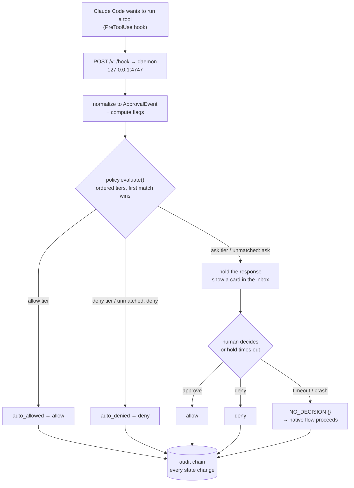

# Overview — the system in one page

> Brezia is an approval control plane for AI agents. Policy auto-resolves the routine
> tool calls; a human decides the rest in a localhost inbox; every state change lands in
> a hash-chained audit log. This page is the mental model — the problem, the loop, and
> the three invariants that shape every design choice.

## The problem

An AI coding agent asks permission constantly — every file write, every shell command,
every tool call surfaces a prompt. Most are routine (`Read`, `ls`, `grep`); a few genuinely
matter (`rm -rf`, a `curl` carrying a secret, a first-time tool). Faced with a firehose of
prompts that are 90% noise, a human either wears down and blanket-approves — defeating the
point — or drowns. The signal that matters is buried in routine.

Brezia's answer: **let a reviewed policy auto-resolve the routine, route only the rest to
a human, and record every decision as tamper-evident evidence.** The policy file is a repo
artifact you read top-to-bottom like CODEOWNERS (decision 004); the human sees a short
queue of things that actually need judgment; and the audit log proves what was decided,
by whom or by which rule, and in what order.

Brezia "sits in the tool-call path of other people's agents," so its guiding principle is
blunt: **failure semantics outrank features, and predictable outranks clever.** A degraded
Brezia must never be worse than no Brezia.

## The loop

One tool call travels this path. Claude Code routes its `PreToolUse` interrupt to the
daemon over an HTTP hook (decision 008); the daemon normalizes it, computes anomaly flags,
evaluates policy, and either answers immediately or **holds the response open** while a
human decides in the inbox. Every step is chained into the audit log.



ASCII fallback — the one diagram to keep in your head:

```
  Claude Code (PreToolUse hook)
        |
        v
  POST /v1/hook  ->  normalize to ApprovalEvent + compute flags
        |
        v
  policy.evaluate()  (ordered tiers, first match wins)
        |
   +----+-------------------+----------------------+
   |                        |                      |
 allow tier             deny tier             ask tier / unmatched
   |                        |                      |
 auto_allowed          auto_denied          HOLD the HTTP response
   -> allow             -> deny             show a card in the inbox
                                                   |
                                        +----------+-----------+
                                        |                      |
                                 human approve/deny     timeout / crash
                                        |                      |
                                   allow / deny         NO_DECISION {}
                                                        (native flow proceeds)
        |                        |                      |
        +------------------------+----------------------+
                                 |
                                 v
                    audit chain: every state change
                 (event_received, policy_decision,
                  human_decision, deferral, policy_reload)
```

The distinctive move is the **hold**: an `ask` does not reject or queue-and-forget — it
keeps the hook's HTTP response open (an entry in an in-memory map, no worker, no queue)
until a human clicks approve/deny or the hold times out. On timeout the response is an
empty body — `NO_DECISION` — so Claude Code's native permission prompt takes over. See
[architecture.md](architecture.md) for the topology and
[internals/request-lifecycle.md](internals/request-lifecycle.md) for the full pipeline.

Three supporting mechanisms make the loop trustworthy:

- **Flags before policy.** Anomaly signals — `secrets_pattern`, `first_time_tool`,
  `first_time_command` — are computed *before* evaluation, so matchers can require them
  and cards always display them. ([internals/flags.md](internals/flags.md))
- **Bash classification fails toward ask.** A shell command is just a string; the
  classifier is conservative by construction — any compound or expansion construct is
  unclassifiable and cannot match an allow tier.
  ([internals/bash-classification.md](internals/bash-classification.md))
- **Aggregation limits.** A ceiling stops laundering one big change into many small
  auto-allows: too many auto-allows on a key escalate the next to `ask`.
  ([internals/aggregation-limits.md](internals/aggregation-limits.md))

## The three invariants

These are not guidelines. They are **permanent tests that are never weakened, skipped, or
deleted — if a change breaks one, the change is wrong, never the test.** They are the spine
of the system and the reason a control plane in the tool-call path is safe to run.

> **Invariant 1 — no allow by omission.** No event ever resolves `allow` without a named
> matching policy tier. `unmatched: ask` is the floor. The pure evaluator only returns
> `auto_allowed` from inside a matched tier (stamping its `tierName`), and the daemon
> re-checks it — downgrading a tierless allow to `ask` before emitting anything.
> Tested in `packages/policy/src/__tests__/invariants.test.ts:34` and, at the boundary,
> `packages/daemon/src/invariants.test.ts:44`.

> **Invariant 2 — ingestion never breaks the user.** Garbage stdin, malformed POSTs, dead
> sockets, and pipeline exceptions all resolve to "no decision" → the runtime's native
> flow proceeds. A degraded Brezia is just normal Claude Code. Fuzz-tested; the boundary
> counterpart asserts a malformed JSON body returns `200 {}`
> (`packages/daemon/src/invariants.test.ts:54`).

> **Invariant 3 — the audit chain verifies end to end.** After every test-suite run, the
> hash-chained log (`hash = sha256(prev_hash + entry_json)`, genesis at seq 1) verifies —
> and a tampered chain is detected. Asserted through a real held→decide loop in
> `packages/daemon/src/invariants.test.ts:67`.

Underneath the invariants runs one uncompromising rule: **nothing anywhere fails toward
`allow`.** Policy-layer errors resolve to `ask`; ingestion-boundary errors resolve to
`NO_DECISION`. There is no catch-all that returns allow, and a 5xx is never surfaced as a
decision. The full failure-direction table is in
[internals/failure-semantics.md](internals/failure-semantics.md).

## What v0 is — and isn't

**v0 is single-player.** One human, one machine, everything on `127.0.0.1`. Localhost
binding *is* the security model — no auth, no CORS, non-configurable address
([security.md](security.md)). Failure direction is "never brick": daemon dead, slow, or
timed out → native prompt (decision 006). The stack is fixed and small (decision 001):
Node + TypeScript, npm workspaces, Fastify, `better-sqlite3` (WAL), zod, React with a
single `useReducer`. The schema is three tables; there is no ORM.

**v0 deliberately does not build ahead.** Out of scope: the MCP proxy, flood detection,
batching, delegation, multi-approver, routing, `needs_info`, auth/OAuth, Postgres,
webhooks, risk scoring, chat integrations. The single allowed piece of foresight is the
`StorageAdapter` interface (~10 methods) with SQLite as the only implementation, so a
future Postgres is an implementation and not a rewrite (decision 003). The policy format
reserves two v1 keys (`route`, `batch`) as accepted-and-ignored so a forward-compatible
file loads today, but the routing/batching *capabilities* stay unbuilt (decision 014).

What *is* fully in v0: the hook loop, the pure policy engine (ordered tiers, matcher
algebra, bash classification, flags, aggregation limits), SQLite persistence, the
hash-chained audit log with `brezia verify`/`export`, the React inbox, and the six-command
CLI.

## Where to go next

- **The vocabulary and core types** → [concepts.md](concepts.md)
- **How it's wired (packages, topology, lifecycle)** → [architecture.md](architecture.md)
- **The invariants and every failure direction** →
  [internals/failure-semantics.md](internals/failure-semantics.md)
- **Get it running** → [guides/getting-started.md](guides/getting-started.md)
- **The full doc map** → [README.md](README.md)
