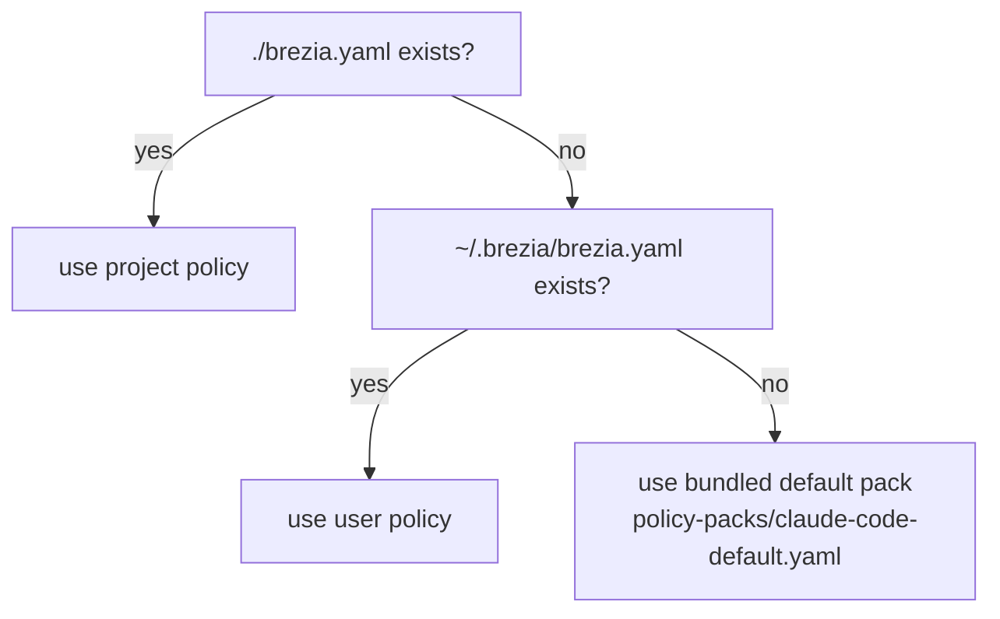

# Configuration — files, paths, and the hook entry

> Everything configurable in Brezia, and every file it reads or writes: the Claude Code
> hook entry, where `brezia.yaml` lives and how it's resolved, the `~/.brezia/` runtime
> directory, and the one thing that is deliberately *not* configurable — the address the
> daemon binds.

Brezia's configuration surface is intentionally tiny. The security model depends on it:
the bind address is a constant, not a setting. Read
[../architecture.md](../architecture.md#runtime-topology) for the topology and
[policy-format.md](policy-format.md) for the policy file's contents.

## Contents

- [The configuration surface at a glance](#the-configuration-surface-at-a-glance)
- [The Claude Code hook entry](#the-claude-code-hook-entry)
- [`brezia.yaml` locations and resolution order](#breziayaml-locations-and-resolution-order)
- [The `~/.brezia/` runtime directory](#the-breziahome-runtime-directory)
- [Ports and binding](#ports-and-binding)
- [Policy hot reload](#policy-hot-reload)
- [The starter policy](#the-starter-policy)
- [What is not configurable](#what-is-not-configurable)

---

## The configuration surface at a glance

| Thing | Where | Set by | Configurable? |
|---|---|---|---|
| Hook entry | `.claude/settings.json` (project) or `~/.claude/settings.json` (user) | `brezia init` | via scope flag |
| Policy | `./brezia.yaml` or `~/.brezia/brezia.yaml` | `brezia init` (starter), you (edits) | yes — it's the policy |
| Database | `~/.brezia/brezia.db` | daemon | no (fixed path) |
| PID file | `~/.brezia/brezia.pid` | `brezia up` | no |
| Diagnostics log | `~/.brezia/brezia.log` | `brezia up` | no |
| Bind address | `127.0.0.1` | constant | **no — never** |
| Port | `4747` | constant (test-injectable) | no in normal use |
| Hook timeout | `300` s in settings; `600` s hold default | `init` writes 300; daemon default 600 | via the settings entry |

---

## The Claude Code hook entry

`brezia init` installs a single `PreToolUse` hook into Claude Code's settings that points
at the daemon. The exact shape was verified live against the installed Claude Code (decision
008) — never coded from memory:

```ts
// packages/cli/src/settings.ts:15
export const BREZIA_HOOK_URL = "http://127.0.0.1:4747/v1/hook";
export const BREZIA_HOOK_TIMEOUT = 300;

// packages/cli/src/settings.ts:20
function breziaGroup(): Record<string, unknown> {
  return {
    matcher: "*",
    hooks: [{ type: "http", url: BREZIA_HOOK_URL, timeout: BREZIA_HOOK_TIMEOUT }],
  };
}
```

The written entry, in `settings.json`:

```json
{
  "hooks": {
    "PreToolUse": [
      {
        "matcher": "*",
        "hooks": [
          { "type": "http", "url": "http://127.0.0.1:4747/v1/hook", "timeout": 300 }
        ]
      }
    ]
  }
}
```

| Field | Value | Meaning |
|---|---|---|
| `matcher` | `"*"` | Governs every tool (Brezia's own policy narrows from there). |
| `hooks[].type` | `"http"` | The HTTP-hook transport — no client binary (decision 008). |
| `hooks[].url` | `http://127.0.0.1:4747/v1/hook` | The daemon's ingestion endpoint. |
| `hooks[].timeout` | `300` | Seconds Claude Code waits before proceeding via native flow. |

> **High-stakes — settings editing.** `init`/`remove` edit a real user file. The design
> keeps them safe: Brezia manages its **own** matcher group (identified solely by the
> daemon URL), never merging into anyone else's; it deep-clones before editing so the
> backup stays the true pre-edit state; it is idempotent; and `remove` drops only our
> group, restoring the file byte-identically for standard formatting. The pure surgery
> lives in `packages/cli/src/settings.ts` (no I/O, exhaustively tested against files that
> already contain other people's hooks); the backup + atomic write live in
> `packages/cli/src/init.ts`. Full command reference: [cli.md](cli.md).

The write itself is atomic and backed up (`packages/cli/src/init.ts:86,95`): a timestamped
`.brezia-backup-<iso>` copy is made, then a sibling temp file is renamed over the target so
a crash mid-write can't corrupt `settings.json`. A file that isn't valid JSON is refused
untouched with an actionable error (`init.ts:70`).

> **Timeout note.** `init` writes `timeout: 300` into settings, while the daemon's default
> **hold** timeout is `600` s (`DEFAULT_HOLD_TIMEOUT_MS`, `packages/daemon/src/index.ts:61`,
> aligned to Claude Code's own 600 s default). The settings `timeout` is the shorter of the
> two, so in practice Claude Code proceeds via native flow at ~300 s. Either way the held
> response resolves to `NO_DECISION` if no human decides — the never-brick outcome.

---

## `brezia.yaml` locations and resolution order

Two commands resolve the policy path, and they must agree.

**Where `init` writes** depends on scope (`resolvePaths`, `packages/cli/src/init.ts:21`):

| Scope | `settings.json` | `brezia.yaml` |
|---|---|---|
| `project` (default) | `./.claude/settings.json` | `./brezia.yaml` |
| `user` | `~/.claude/settings.json` | `~/.brezia/brezia.yaml` |

**Where `up` reads** is a fixed precedence — the first file that exists wins
(`resolvePolicyPath`, `packages/cli/src/up.ts:22`):

```ts
// packages/cli/src/up.ts:22
export function resolvePolicyPath(cwd = process.cwd(), home = homedir()): string {
  const candidates = [
    join(cwd, "brezia.yaml"),                    // 1. project-local
    join(home, ".brezia", "brezia.yaml"),        // 2. user
    defaultPackPath(),                           // 3. bundled default pack
  ];
  return candidates.find((p) => existsSync(p)) ?? defaultPackPath();
}
```



So a repo-local `brezia.yaml` overrides a user one, which overrides the bundled default
(`policy-packs/claude-code-default.yaml`, resolved by `defaultPackPath`,
`packages/cli/src/init.ts:31`). If nothing is loaded at all, the daemon still runs the
no-allow floor — `unmatched: ask`, empty tiers — so it never auto-allows
(`DEFAULT_POLICY`/`SAFE_DEFAULT_POLICY`, `packages/daemon/src/index.ts:53`,
`packages/daemon/src/policy-loader.ts:7`).

---

## The `~/.brezia/` runtime directory

The daemon's home. All under `join(homedir(), ".brezia")`:

| File | Purpose | Created by |
|---|---|---|
| `brezia.db` | SQLite database — events, requests, and the audit chain (WAL mode). Doubles as the portable evidence artifact. | `start()` (`packages/daemon/src/index.ts:44,431`) |
| `brezia.pid` | Guards against a second daemon instance; holds the process id. | `brezia up` (`packages/cli/src/up.ts:15`) |
| `brezia.log` | Append-only human-readable diagnostics ("what happened / why"), rotated at ~5 MB. | `makeLogger` (`packages/daemon/src/logger.ts:13`) |
| `brezia.yaml` | The user-scope policy (only when `init --user` was used). | `brezia init --user` |

The default DB path is a fixed function, not a setting:

```ts
// packages/daemon/src/index.ts:44
export function defaultDbPath(): string {
  return join(homedir(), ".brezia", "brezia.db");
}
```

`brezia up` writes its PID file, refusing to start if a live process already holds one
(`packages/cli/src/up.ts:93`), and removes it on clean shutdown. The **diagnostics log** is
distinct from the **audit chain**: the log is a best-effort ops view (a write failure never
touches the decision path — `logger.ts:26`), while the audit chain in `brezia.db` is the
tamper-evident record (`brezia verify`). See
[../internals/audit-chain.md](../internals/audit-chain.md) and
[../guides/operations.md](../guides/operations.md).

---

## Ports and binding

The bind address and port are constants:

```ts
// packages/daemon/src/index.ts:39
export const HOST = "127.0.0.1";
export const PORT = 4747;
```

- **`HOST` is never configurable.** `ServerOptions` exposes a `port` (defaulting to `4747`;
  tests pass `port: 0` for an ephemeral port), but there is deliberately **no** address
  option — the doc-comment on `port` says so: *"The address (HOST) is never configurable."*
  (`packages/daemon/src/index.ts:66`).
- **Startup asserts loopback.** After `listen()`, `start()` walks every bound address and
  throws if any is not `127.0.0.1`, closing the server first
  (`packages/daemon/src/index.ts:440`). A test binds for real and checks it
  (`hook-endpoint.test.ts:253`).
- **Port-in-use** is reported with a clear, actionable message rather than a stack trace
  (`packages/cli/src/up.ts:114`).

> **Security.** Localhost binding *is* the v0 security model — no auth, no CORS, no
> configurable address, and the inbox served same-origin so there is no legitimate
> cross-origin client. Widening the bind, adding permissive CORS, or making the address
> configurable are all explicitly forbidden. See [../security.md](../security.md).

---

## Policy hot reload

The daemon watches the resolved `brezia.yaml` with chokidar and reloads on change. The
sequence is **parse → validate → atomic swap**; an invalid file keeps the previous policy
and never crashes and never fails open:

```ts
// packages/daemon/src/policy-loader.ts:65
load(path: string): boolean {
  const r = loadPolicyFile(path);
  if (r.ok && r.policy !== undefined) {
    this.current = r.policy; // atomic swap
    this.lastError = null;
    return true;
  }
  this.lastError = r.error ?? "unknown policy load error";
  return false;
}
```

On every reload the daemon chains a `policy_reload` audit entry (ok/failed) and broadcasts a
`policy.error` SSE event — an error string on a bad reload to drive the inbox banner, or
`null` to clear it on a good one (`packages/daemon/src/index.ts:158`). A rejected reload
logs a line naming the fix and keeps serving the last-known-good policy. The watcher uses
`awaitWriteFinish` so a half-written file isn't parsed mid-save
(`packages/daemon/src/policy-loader.ts:78`). Authoring/reload workflow:
[../guides/writing-policy.md](../guides/writing-policy.md).

---

## The starter policy

`brezia init` seeds a policy if one doesn't already exist, and **never overwrites** an
existing file:

```ts
// packages/cli/src/init.ts:133
if (existsSync(policyFile)) {
  msgs.push(`  kept your existing policy at ${policyFile}.`);
} else {
  mkdirSync(dirname(policyFile), { recursive: true });
  writeFileSync(policyFile, opts.packContent ?? readDefaultPack(), "utf8");
  msgs.push(`✓ wrote a starter policy to ${policyFile}.`);
}
```

The seeded content is the bundled default pack (`readDefaultPack`,
`packages/cli/src/init.ts:34`), whose annotated tiers are documented in
[policy-format.md](policy-format.md#worked-example-the-annotated-default-pack). Editing that
file (or a project-local `brezia.yaml`) and saving triggers the hot-reload above.

---

## What is not configurable

By design — these are guarantees, not omissions:

| Not configurable | Why |
|---|---|
| The bind address (`127.0.0.1`) | It *is* the v0 security model (decision 006 / boundaries). |
| CORS / auth | No cross-origin client exists; same-origin UI. |
| The DB path (`~/.brezia/brezia.db`) | Fixed evidence-artifact location. |
| Telemetry / phone-home / update checks | None exist. Ever. |
| `audit_log` mutability | Append-only; no UPDATE/DELETE exists in the codebase. |
| Allow-by-omission | `unmatched` accepts only `ask`/`deny` — never `allow`. |

---

**Next:** [cli.md](cli.md) for the commands that manage these files,
[../internals/hook-integration.md](../internals/hook-integration.md) for the hook contract,
or [../security.md](../security.md) for why the bind and telemetry stances are load-bearing.
