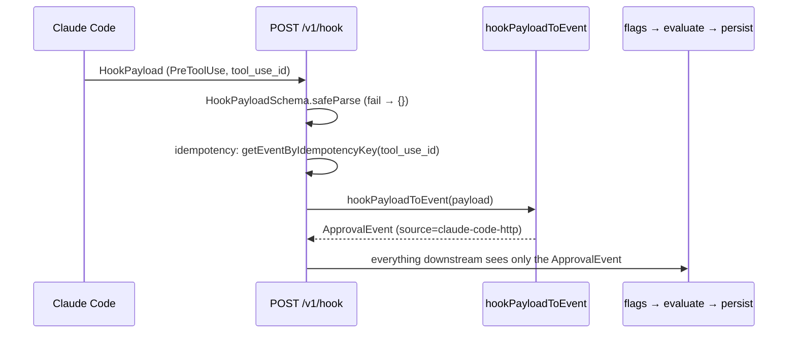

# Events API — the generic approval contract

> The runtime-agnostic contract every approval flows through: the `ApprovalEvent`
> schema, the idempotency rule, the hook-payload → event mapping, and the versioning
> policy. This is the standard-setting surface — versioned from commit one,
> additive-only after v0 — that the Claude Code hook endpoint is merely an *adapter*
> over.

Read [concepts.md](../concepts.md) first for `ApprovalEvent`, `HookPayload`, and the
**hook adapter**. This page is the "why it's a contract, not a Claude Code plugin" story.

## Contents

- [Why a generic Events API](#why-a-generic-events-api)
- [The `ApprovalEvent` schema](#the-approvalevent-schema)
- [Idempotency](#idempotency)
- [The hook payload](#the-hook-payload)
- [The hook-payload → event mapping](#the-hook-payload--event-mapping)
- [The hook endpoint is an adapter](#the-hook-endpoint-is-an-adapter)
- [Versioning policy](#versioning-policy)

---

## Why a generic Events API

Brezia is "an approval control plane for AI agents," not "a Claude Code plugin." The seam
that makes that true is the `ApprovalEvent`: everything downstream of the ingestion edge —
flags, policy, storage, the audit chain, the inbox — operates on an `ApprovalEvent` and
never sees a raw runtime payload. The one Claude-Code-specific module is the hook adapter
(`packages/daemon/src/hook-adapter.ts`); swap it for another runtime's adapter and the rest
of the system is unchanged.

The transport was chosen to be the dumbest possible integration (decision 002): **one
POST, a JSON body, an `Idempotency-Key` header** — implementable from any language in
minutes, no client library, no query language. That is what makes "point your hook at
Brezia" a plausible default.

> **Status at v0.** The generic endpoint `POST /v1/approval-events` is **stubbed** — it
> returns `501` (`packages/daemon/src/index.ts:416`). The live ingestion path at v0 is
> `POST /v1/hook`, which accepts a Claude Code `HookPayload` and adapts it to an
> `ApprovalEvent` internally. This page documents the *contract*; the contract is the
> promise, and it is fixed now even though the generic handler lands in a later phase. See
> [http-api.md](http-api.md#post-v1approval-events).

```mermaid
flowchart LR
    cc["Claude Code<br/>HookPayload"] -->|POST /v1/hook| adapt["hookPayloadToEvent()<br/>(the adapter)"]
    other["any runtime<br/>ApprovalEvent"] -.->|POST /v1/approval-events<br/>(v0: 501 stub)| ev
    adapt --> ev["ApprovalEvent<br/>(THE contract)"]
    ev --> flags[computeFlags]
    flags --> pol["evaluate()"]
    pol --> store[(storage + audit chain)]
```

---

## The `ApprovalEvent` schema

Brezia's normalized, runtime-agnostic event. Defined in `shared` — THE contract — and
imported everywhere:

```ts
// packages/shared/src/index.ts:24
export const ApprovalEventSchema = z.object({
  source: z.string(),
  session: z.string(),
  tool: z.string(),
  arguments: z.record(z.unknown()),
  context: z.object({
    task: z.string().optional(),
    workspace: z.string().optional(),
    owner: z.string().optional(),
    cwd: z.string().optional(),
    worktree: z.string().optional(),
  }).optional(),
  idempotencyKey: z.string().optional(),
});
```

| Field | Type | Meaning | Downstream use |
|---|---|---|---|
| `source` | `string` | Origin, e.g. `"claude-code-http"`. | audit `event_received` |
| `session` | `string` | Runtime session id. | inbox grouping; `session` aggregation key |
| `tool` | `string` | Tool name, e.g. `Bash`, `Read`, `mcp__everything__echo`. | tool matching; `first_time_tool`; `tool` aggregation key |
| `arguments` | `Record<string, unknown>` | Raw tool input. `arguments.command` is where Bash classification and `first_time_command` look. | matchers; flags |
| `context?` | object | Optional `task`/`workspace`/`owner`/`cwd`/`worktree`. | `cwd`/`worktree` → multi-session grouping; `owner` → `agent` aggregation key |
| `idempotencyKey?` | `string` | Dedupe key; the adapter sets it from `tool_use_id`. | idempotency replay |

`arguments` is `z.record(z.unknown())` — deliberately open, because a tool's input shape is
the runtime's, not Brezia's. The matcher engine reads specific keys (`command`, `file_path`,
…) defensively: a missing or non-string value simply fails to match, never toward allow
(`packages/policy/src/evaluate.ts:21`).

---

## Idempotency

The rule (decision 009): **a retried tool call
returns the same outcome it got the first time.** The runtime's `tool_use_id` is the
idempotency key.

- On the wire (the future generic endpoint): the caller sends an `Idempotency-Key` header.
- Via the hook adapter today: `tool_use_id` → `ApprovalEvent.idempotencyKey`
  (`packages/daemon/src/hook-adapter.ts:17`), persisted as `events.idempotency_key`, which
  carries a `UNIQUE` constraint (`packages/daemon/src/sqlite-storage.ts:49`).

The daemon checks the key **before** evaluating policy and replays the original outcome if
it's a duplicate (`packages/daemon/src/index.ts:219`). Replay is faithful for the decision;
the reason string may read slightly more generic:

```ts
// packages/daemon/src/replay.ts:19
switch (stored.decision) {
  case "auto_allowed":
    return hookDecision("allow", autoReason);
  case "auto_denied":
    return hookDecision("deny", autoReason);
  case "ask": {
    const request = storage.getRequestByEventId(stored.id);
    if (request?.status === "approved") return hookDecision("allow", /* … */);
    if (request?.status === "denied")   return hookDecision("deny",  /* … */);
    return NO_DECISION; // pending / deferred / expired / unknown → native flow
  }
```

Replay semantics by original outcome:

| Original stored decision | Replay returns |
|---|---|
| `auto_allowed` | `allow` (reason reconstructed from the tier) |
| `auto_denied` | `deny` (reason reconstructed from the tier) |
| `ask` → human `approved` | `allow` (with the human's reason) |
| `ask` → human `denied` | `deny` (with the human's reason) |
| `ask` still `pending` / `deferred` | `{}` (`NO_DECISION`) — mid-hold retry, never-brick |

There is also a **race** case: two duplicates arriving together. The first insert wins the
`UNIQUE(idempotency_key)` constraint; the loser catches the insert throw and replays the
now-persisted winner (`packages/daemon/src/index.ts:267`). Verified in
`sqlite-storage.test.ts:52` (collision throws) and `:58` (NULL keys don't collide, so
key-less events coexist).

> **Failure direction.** A replay that has no terminal outcome to reproduce (mid-hold,
> deferred, or an unknown decision) returns `{}` → native flow. Never a guessed allow.

---

## The hook payload

The one Claude-Code-specific shape. **Coded from reality, never from memory** (decision
009): it was tightened against payloads captured off the installed Claude Code into
`fixtures/pretooluse-*.json`, because the published docs omitted `tool_use_id` and did not
list `prompt_id`/`effort` — the live payload carries all three.

```ts
// packages/shared/src/index.ts:51
export const HookPayloadSchema = z.object({
  session_id: z.string(),
  transcript_path: z.string(),
  cwd: z.string(),
  permission_mode: z.string(),
  hook_event_name: z.literal("PreToolUse"),
  tool_name: z.string(),
  tool_input: z.record(z.unknown()),
  tool_use_id: z.string(),
  prompt_id: z.string().optional(),
  effort: z.object({ level: z.string() }).passthrough().optional(),
  agent_id: z.string().optional(),
  agent_type: z.string().optional(),
  worktree: z.string().optional(),
}).passthrough();
```

| Field | Required | Notes |
|---|---|---|
| `session_id`, `transcript_path`, `cwd`, `permission_mode`, `hook_event_name`, `tool_name`, `tool_input`, `tool_use_id` | required | always-present core fields |
| `prompt_id`, `effort` | optional | version-specific |
| `agent_id`, `agent_type`, `worktree` | optional | subagent-only |
| (unknown future fields) | pass through | `.passthrough()` keeps them |

Two choices carry the never-brick guarantee (see also
[../concepts.md](../concepts.md#hookpayload--the-raw-claude-code-payload)):

1. **Core required, version/subagent fields optional.** `hook_event_name` is a literal
   `"PreToolUse"` — v0 governs only that event.
2. **`.passthrough()`** so Claude Code adding fields between versions never fails
   validation. Combined with the daemon's `safeParse` (a parse failure →
   `NO_DECISION`, never a throw — `packages/daemon/src/index.ts:213`), a shape change never
   bricks the user.

MCP tools flow through unchanged: `tool_name` like `mcp__everything__echo` is just a string,
confirmed by `fixtures/pretooluse-mcp.json` and `hook-adapter.test.ts:37` — no special
ingestion handling.

---

## The hook-payload → event mapping

The entire adapter is one small function — the only Claude-Code-specific code in the
pipeline:

```ts
// packages/daemon/src/hook-adapter.ts:7
export function hookPayloadToEvent(payload: HookPayload): ApprovalEvent {
  return {
    source: "claude-code-http",
    session: payload.session_id,
    tool: payload.tool_name,
    arguments: payload.tool_input,
    context: {
      cwd: payload.cwd,
      worktree: payload.worktree,
    },
    idempotencyKey: payload.tool_use_id,
  };
}
```

| `ApprovalEvent` field | Source `HookPayload` field |
|---|---|
| `source` | constant `"claude-code-http"` |
| `session` | `session_id` |
| `tool` | `tool_name` |
| `arguments` | `tool_input` |
| `context.cwd` | `cwd` |
| `context.worktree` | `worktree` (optional; absent on non-worktree sessions) |
| `idempotencyKey` | `tool_use_id` |

Fields the mapping deliberately drops at v0 (`transcript_path`, `permission_mode`,
`prompt_id`, `effort`, `agent_id`, `agent_type`): captured and validated so they don't
brick ingestion, but not yet mapped onto the event — `context.owner`/`task`/`workspace`
stay open for a future adapter that has richer runtime metadata. Verified in
`hook-adapter.test.ts:16` (core fields) and `:26` (every fixture's `tool_use_id` becomes the
key).

---

## The hook endpoint is an adapter

`POST /v1/hook` is not the contract — it is a Claude-Code-shaped façade over the contract.
The sequence, from payload to normalized event:



When the generic `POST /v1/approval-events` ships, it will skip the adapter — the caller
POSTs an `ApprovalEvent` directly with an `Idempotency-Key` header — and join the same
pipeline at "everything downstream." The hook endpoint's decision/response semantics
(hold, timeout, replay, the `hookSpecificOutput` response) are in
[http-api.md](http-api.md#post-v1hook); the reality-first capture ritual is in
[../internals/hook-integration.md](../internals/hook-integration.md).

---

## Versioning policy

Both standard-setting surfaces — this Events API and the [policy format](policy-format.md)
— are **versioned from commit one and additive-only after v0** (decision 002). Concretely:

- **The event contract** (`ApprovalEventSchema`) may gain new *optional* fields after v0;
  it may not rename or remove existing fields or tighten a field's type. Consumers must
  tolerate unknown fields.
- **The hook payload** (`HookPayloadSchema`) is `.passthrough()` precisely so Claude Code's
  additive field changes never break validation. A field is promoted from
  passthrough-tolerated to mapped only additively.
- **The audit `entry_json`** is likewise a versioned contract (`brezia verify` re-hashes it,
  `brezia export` emits it) — additive-only, see
  [storage-adapter.md](storage-adapter.md#the-audit-chain-tables) and decision 011.

The path prefix `/v1` is the version marker. A breaking change would be `/v2`, not an
in-place edit — the whole point of pinning the shape now is that v1 can *activate* new
behavior additively rather than break integrators.

---

**Next:** [http-api.md](http-api.md) for the endpoints that carry this contract,
[policy-format.md](policy-format.md) for the other versioned surface, or
[../internals/hook-integration.md](../internals/hook-integration.md) for the
capture-from-reality story behind the payload schema.
