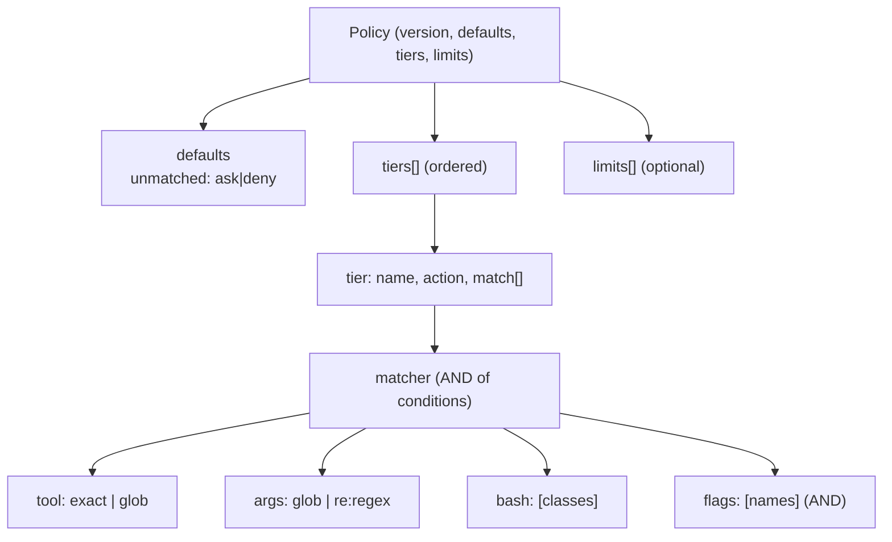

# Policy format — the complete `brezia.yaml` reference

> The authoritative spec for a Brezia policy file: its structure, the tier and matcher
> shapes, the matcher algebra, the Bash classes, aggregation limits, and the strict
> parsing that catches typos loudly. This is a standard-setting surface — versioned
> from commit one, additive-only after v0.

The *shape and validation* live in `packages/shared` (THE contract); the *evaluation*
lives in the pure `packages/policy`. This page documents both. For the algorithm in
depth see [../internals/policy-evaluation.md](../internals/policy-evaluation.md); for how
Bash strings become classes see
[../internals/bash-classification.md](../internals/bash-classification.md); for authoring
guidance see [../guides/writing-policy.md](../guides/writing-policy.md).

## Contents

- [File structure](#file-structure)
- [`defaults` — the floor](#defaults--the-floor)
- [`tiers` — ordered rungs](#tiers--ordered-rungs)
- [A matcher and the matcher algebra](#a-matcher-and-the-matcher-algebra)
- [Bash classes](#bash-classes)
- [`limits` — aggregation ceilings](#limits--aggregation-ceilings)
- [`.strict()` — unknown keys are rejected](#strict--unknown-keys-are-rejected)
- [The v1-reserved keys: `route` and `batch`](#the-v1-reserved-keys-route-and-batch)
- [Worked example: the annotated default pack](#worked-example-the-annotated-default-pack)

---

## File structure

A policy is a YAML document with four top-level keys — `version`, `defaults`, `tiers`, and
optional `limits`:

```ts
// packages/shared/src/index.ts:161
export const PolicySchema = z.object({
  version: z.literal(1),
  defaults: PolicyDefaultsSchema,
  tiers: z.array(PolicyTierSchema),
  limits: z.array(PolicyLimitSchema).optional(),
}).strict();
```

| Key | Type | Required | Meaning |
|---|---|---|---|
| `version` | literal `1` | yes | Format version. Anything but `1` is rejected (`policy-schema.test.ts:61`). |
| `defaults` | object | yes | The unmatched floor (and reserved expiry behavior). |
| `tiers` | array | yes | Ordered rules; first match wins. May be empty (`[]` → everything asks). |
| `limits` | array | no | Aggregation ceilings (anti-splitting). |

The daemon loads the file with `parse YAML → PolicySchema.safeParse → atomic swap`
(`packages/daemon/src/policy-loader.ts:21`). An invalid file is rejected and the previous
policy is kept — never a crash, never fail-open. Hot-reload details are in
[configuration.md](configuration.md#policy-hot-reload) and
[../guides/writing-policy.md](../guides/writing-policy.md).



---

## `defaults` — the floor

```ts
// packages/shared/src/index.ts:152
export const PolicyDefaultsSchema = z.object({
  unmatched: z.enum(["ask", "deny"]),
  on_expiry: z.enum(["deny", "defer"]).optional(),
}).strict();
```

| Field | Type | Meaning |
|---|---|---|
| `unmatched` | `"ask"` \| `"deny"` | What an event matching **no** tier resolves to — the **unmatched floor**. |
| `on_expiry?` | `"deny"` \| `"defer"` | Reserved for enforced mode; **not read at v0**. |

`unmatched` can be `ask` or `deny` but **never `allow`** — there is no allow-by-omission.
The schema itself rejects `unmatched: allow` (`policy-schema.test.ts:71`), and the
evaluator's floor only ever produces `ask` or `auto_denied`:

```ts
// packages/policy/src/evaluate.ts:149
const unmatched = policy?.defaults?.unmatched ?? "ask";
return unmatched === "deny"
  ? { decision: "auto_denied", reason: "unmatched default" }
  : { decision: "ask", reason: "unmatched default" };
```

> **Invariant 1.** No event resolves `allow` without a named matching tier. The floor is
> the last line of that guarantee: an unmatched event can only `ask` or `deny`. See
> [../internals/failure-semantics.md](../internals/failure-semantics.md).

`on_expiry` is forward room for the enforced-mode expiry path (decision 006). At v0 a held
call that outlives the hook window always **defers** (returns `NO_DECISION` → native flow)
regardless of this field; the reserved `expired` request status is never written. See
[../concepts.md](../concepts.md#the-request-state-machine).

---

## `tiers` — ordered rungs

A tier is a named rule: a disjunction of matchers plus an action. Tiers evaluate top to
bottom, **first match wins** (the firewall model, decision 004).

```ts
// packages/shared/src/index.ts:125
export const PolicyTierSchema = z.object({
  name: z.string().min(1),
  match: z.array(MatcherSchema),
  action: PolicyActionSchema,      // "allow" | "ask" | "deny"
  route: z.unknown().optional(),   // v1-reserved, accepted-and-ignored (decision 014)
  batch: z.unknown().optional(),   // v1-reserved, accepted-and-ignored (decision 014)
}).strict();
```

| Field | Type | Meaning |
|---|---|---|
| `name` | non-empty `string` | Identifies the tier — stamped onto `auto_allowed` results (invariant 1) and shown on cards. |
| `match` | `Matcher[]` | OR list: the tier matches if **any** matcher matches. |
| `action` | `"allow"` \| `"ask"` \| `"deny"` | The outcome when the tier matches. |
| `route`, `batch` | any | v1-reserved; see [below](#the-v1-reserved-keys-route-and-batch). |

The action maps to a decision inside a matched tier:

| `action` | Decision | Notes |
|---|---|---|
| `allow` | `auto_allowed` (names the tier) | may be downgraded to `ask` by an aggregation limit |
| `deny` | `auto_denied` | |
| `ask` | `ask` | held for a human |

```ts
// packages/policy/src/evaluate.ts:111
for (const tier of tiers) {
  if (!matchesTier(tier, event, flags)) continue;
  switch (tier.action) {
    case "allow": { /* aggregation-limit check, then auto_allowed with tierName */ }
    case "deny":  return { decision: "auto_denied", tierName: tier.name, /* … */ };
    case "ask":   return { decision: "ask", tierName: tier.name, /* … */ };
  }
}
```

Order matters and is the whole design: put `deny`/`ask` guards (secrets, dangerous
commands) *above* broad `allow` tiers so a guard wins. `evaluate.test.ts:97` verifies an
earlier `deny-rm` tier beats a later `allow-bash` tier.

---

## A matcher and the matcher algebra

A matcher is the atom of matching — a **conjunction** of conditions:

```ts
// packages/shared/src/index.ts:112
export const MatcherSchema = z.object({
  tool: z.string().optional(),
  args: z.record(z.string()).optional(),
  bash: z.array(z.string()).optional(),
  flags: z.array(z.string()).optional(),
}).strict();
```

| Condition | Shape | Matches when |
|---|---|---|
| `tool` | `string` | The tool name equals the pattern, or matches it as a picomatch glob. |
| `args` | `{ key: pattern }` | **Every** listed key's value matches its pattern (glob, or `re:` regex). |
| `bash` | `string[]` | The `arguments.command` classifies into one of the listed [Bash classes](#bash-classes). |
| `flags` | `string[]` | **Every** listed [flag](../internals/flags.md) is active (AND). |

**The algebra** (decision 010): **AND within a matcher, OR across a tier's matchers** — a
matcher matches when *all* its present conditions hold; a tier matches when *any* matcher
does. Together this is disjunctive normal form (DNF) — full boolean expressiveness. AND
(not OR) inside a matcher is the deliberate choice, because AND-within + OR-across yields
DNF, whereas OR-within would collapse to a flat OR that could never express a conjunction
like "secret **and** first-time."

```ts
// packages/policy/src/evaluate.ts:61
function matchesMatcher(matcher, event, flags): boolean {
  if (matcher.tool  !== undefined && !matchTool(matcher.tool, event.tool)) return false;
  if (matcher.args  !== undefined && !matchArgs(matcher.args, event.arguments)) return false;
  if (matcher.bash  !== undefined && !matchBash(matcher.bash, event.arguments)) return false;
  if (matcher.flags !== undefined && !matchFlags(matcher.flags, flags)) return false;
  return true;
}
```

An **empty matcher `{}` matches everything** — permitted but discouraged
(`packages/policy/src/evaluate.ts:59`).

**Tool matching** — exact or picomatch glob (`evaluate.ts:14`). `tool: "Read"` matches
`Read`; `tool: "mcp__*"` matches every MCP tool (`evaluate.test.ts:25`).

**Argument matching** — each value is a **picomatch glob by default**; prefix it with
`re:` to use a regular expression instead (`evaluate.ts:21`):

```ts
// packages/policy/src/evaluate.ts:21
function matchArg(pattern: string, value: unknown): boolean {
  if (typeof value !== "string") return false;
  if (pattern.startsWith("re:")) {
    try { return new RegExp(pattern.slice(3)).test(value); }
    catch { return false; } // a malformed regex never matches
  }
  return picomatch(pattern)(value);
}
```

Two fail-toward-not-allowing behaviors are load-bearing, both tested
(`evaluate.test.ts:57,62`): a **missing or non-string** argument never matches, and a
**malformed regex** never matches. Examples:

```yaml
# glob (default): any file under a workspace dir
- tool: Write
  args: { file_path: "**/workspace/**" }

# regex: only read-only git subcommands
- tool: Bash
  args: { command: "re:^git (status|log)\\b" }
```

**Flag matching** — every listed flag must be active (`evaluate.ts:44`). The v0 flags are
`secrets_pattern`, `first_time_tool`, `first_time_command` (`FLAG_NAMES`,
`packages/shared/src/index.ts:100`); they are computed **before** policy runs so matchers
may require them and cards always display them. `evaluate.test.ts:68` verifies AND-of-flags:
a matcher listing two flags matches only when *both* are set. Full flag semantics:
[../internals/flags.md](../internals/flags.md).

---

## Bash classes

`bash: [ ... ]` requires that `arguments.command` **classify into** one of the listed
curated classes. Classification is deliberately conservative and fails toward `ask`
(decision 005): the raw command string is first checked for any compound/expansion
construct, then tokenized, then matched by **token-prefix equality** against a curated
table. Anything compound, unparseable, or not in the table is `UNCLASSIFIABLE` and never
matches a `bash` condition:

```ts
// packages/policy/src/bash.ts:53
function matchBash(classes: string[], args): boolean {
  const klass = classifyBash(args.command);
  if (klass === UNCLASSIFIABLE) return false;
  return classes.includes(klass);
}
```

The compound gate is checked against the **raw** string so a quoted or escaped operator
cannot sneak a safe class through (`packages/policy/src/bash.ts:12`):

```ts
// packages/policy/src/bash.ts:12
const COMPOUND = /[;&|<>$`(){}\n\r]/;
```

The v0 classes and their exact members (from the curated `PREFIX_TABLE`,
`packages/policy/src/bash.ts:17` — this is the **authoritative** list):

| Class | Command prefixes that classify into it |
|---|---|
| `read` | `ls`, `cat`, `head`, `tail`, `pwd`, `wc`, `stat`, `grep`, `which`, `echo`, `du` |
| `vcs-read` | `git status`, `git diff`, `git log`, `git show`, `git rev-parse`, `git ls-files`, `git blame`, `git describe` |
| `test` | `npm test`, `pytest`, `vitest` |
| `build` | `npm run build`, `tsc` |

> **Security — the exclusions are deliberate.** `read` excludes `rg`, `tree`, and `file`
> even though they look read-only: `rg --pre`/`--hostname-bin` execute a program, `tree -o`
> writes a file, and `file -C`/`-m` compile/write — plain-form exec/write vectors that no
> shell-metachar gate catches (`packages/policy/src/bash.ts:22`). `find`/`xargs` (`-exec`)
> and `env`/`node`/`sh`/`awk` (run code) are excluded for the same reason. GNU `grep` is
> included because, unlike `rg`, it has no exec/write flag. Rationale and the property test
> (no adversarial string ever classifies into a real class) are in
> [../internals/bash-classification.md](../internals/bash-classification.md).

---

## `limits` — aggregation ceilings

Anti-splitting: a ceiling that stops an agent laundering one big change into many
individually-cheap auto-allows. Ships in v0 — not deferred.

```ts
// packages/shared/src/index.ts:143
export const PolicyLimitSchema = z.object({
  per: z.enum(["agent", "tool", "session"]),
  window: z.string().regex(/^\d+[smhd]$/), // e.g. "24h", "30m"
  max_asks_auto_allowed: z.number().int().positive(),
}).strict();
```

| Field | Type | Meaning |
|---|---|---|
| `per` | `"agent"` \| `"tool"` \| `"session"` | The dimension the count is keyed by. |
| `window` | `\d+[smhd]` | Rolling window: `s`/`m`/`h`/`d`. E.g. `24h`, `30m`. |
| `max_asks_auto_allowed` | positive int | The cap — auto-allows allowed in the window before the next escalates. |

When the count of prior auto-allows for a key **reaches** the cap, the next would-be allow
is escalated to `ask` (not denied — held for a human):

```ts
// packages/policy/src/limits.ts:41
for (const limit of policy.limits ?? []) {
  const windowMs = parseWindowMs(limit.window);
  if (windowMs === null) continue;
  const key = aggregationKey(limit.per, event);
  if (counter.countInWindow(key, windowMs, now) >= limit.max_asks_auto_allowed) {
    return `${limit.per}/${limit.window}`; // breached → escalate
  }
}
```

The dimension key is derived per event (`aggregationKey`, `packages/policy/src/limits.ts:26`):
`tool:<tool>`, `session:<session>`, or `agent:<owner-or-session>` (the `agent` key uses
`context.owner` when present, else the session — the hook has no distinct agent id for the
main session at v0). `hook-endpoint.test.ts:226` verifies two allows then a held third under
a cap of 2.

> **Failure direction.** Limits are enforced only when the daemon injects both a clock and
> the counter (`evaluate.ts:118`). An *unevaluable* key (malformed, or a dimension the
> counter doesn't recognize) counts as a **forced breach** → escalates to `ask`, never
> silently disabling the cap (decision 013 — see
> [../internals/aggregation-limits.md](../internals/aggregation-limits.md)).

---

## `.strict()` — unknown keys are rejected

Every schema level is `.strict()`: an unknown key anywhere is a hard validation error, not
a silent no-op. The reason (decision 010): a typo'd key would otherwise silently disable a
rule — a typo in a security control must surface loudly, not fail open.

`policy-schema.test.ts` covers this at every level: an unknown top-level key (`:29`), an
unknown key inside a matcher (`:33`), inside a tier (`:39`), inside `defaults` (`:55`), an
unknown `action` (`:65`), and `version` ≠ 1 (`:61`) all fail. A rejected file means the
daemon keeps the previous policy and raises a `policy.error` banner — see
[configuration.md](configuration.md#policy-hot-reload).

---

## The v1-reserved keys: `route` and `batch`

Two tier keys are **accepted and ignored** at v0 (decision 014). The policy-file format is
designed to be forward-compatible: the `batch` and `route` keys are reserved for v1, and
the single-player daemon ignores them. So a v1-ready policy loads on the v0 daemon without
error, and `evaluate()` never reads them.

```ts
// packages/shared/src/index.ts:137
route: z.unknown().optional(),   // any shape — v1's shape isn't settled yet
batch: z.unknown().optional(),
```

- Both are `z.unknown().optional()` — **any** value shape is tolerated (a string `route`,
  an object `batch`), because validating the shape of an ignored key would itself be
  premature (`policy-schema.test.ts:45`).
- Every **other** unknown tier key is still rejected by `.strict()` — the reservation is
  exactly two keys, not a general escape hatch.
- The routing and batching *capabilities* are **not built** at v0; only the two format keys
  are reserved. This is what lets v1 *activate* them as a behavior change rather than a
  breaking format change.

---

## Worked example: the annotated default pack

The bundled starter policy (`policy-packs/claude-code-default.yaml`) — tuned so a fresh
install clears a routine session while everything mutating, network-bound, or
secrets-shaped waits for a human:

```yaml
# policy-packs/claude-code-default.yaml:11
version: 1

defaults:
  unmatched: ask       # no allow by omission — unmatched events ask a human
  on_expiry: defer     # reserved (enforced mode); v0 always defers on timeout

tiers:
  # 1. SECRETS FIRST — placed above the allow tiers so `cat .env` still stops here.
  - name: escalate-secrets
    match:
      - flags: [secrets_pattern]
    action: ask

  # 2. READ-ONLY tools + classified-safe shell reads auto-resolve.
  - name: allow-reads
    match:
      - tool: Read
      - tool: Grep
      - tool: Glob
      - tool: Bash
        bash: [read, vcs-read]
    action: allow

  # 3. ROUTINE DEV — running tests and builds auto-resolves.
  - name: allow-dev
    match:
      - tool: Bash
        bash: [test, build]
    action: allow

  # Everything else (Write, Edit, mutating/network shell, unclassifiable commands)
  # has no matching tier → unmatched: ask.

# ANTI-SPLITTING: after 200 auto-allows in a day for one session, the next escalates.
limits:
  - per: session
    window: 24h
    max_asks_auto_allowed: 200
```

How a few events resolve under this pack:

| Event | Resolves to | Why |
|---|---|---|
| `Read {file_path: …}` | `auto_allowed` (`allow-reads`) | read-only tool |
| `Bash {command: "git status"}` | `auto_allowed` (`allow-reads`) | classifies `vcs-read` |
| `Bash {command: "npm test"}` | `auto_allowed` (`allow-dev`) | classifies `test` |
| `Bash {command: "ls && curl x"}` | `ask` (unmatched) | compound → `UNCLASSIFIABLE` |
| `Bash {command: "curl … --data @.env"}` | `ask` (`escalate-secrets`) | `secrets_pattern` flag, tier 1 wins |
| `Write {file_path: …}` | `ask` (unmatched) | no allow tier for `Write` |
| 201st session auto-allow in 24h | `ask` | aggregation limit breached |

The secrets tier sits first on purpose: because tiers are first-match-wins, `cat .env` — a
`read` that would match `allow-reads` — is intercepted by `escalate-secrets` above it.
Authoring your own from here: [../guides/writing-policy.md](../guides/writing-policy.md).

---

**Next:** [../internals/policy-evaluation.md](../internals/policy-evaluation.md) for the
pure engine, [../internals/bash-classification.md](../internals/bash-classification.md) for
the Bash classifier, [../internals/aggregation-limits.md](../internals/aggregation-limits.md)
for the counter, or [configuration.md](configuration.md) for where the file lives and how
it reloads.
