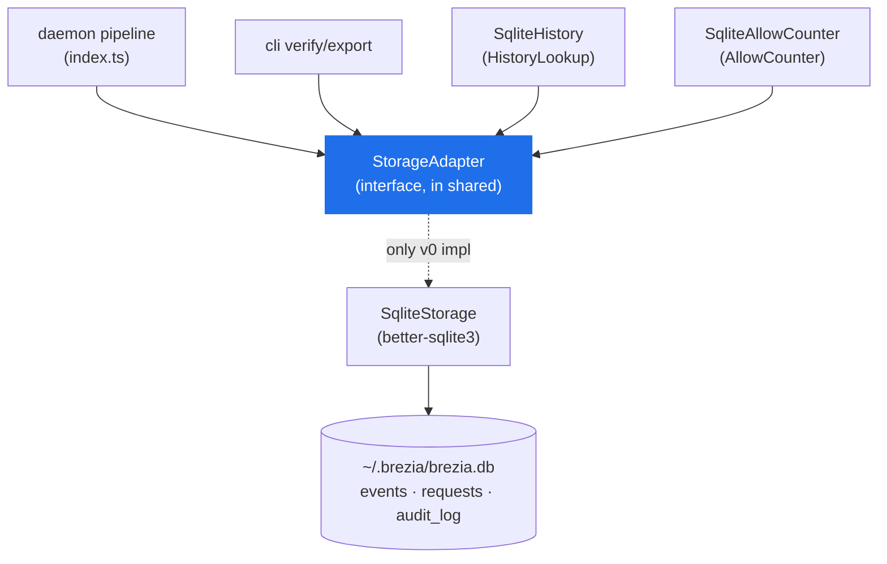
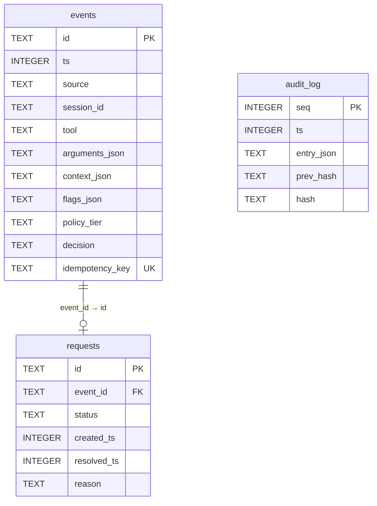

# StorageAdapter — the persistence contract & SQLite schema

> The one piece of v1 foresight allowed at v0: storage behind a ~16-method interface so a
> later Postgres is an *implementation*, not a rewrite. This page documents every method,
> the three-table SQLite schema field by field, the implementation notes (WAL,
> synchronous, indexes, derived reads), and why the audit log has no update or delete.

Read [concepts.md](../concepts.md#persistence--evidence) for `StoredEvent`, `AuditEntry`,
and `AuditRow`. The interface lives in `shared` (THE contract); the only v0 implementation
is `SqliteStorage` in the daemon. Durability and derived-read internals are in
[../internals/persistence.md](../internals/persistence.md); the chain is in
[../internals/audit-chain.md](../internals/audit-chain.md).

## Contents

- [Why an interface at all](#why-an-interface-at-all)
- [The `StorageAdapter` interface](#the-storageadapter-interface)
- [The SQLite schema](#the-sqlite-schema)
- [The `events` table](#the-events-table)
- [The `requests` table](#the-requests-table)
- [The `audit_log` table](#the-audit_log-table)
- [Derived reads: history, counter, stats](#derived-reads-history-counter-stats)
- [Implementation notes](#implementation-notes)
- [Why no update/delete for the audit chain](#why-no-updatedelete-for-the-audit-chain)

---

## Why an interface at all

The scope rule forbids building ahead — with exactly one exception: the `StorageAdapter`
interface (decision 003). The reasoning: SQLite (`better-sqlite3`) is the *correct* engine
for a single-process localhost daemon, not a placeholder — its synchronous API removes
async races and makes the append-and-chain transaction trivial, and an embedded DB is
effectively mandated by the ten-minute zero-config install. But a hosted control plane
later will want Postgres. Putting SQLite behind a small interface means that swap is an
implementation change, not a rewrite. The interface is **additive-only after v0**, like the
rest of the contract.



The daemon and CLI both depend on the *interface*; `SqliteStorage` is re-exported from the
daemon so the CLI's `verify`/`export` share one implementation and one chain-verification
routine (`packages/daemon/src/index.ts:26`).

---

## The `StorageAdapter` interface

Sixteen methods, grouped by concern. The full definition:

```ts
// packages/shared/src/index.ts:315 (abbreviated to signatures)
export interface StorageAdapter {
  // Events
  insertEvent(event: StoredEvent): void;
  getEventByIdempotencyKey(key: string): StoredEvent | undefined;
  // Derived history (first-time flags)
  hasSeenTool(tool: string): boolean;
  hasSeenCommand(command: string): boolean;
  // Derived counter (aggregation limits)
  countAutoAllows(dim: AggregationDim, value: string, sinceTs: number): number;
  // Rolling stats
  statsSince(sinceTs: number): { total: number; autoResolved: number };
  // Requests
  insertRequest(request: Request): void;
  getRequest(id: string): Request | undefined;
  getRequestByEventId(eventId: string): Request | undefined;
  listRequestsByStatus(status: RequestStatus): Request[];
  updateRequestStatus(id: string, status: RequestStatus, resolvedTs: number, reason?: string): void;
  // Audit chain (append-only)
  appendAuditEntry(entryJson: string, prevHash: string): { seq: number; hash: string };
  getLastAuditEntry(): { seq: number; hash: string } | undefined;
  allAuditEntries(): AuditRow[];
  verifyAuditChain(): boolean;
}
```

| Method | Group | Returns | Purpose |
|---|---|---|---|
| `insertEvent` | events | `void` | Persist a `StoredEvent` (the effective decision). Throws on `UNIQUE(idempotency_key)` collision. |
| `getEventByIdempotencyKey` | events | `StoredEvent?` | Idempotency lookup — replay the original outcome. |
| `hasSeenTool` | derived history | `boolean` | Any prior event with this tool? → `first_time_tool`. |
| `hasSeenCommand` | derived history | `boolean` | Any prior event with this `arguments.command`? → `first_time_command`. |
| `countAutoAllows` | derived counter | `number` | Count `auto_allowed` events matching a dimension/value since a cutoff. |
| `statsSince` | stats | `{ total, autoResolved }` | Totals since a cutoff, for `/v1/stats`. |
| `insertRequest` | requests | `void` | Create a `pending` request for an `ask`. |
| `getRequest` | requests | `Request?` | Lookup by request id. |
| `getRequestByEventId` | requests | `Request?` | Lookup by event id (used by replay). |
| `listRequestsByStatus` | requests | `Request[]` | Crash recovery lists `pending` on boot. |
| `updateRequestStatus` | requests | `void` | Move a request to `approved`/`denied`/`deferred`. |
| `appendAuditEntry` | audit | `{ seq, hash }` | Append one chained entry (stores `entryJson` verbatim). |
| `getLastAuditEntry` | audit | `{ seq, hash }?` | The chain head — its hash is the next `prev_hash`. |
| `allAuditEntries` | audit | `AuditRow[]` | Full chain, ordered by `seq`, for verify/export. |
| `verifyAuditChain` | audit | `boolean` | Re-walk and re-hash the chain end to end. |

Note there is **no** `updateAuditEntry` or `deleteAuditEntry`, and no bulk event deletion —
that absence is the append-only guarantee, [below](#why-no-updatedelete-for-the-audit-chain).

`AggregationDim` (`"tool" | "session" | "agent"`, `packages/shared/src/index.ts:309`) mirrors
`PolicyLimit.per`; the value is the already-resolved key (e.g. the tool name, or
owner-or-session for `agent`). The **derived** methods (`hasSeen*`, `countAutoAllows`,
`statsSince`, plus `getRequestByEventId` and `allAuditEntries`) were added when history and
the counter were made SQL-derived rather than in-memory shadows (decision 012).

---

## The SQLite schema

Three tables, created idempotently in `migrate()` (no ORM — the schema is small):

```ts
// packages/daemon/src/sqlite-storage.ts:36
this.db.exec(`
  CREATE TABLE IF NOT EXISTS events ( … idempotency_key TEXT UNIQUE );
  CREATE INDEX IF NOT EXISTS idx_events_tool ON events(tool);
  CREATE INDEX IF NOT EXISTS idx_events_session ON events(session_id);
  CREATE INDEX IF NOT EXISTS idx_events_decision_ts ON events(decision, ts);

  CREATE TABLE IF NOT EXISTS requests ( … event_id TEXT NOT NULL REFERENCES events(id) … );
  CREATE INDEX IF NOT EXISTS idx_requests_status ON requests(status);
  CREATE INDEX IF NOT EXISTS idx_requests_event ON requests(event_id);

  CREATE TABLE IF NOT EXISTS audit_log (
    seq INTEGER PRIMARY KEY AUTOINCREMENT, ts INTEGER NOT NULL,
    entry_json TEXT NOT NULL, prev_hash TEXT NOT NULL, hash TEXT NOT NULL
  );
`);
```



`audit_log` has **no** foreign key to `events`/`requests` on purpose — it is the standalone,
self-describing evidence artifact (each `entry_json` carries its own ids and `ts`), so it
verifies and exports without joins.

---

## The `events` table

One row per accepted event — a `StoredEvent` (the `ApprovalEvent` plus what Brezia computed
and decided). This table is also the single source of truth for derived history, the
aggregation counter, and stats (decision 012).

| Column | Type | Maps to | Notes |
|---|---|---|---|
| `id` | `TEXT PRIMARY KEY` | `StoredEvent.id` | ulid |
| `ts` | `INTEGER NOT NULL` | `.ts` | epoch ms |
| `source` | `TEXT NOT NULL` | `.source` | e.g. `claude-code-http` |
| `session_id` | `TEXT` | `.session` | `session` aggregation dimension |
| `tool` | `TEXT NOT NULL` | `.tool` | indexed; `first_time_tool` / `tool` dimension |
| `arguments_json` | `TEXT NOT NULL` | `.arguments` | JSON; `json_extract($.command)` drives `hasSeenCommand` |
| `context_json` | `TEXT` | `.context` | JSON; `json_extract($.owner)` drives the `agent` dimension |
| `flags_json` | `TEXT` | `.flags` | JSON of computed flags |
| `policy_tier` | `TEXT` | `.policyTier` | the matched tier, if any |
| `decision` | `TEXT NOT NULL` | `.decision` | the **effective** decision |
| `idempotency_key` | `TEXT UNIQUE` | `.idempotencyKey` | `tool_use_id`; the dedupe constraint |

Two design points:

- **`decision` is the *effective* decision**, never the raw evaluator output. A tierless
  `auto_allowed` (a policy bug) is stored as `ask` by the daemon's invariant-1 guard
  (`packages/daemon/src/index.ts:242`), so `countAutoAllows` and `statsSince` never credit a
  non-emitted allow. See [http-api.md](http-api.md#post-v1hook).
- **`idempotency_key TEXT UNIQUE`** enforces the replay rule at the storage layer: a
  duplicate insert throws, and the daemon catches it to replay the winner
  (`sqlite-storage.test.ts:52`). NULL keys don't collide, so key-less events coexist
  (`:58`).

The insert is a single prepared statement (`packages/daemon/src/sqlite-storage.ts:82`);
row → `StoredEvent` reconstruction is `rowToStoredEvent` (`:290`), which re-parses the JSON
columns and normalizes a null `session_id` to `""`.

---

## The `requests` table

One row per event that resolved to `ask` — a persisted `Request`. This is a **mutable
lifecycle** table (`pending → approved | denied | deferred`), unlike `audit_log`.

| Column | Type | Maps to | Notes |
|---|---|---|---|
| `id` | `TEXT PRIMARY KEY` | `Request.id` | ulid |
| `event_id` | `TEXT NOT NULL REFERENCES events(id)` | `.eventId` | FK to the originating event |
| `status` | `TEXT NOT NULL` | `.status` | indexed; `pending`/`approved`/`denied`/`deferred` |
| `created_ts` | `INTEGER` | `.createdTs` | when held |
| `resolved_ts` | `INTEGER` | `.resolvedTs` | when a terminal transition occurred |
| `reason` | `TEXT` | `.reason` | human's reason, or the defer cause |

`updateRequestStatus` is the one `UPDATE` here, and the code comments that this is
deliberate — the append-only rule applies to `audit_log`, **not** to this lifecycle table:

```ts
// packages/daemon/src/sqlite-storage.ts:204
updateRequestStatus(id, status, resolvedTs, reason?): void {
  // requests is a mutable lifecycle table (pending → resolved); the append-only
  // rule applies to audit_log, not here.
  this.db.prepare(
    `UPDATE requests SET status = ?, resolved_ts = ?, reason = ? WHERE id = ?`,
  ).run(status, resolvedTs, reason ?? null, id);
}
```

`listRequestsByStatus("pending")` is what **crash recovery** reads on boot: any request left
`pending` by a dead process is moved to `deferred` and chained
(`packages/daemon/src/index.ts:139`). The reserved `expired` status is never written at v0 —
both a hold timeout and crash recovery resolve to `deferred`. See
[../concepts.md](../concepts.md#the-request-state-machine).

---

## The `audit_log` table

The hash-chained, append-only evidence log. One row per state change (decisions 007, 011).

| Column | Type | Meaning |
|---|---|---|
| `seq` | `INTEGER PRIMARY KEY AUTOINCREMENT` | Monotonic sequence; `seq = 1` is the first entry. |
| `ts` | `INTEGER NOT NULL` | Append time (epoch ms). The entry's own `ts` also lives inside `entry_json`. |
| `entry_json` | `TEXT NOT NULL` | The serialized `AuditEntry`, stored **verbatim** — the versioned contract that `verify` re-hashes and `export` emits. |
| `prev_hash` | `TEXT NOT NULL` | The previous row's `hash`; `GENESIS_HASH` (64 hex zeros) for `seq 1`. |
| `hash` | `TEXT NOT NULL` | `sha256(prev_hash + entry_json)`. |

Append and verify:

```ts
// packages/daemon/src/sqlite-storage.ts:221
appendAuditEntry(entryJson: string, prevHash: string): { seq: number; hash: string } {
  const ts = Date.now();
  const hash = chainHash(prevHash, entryJson); // sha256(prevHash + entryJson)
  const info = this.db.prepare(
    `INSERT INTO audit_log (ts, entry_json, prev_hash, hash) VALUES (?, ?, ?, ?)`,
  ).run(ts, entryJson, prevHash, hash);
  return { seq: Number(info.lastInsertRowid), hash };
}
```

```ts
// packages/daemon/src/sqlite-storage.ts:254
verifyAuditChain(): boolean {
  let expectedPrev = GENESIS_HASH;
  for (const row of this.allAuditEntries()) {
    if (row.prevHash !== expectedPrev) return false;
    if (chainHash(row.prevHash, row.entryJson) !== row.hash) return false;
    expectedPrev = row.hash;
  }
  return true;
}
```

`verify` re-hashes the **exact stored `entry_json` string** — never a re-serialization — so
canonical-JSON key ordering never enters the trust boundary (decision 011). An empty chain
verifies vacuously (`sqlite-storage.test.ts:140`); a tampered `entry_json` or a broken
`prev_hash` link both fail verification (`:144`, `:165`). The `AuditEntry` variants and when
each is written are documented in
[../internals/audit-chain.md](../internals/audit-chain.md) and
[../concepts.md](../concepts.md#auditentry--the-chained-state-changes). Rows are read back as
`AuditRow` (`{ seq, ts, entryJson, prevHash, hash }`, `packages/shared/src/index.ts:289`).

---

## Derived reads: history, counter, stats

First-time history and the aggregation counter are **derived from the `events` table via
SQL**, not kept as an in-memory shadow (decision 012 — "Option A"). Rationale: the events
table is already the durable record, so deriving from it is a single source of truth that
can't drift, adds no unbounded in-memory growth, and needs no extra tables.

- **`hasSeenTool` / `hasSeenCommand`** — a `SELECT 1 … LIMIT 1` existence check;
  `hasSeenCommand` uses `json_extract(arguments_json, '$.command')`
  (`packages/daemon/src/sqlite-storage.ts:116,123`). "Seen" means a *prior* event, so flags
  are computed before the current event is inserted (`sqlite-storage.test.ts:66`).

- **`countAutoAllows`** — counts `decision = 'auto_allowed'` rows at/after a cutoff, keyed by
  dimension; the `agent` dimension resolves to owner-or-session in SQL, mirroring the policy
  layer's key:

  ```sql
  -- packages/daemon/src/sqlite-storage.ts:143
  SELECT COUNT(*) AS n FROM events
   WHERE decision = 'auto_allowed' AND ts >= ? AND <column> = ?
  -- <column> = tool | session_id | COALESCE(json_extract(context_json,'$.owner'), session_id)
  ```

- **`statsSince`** — `total` and `autoResolved` (=`auto_allowed`+`auto_denied`) since a
  cutoff, for `/v1/stats` (`packages/daemon/src/sqlite-storage.ts:153`).

The pure policy layer never calls these directly — it depends on the `HistoryLookup` and
`AllowCounter` interfaces, which the daemon's thin `SqliteHistory` / `SqliteAllowCounter`
adapters implement over the `StorageAdapter` (`packages/daemon/src/derived.ts`). The counter
parses the policy layer's opaque `dim:value` key back into a query, and — crucially — an
unrecognized dimension or malformed key returns a **force-breach sentinel**
(`Number.MAX_SAFE_INTEGER`) so an unevaluable limit escalates to `ask`, never silently
disabling the cap (decision 013):

```ts
// packages/daemon/src/derived.ts:38
countInWindow(key: string, windowMs: number, now: number): number {
  const i = key.indexOf(":");
  if (i < 0) return FORCE_BREACH;
  const dim = key.slice(0, i);
  const value = key.slice(i + 1);
  if (!DIMS.has(dim)) return FORCE_BREACH;
  return this.storage.countAutoAllows(dim as AggregationDim, value, now - windowMs);
}
```

Verified in `derived.test.ts:56` (an unrecognized dimension forces a breach). Full treatment:
[../internals/aggregation-limits.md](../internals/aggregation-limits.md) and
[../internals/persistence.md](../internals/persistence.md).

---

## Implementation notes

- **Synchronous by design.** `better-sqlite3` is synchronous, so every adapter method is a
  plain function call with no async ceremony — this removes async races and makes the
  append-and-chain a trivial, ordinary sequence of statements (decision 003,
  `packages/daemon/src/sqlite-storage.ts:20`).
- **WAL mode** (`journal_mode = WAL`, `sqlite-storage.ts:31`) lets the UI/SSE reads run
  alongside writes. `foreign_keys = ON` enforces the `requests.event_id` FK.
- **Indexes** back the hot reads: `events(tool)` and `events(session_id)` for history/counter,
  `events(decision, ts)` for the counter/stats windows, and `requests(status)` /
  `requests(event_id)` for the pending list and by-event lookup.
- **Prepared statements** throughout; JSON columns (`arguments_json`, `context_json`,
  `flags_json`) are stringified on write and parsed on read by the row mappers
  (`sqlite-storage.ts:290`).
- **Lifecycle.** The path is `~/.brezia/brezia.db` in production and `":memory:"` in tests
  (`packages/daemon/src/index.ts:92`). `createServer` owns the DB's `close()` only when it
  opened it, releasing it on Fastify `onClose` (`index.ts:178`).

---

## Why no update/delete for the audit chain

The append-only guarantee (invariant "the audit chain verifies end-to-end") is enforced two
ways:

1. **By absence.** There is no `UPDATE audit_log` or `DELETE FROM audit_log` statement
   anywhere in the codebase, and the file that defines the storage carries the rule as a
   header comment: *"there is no UPDATE or DELETE statement for audit_log anywhere in this
   file. Do not add one."* (`packages/daemon/src/sqlite-storage.ts:24`). The `StorageAdapter`
   interface offers no method to mutate an entry.
2. **By a source-scan test.** `sqlite-storage.test.ts:173` reads the storage source and
   asserts it contains no `update audit_log` or `delete from audit_log` — a regression trip
   wire, so a future edit that adds one fails CI.

Tamper *evidence* is the chain itself: because each `hash` binds `prev_hash + entry_json`, any
edit to a stored row (even directly on disk) breaks `verifyAuditChain` — demonstrated by the
disk-tampering test that mutates a row with a raw handle and watches verification fail
(`sqlite-storage.test.ts:144`).

> **Invariant 3.** The audit chain verifies end-to-end after every test-suite run. The
> append-only design is what makes that verification meaningful — an editable log proves
> nothing. See [../internals/audit-chain.md](../internals/audit-chain.md) and
> [../security.md](../security.md).

---

**Next:** [../internals/persistence.md](../internals/persistence.md) for durability and
derived reads in depth, or [../internals/audit-chain.md](../internals/audit-chain.md) for
the chain and `verify`/`export`.
